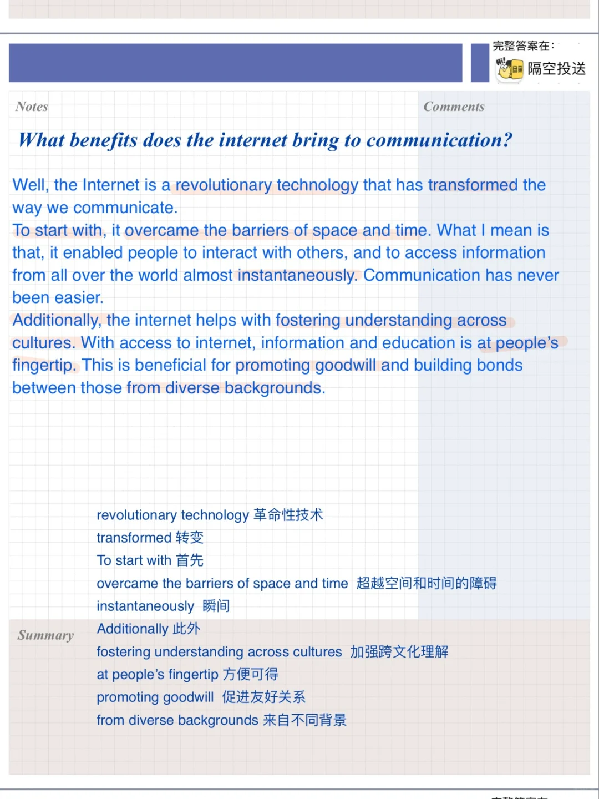
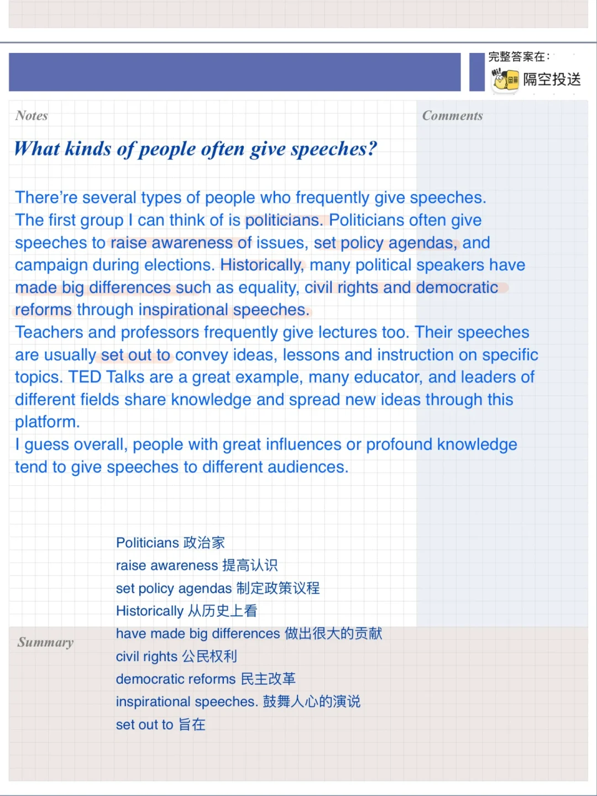
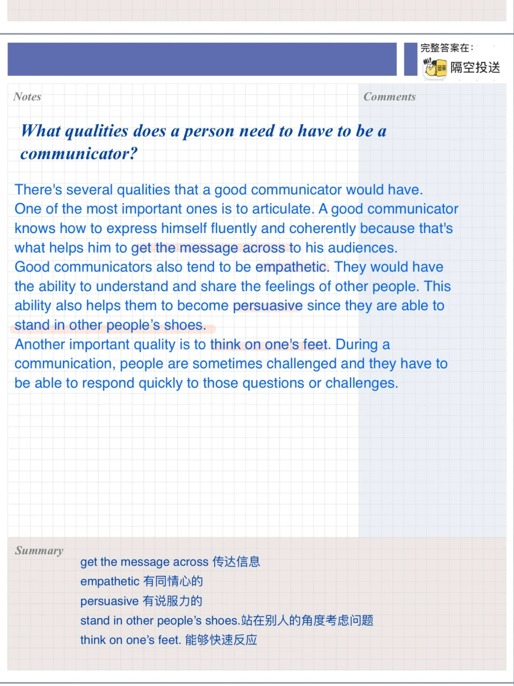
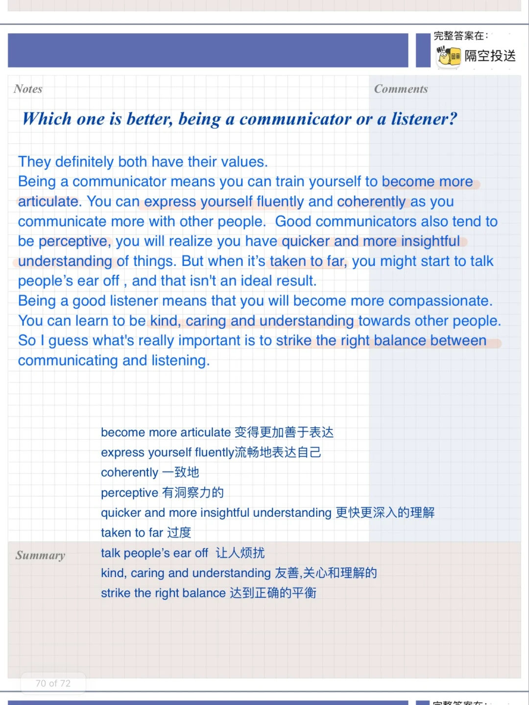

# 高分雅思口语P3答案｜演讲经历

“演讲经历”part3主要讨论交流
交流与聆听那个更重要，如何有效交流，演讲者品质等
快积累表达，练习起来吧
#雅思口语 #雅思攻略 #雅思备考 #雅思口语换题 #雅思 #雅思口语高分示范 #雅思口语part3

## 图片
| 图1 | 图2 | 图3 | 图4 |
| --- | --- | --- | --- |
|  |  |  |  |

生成时间：2025-11-15 01:45:40