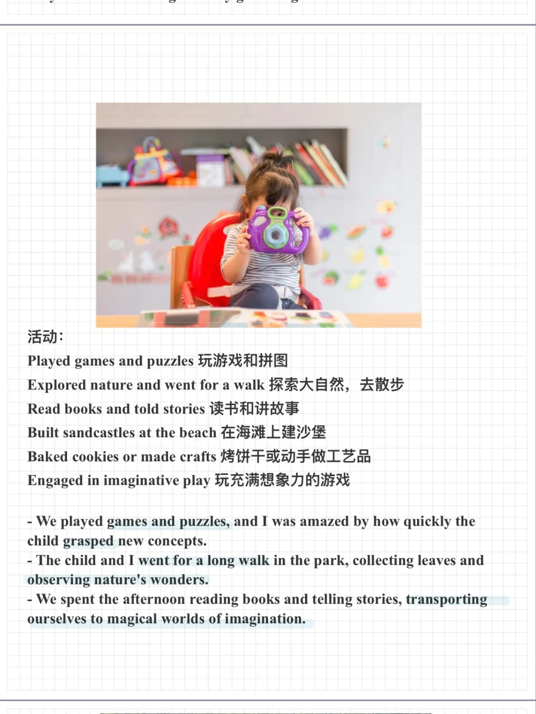

# 雅思口语P2语料｜陪伴孩子的有趣经历

一起来积累素材，回答新题part2:
Describe an occasion when you spent (quite some)
time with a young child
#雅思口语 #雅思攻略 #雅思备考 #雅思口语换题 #雅思考试 #英语口语

## 图片
| 图1 | 图2 | 图3 | 图4 |
| --- | --- | --- | --- |
|  |  |  |   |

生成时间：2025-11-15 01:44:33