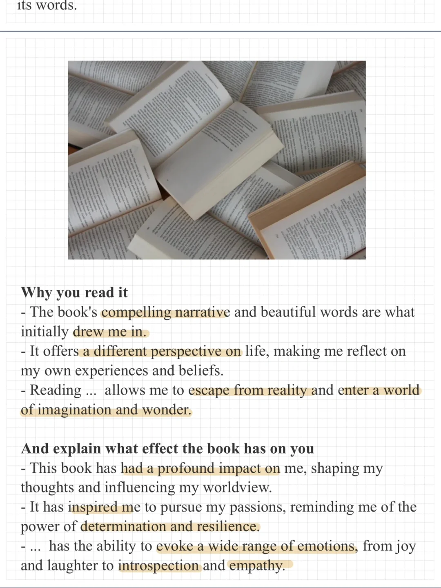
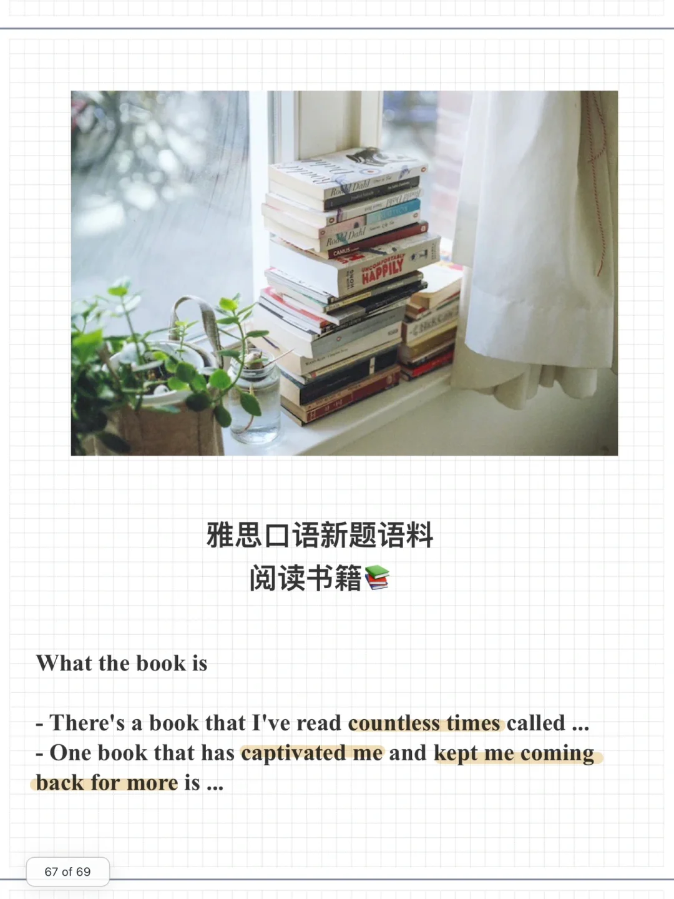
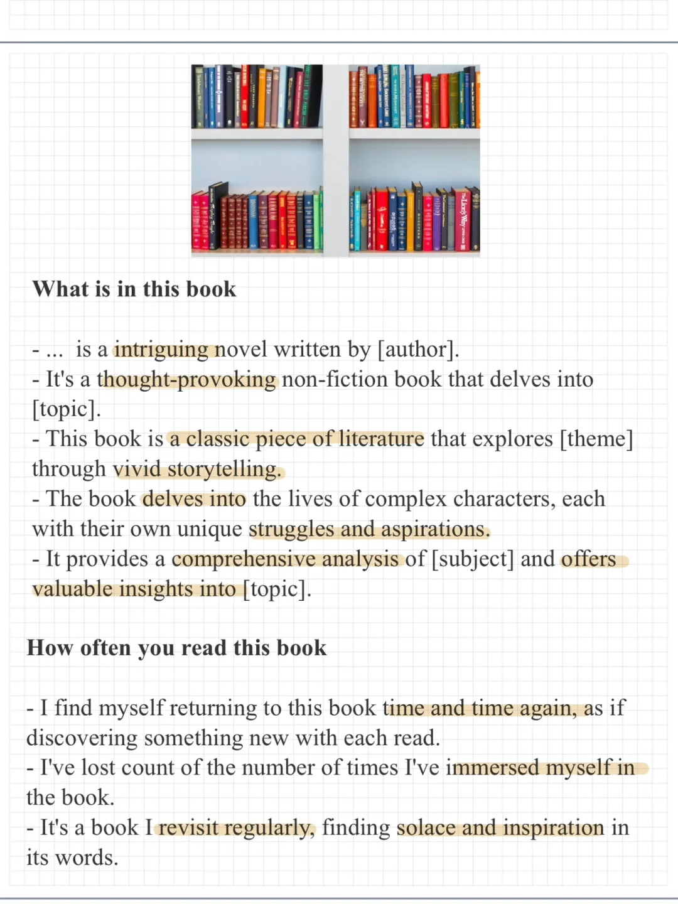

# 雅思口语新题语料｜多次阅读的书籍

新题库中part2题目:
Describe a book that you have read many times多次阅读的书
What the book is
What is in this book
How often you read this book
Why you read it
And explain what effect the book has on you
#雅思口语 #雅思攻略 #雅思备考 #雅思口语换题 #雅思口语高分素材

## 图片
| 图1 | 图2 | 图3 | 图4 |
| --- | --- | --- | --- |
|  |  |  |   |

生成时间：2025-11-15 01:42:22