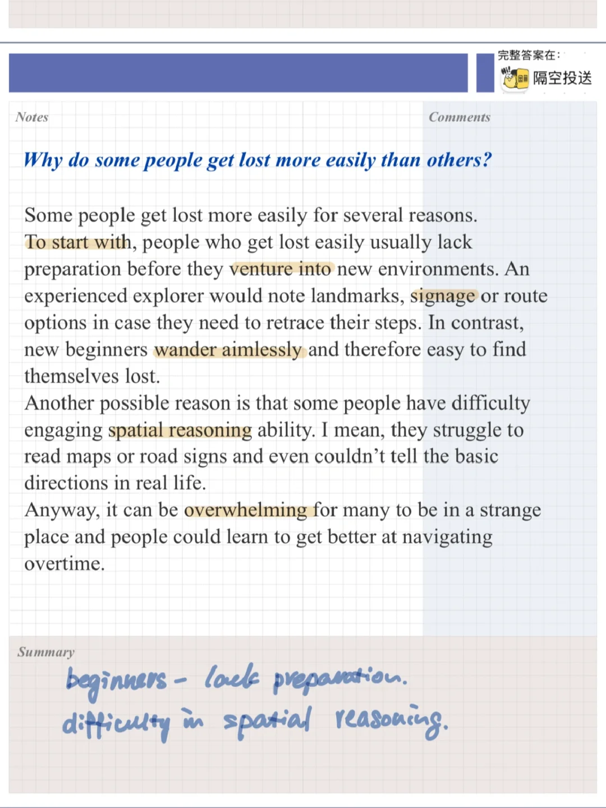
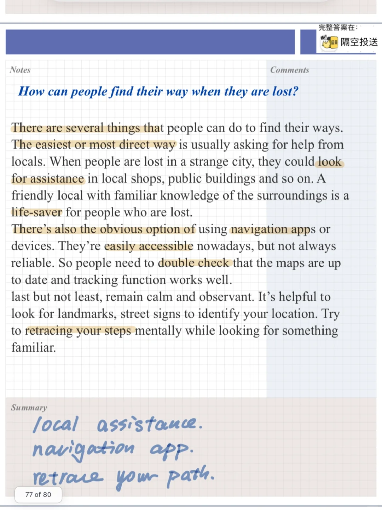
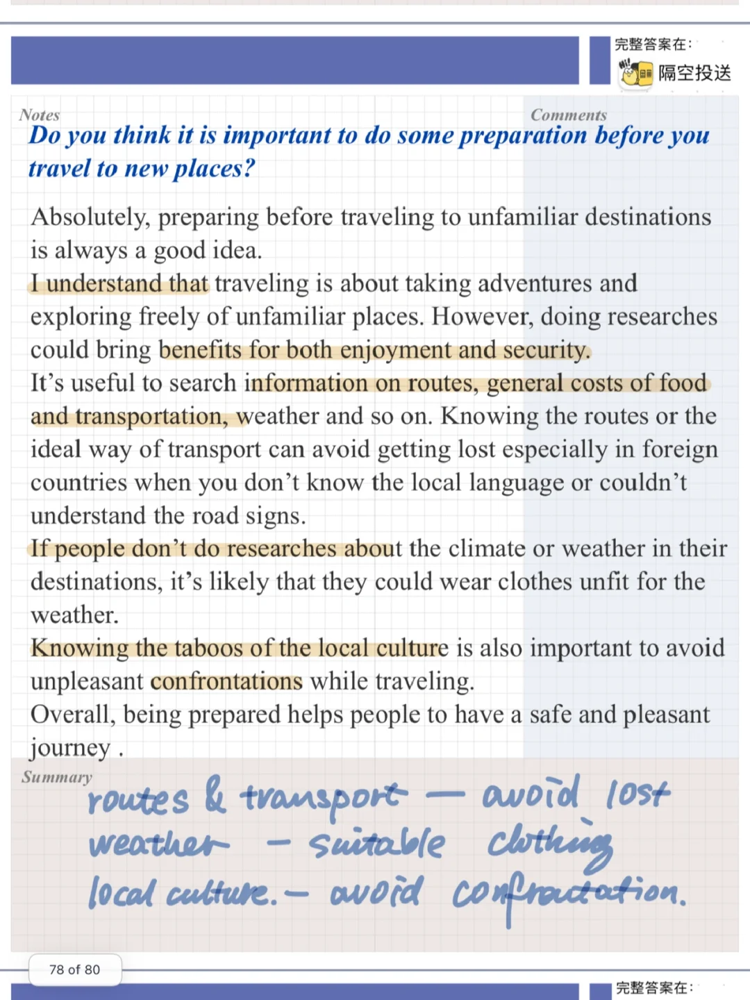
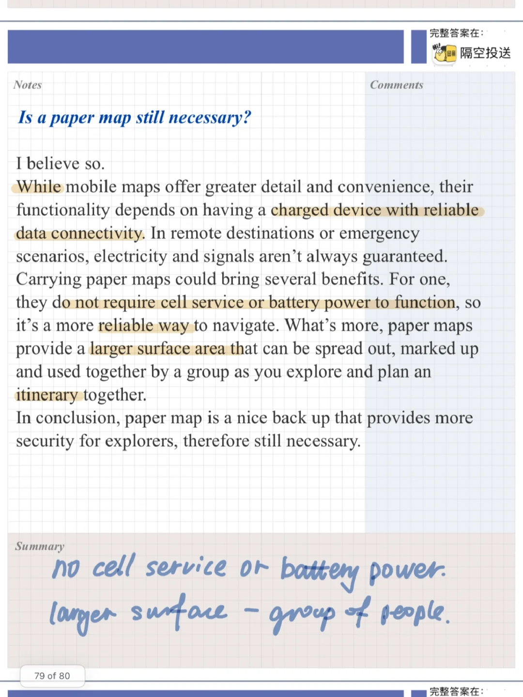

# 雅思口语part3高分参考答案｜迷路

今天分享的答案关于迷路的原因、后怎么办等问题
相关当季part2: Describe an occasion when you lost your way  迷路
Where you were
What happened
How you felt
And explain how you found your way
	
#雅思口语 #雅思攻略 #雅思备考 #雅思口语换题 #雅思 #雅思口语高分范例

## 图片
| 图1 | 图2 | 图3 | 图4 |
| --- | --- | --- | --- |
|  |  |  |  |

生成时间：2025-11-15 01:40:09