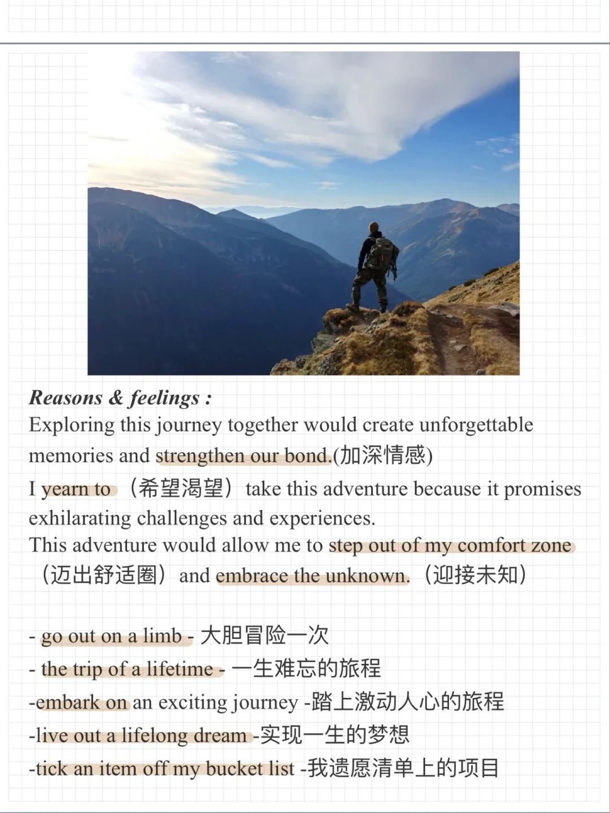
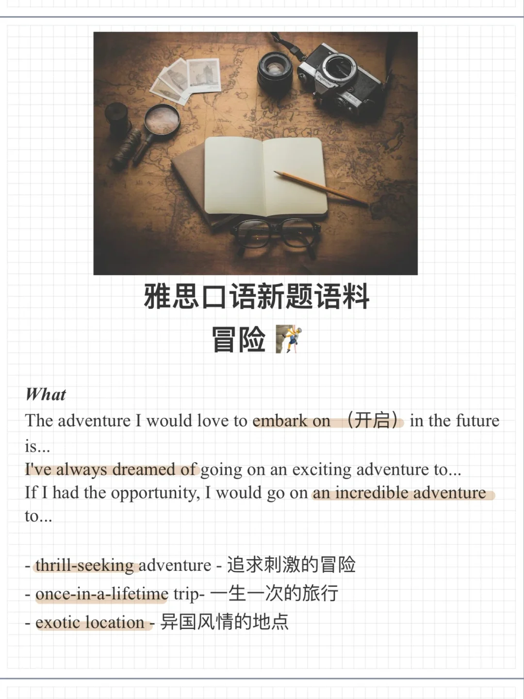
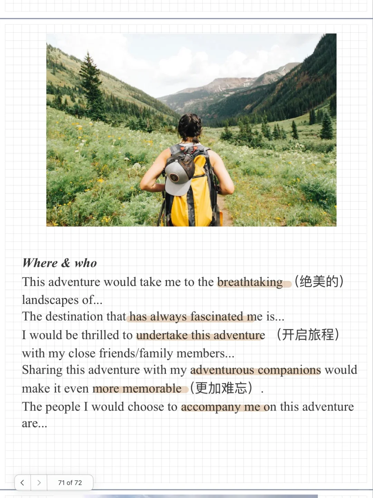

# 雅思口语新题语料｜冒险

一起来积累相关词汇句型，描述自己计划的一场冒险吧～
Describe an adventure you would like to take in the future 冒险
What the adventure is
Where you would go
Who you would be with
And explain why you would like to take the adventure
#雅思口语 #雅思攻略 #雅思备考 #雅思口语换题 #雅思 #雅思高分

## 图片
| 图1 | 图2 | 图3 | 图4 |
| --- | --- | --- | --- |
|  |  |  |   |

生成时间：2025-11-15 01:39:04