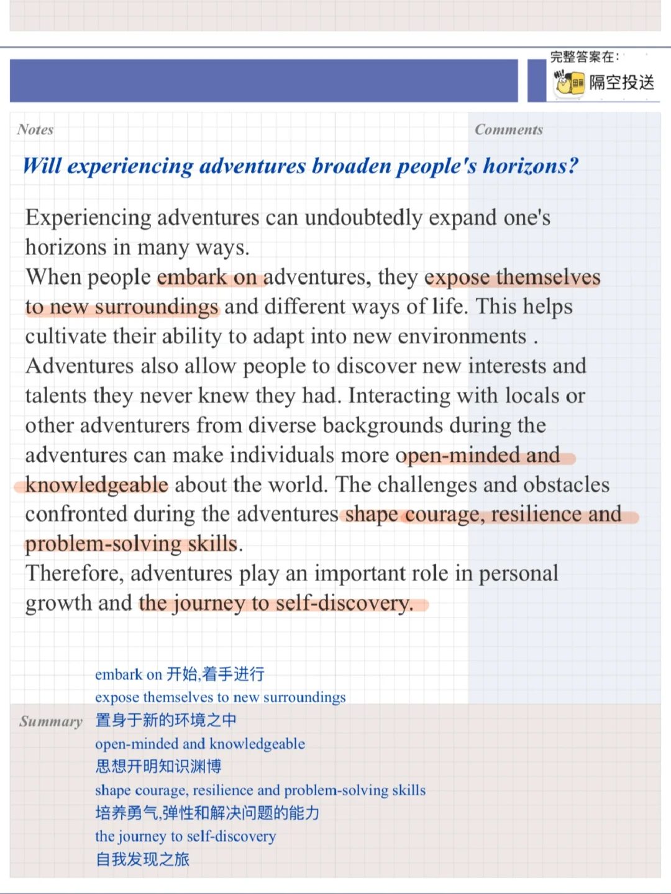
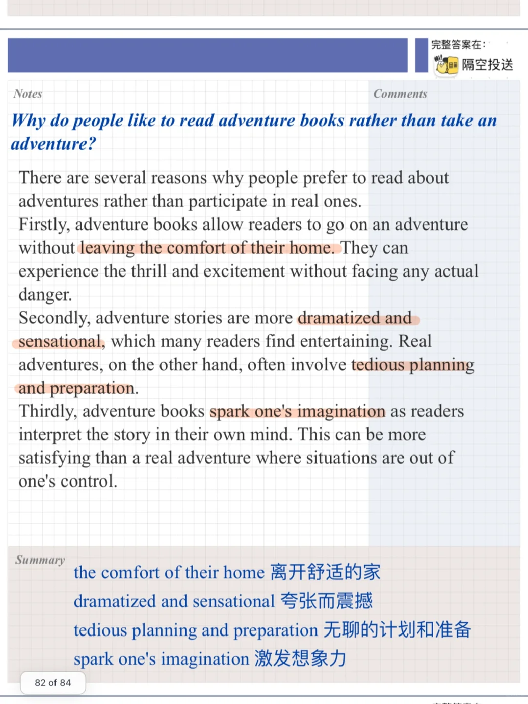
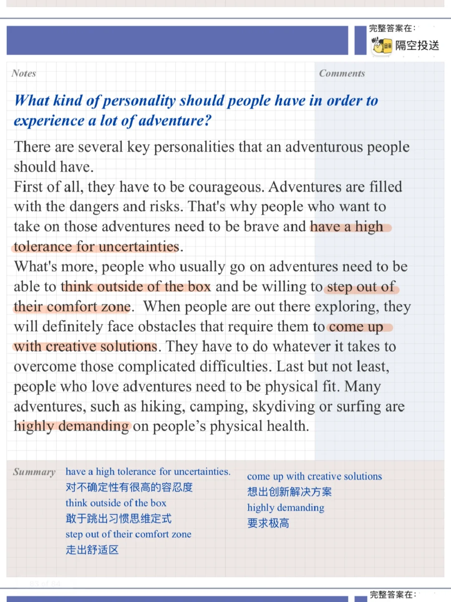

# 雅思口语高分part3｜冒险

今天分享的part3主题关于冒险
🌟对应part2: Describe an adventure you would like to take in the future 冒险
What the adventure is
Where you would go
Who you would be with
And explain why you would like to take the adventure
	
一起练习这几个问题吧：
1⃣️Who likes to read adventure books?
2⃣️Why do people like to read adventure books rather than take an adventure?
3⃣️What kind of personality should people have in order to experience a lot of adventure?
4⃣️Will experiencing adventures broaden people's horizons?
#雅思口语 #雅思攻略 #雅思备考 #雅思口语换题 #雅思 #雅思口语高分示范

## 图片
| 图1 | 图2 | 图3 | 图4 |
| --- | --- | --- | --- |
|  |  |  |  |

生成时间：2025-11-15 01:37:58