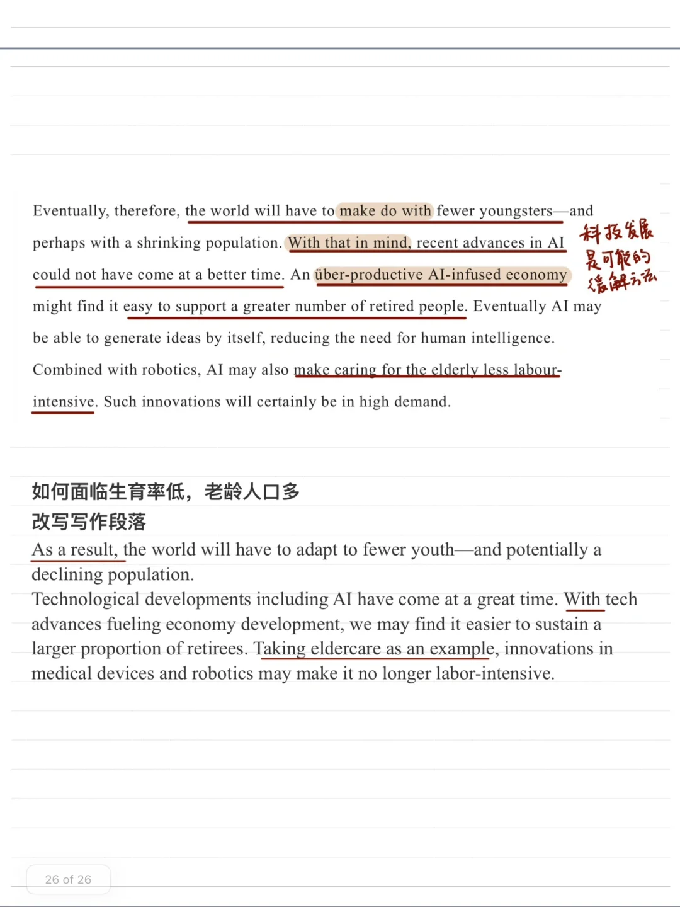
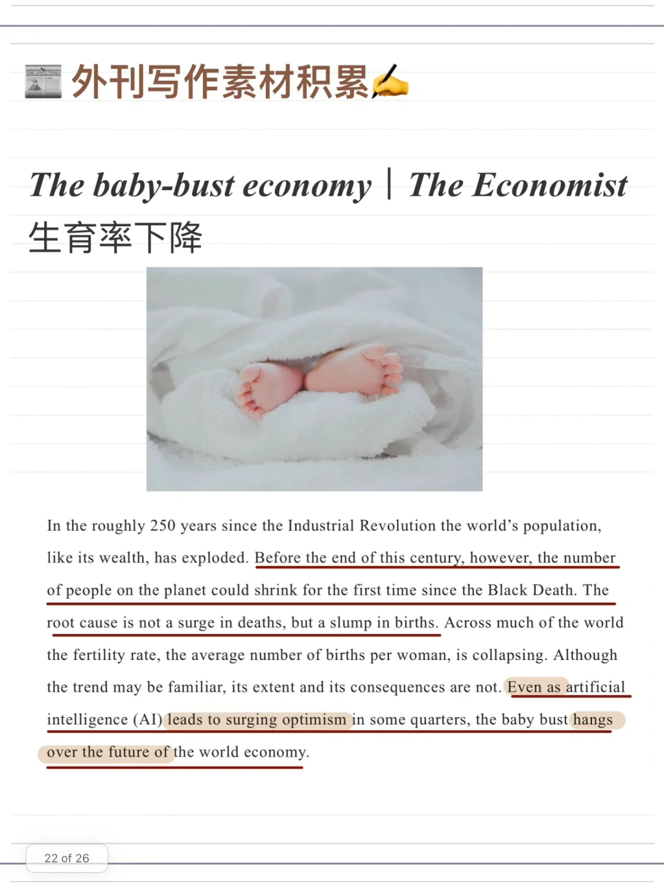
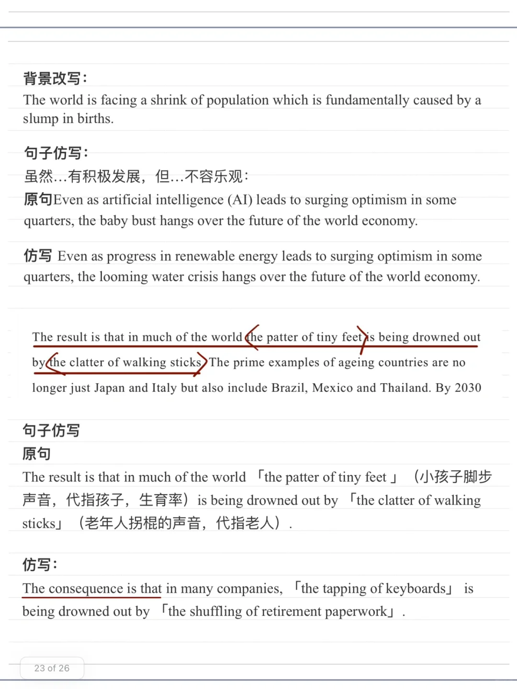
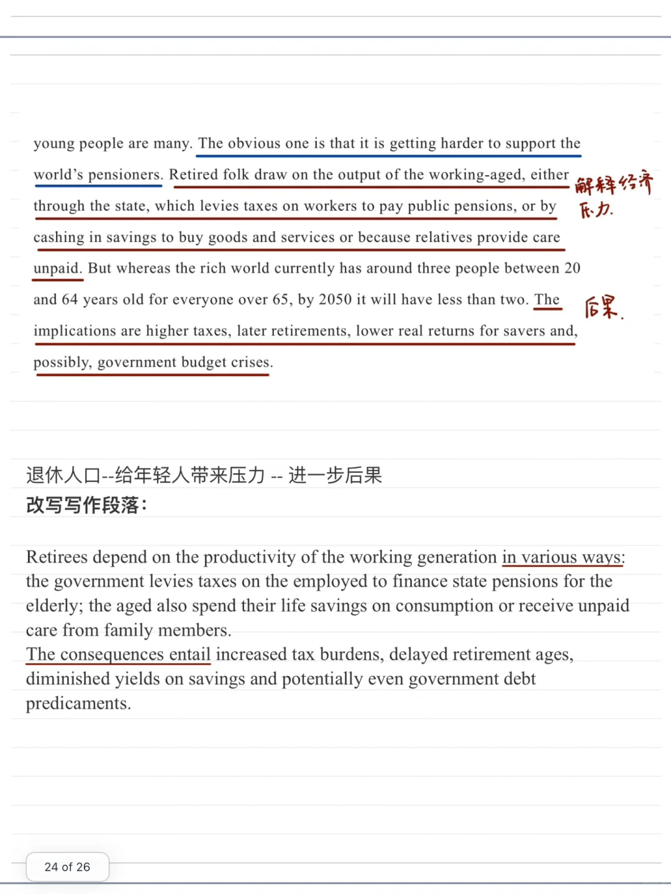
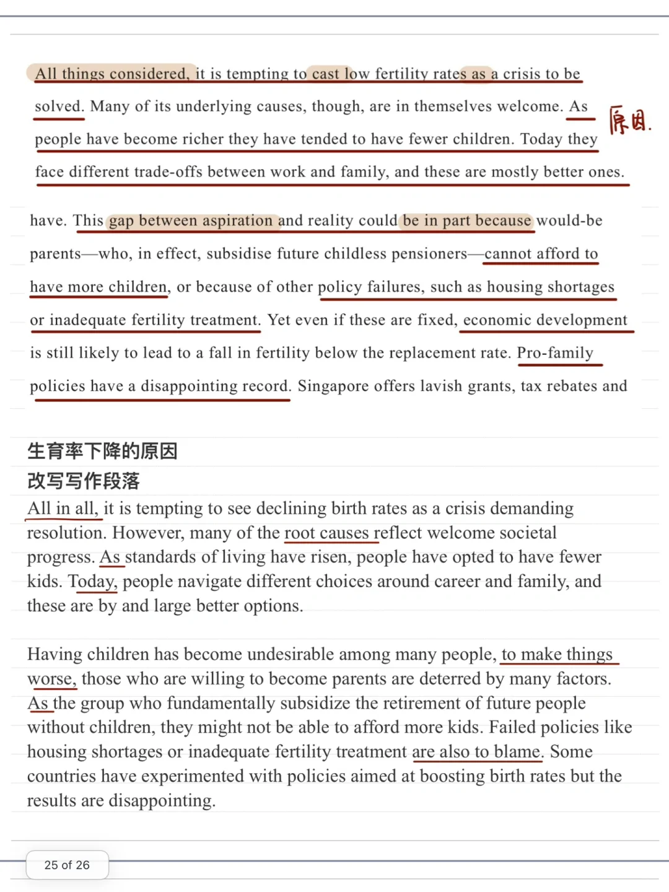

# 从外刊中提取写作素材｜生育率下降

尝试通过阅读外刊积累更多写作素材和观点
今天的外刊资料来源于经济学人关于生育率下降的文章
改写角度有 生育率下降的原因，导致的后果，可能的应对方法。
#雅思攻略  #雅思备考 #写作素材 #雅思写作 #写作如何找观点

## 图片
| 图1 | 图2 | 图3 | 图4 |
| --- | --- | --- | --- |
|  |  |  |  |
|  |   |   |   |

生成时间：2025-11-15 01:35:48