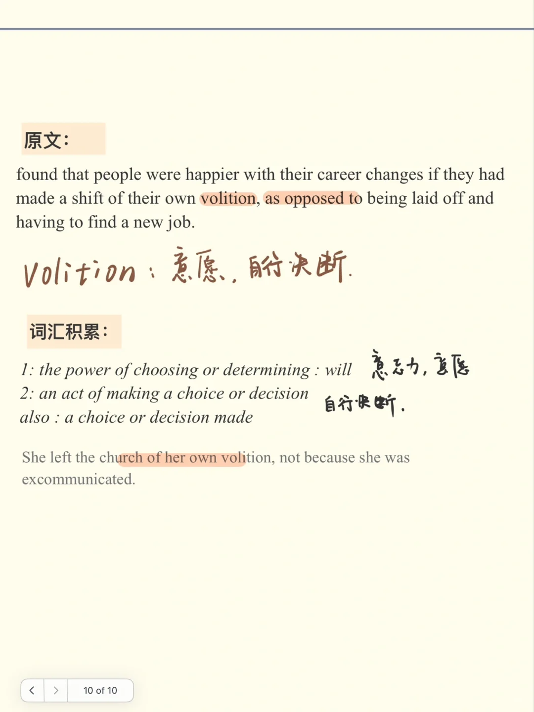
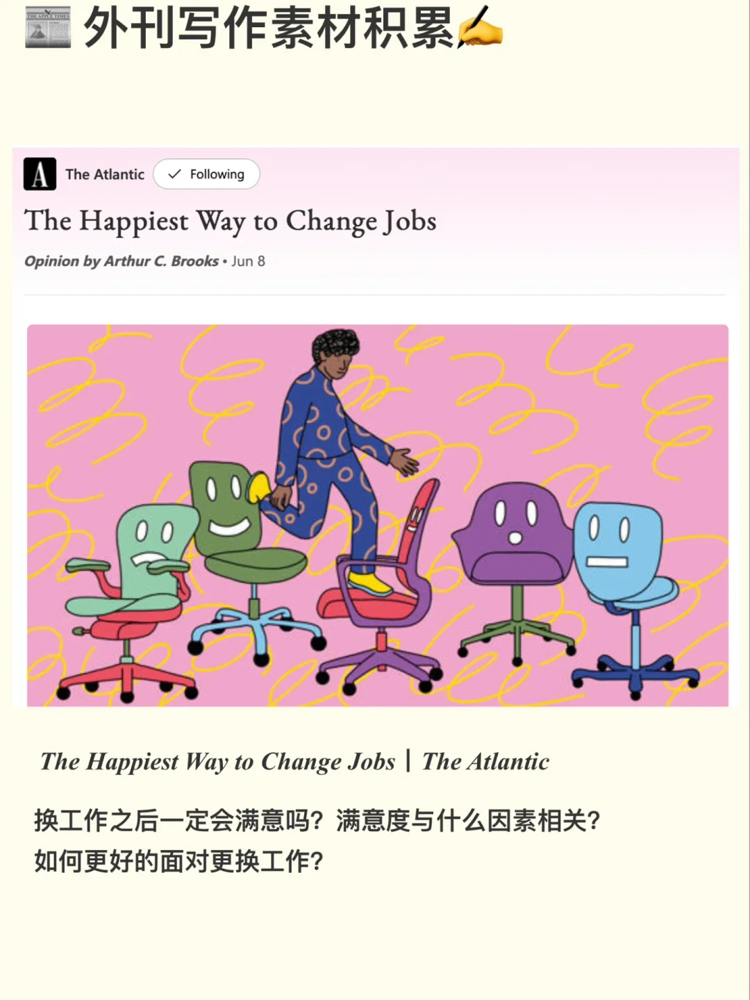
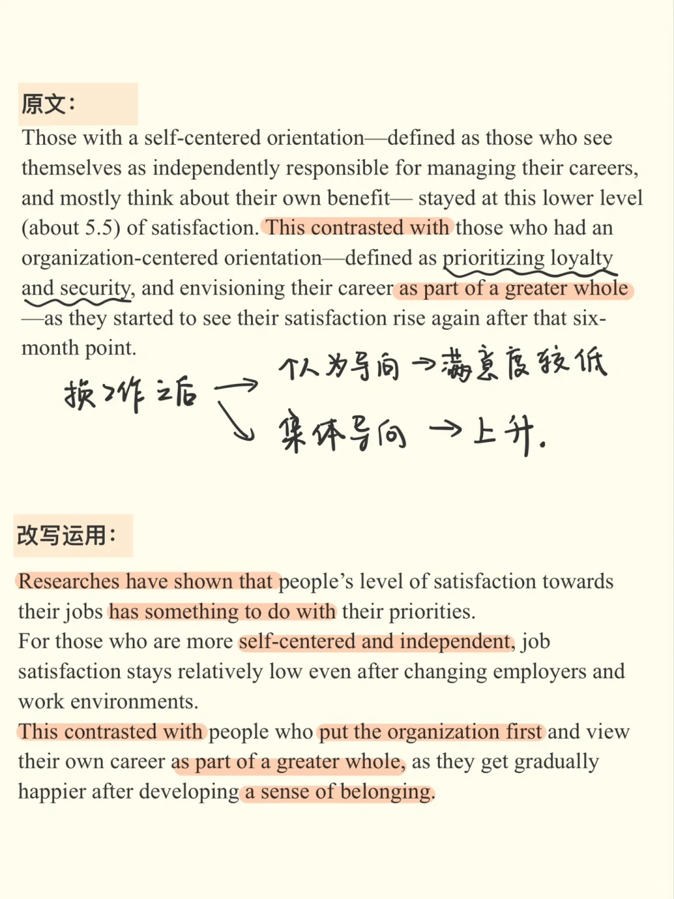
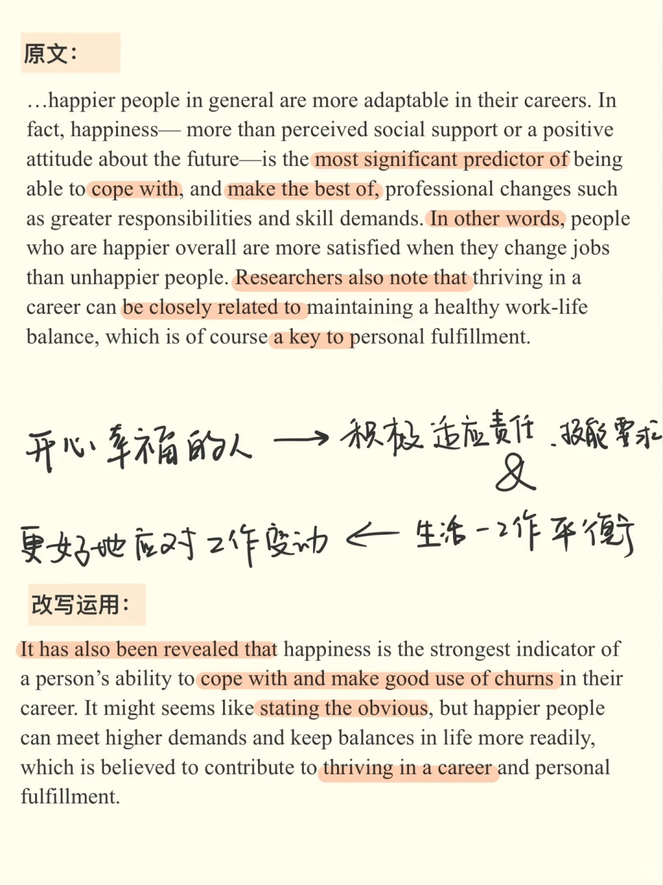
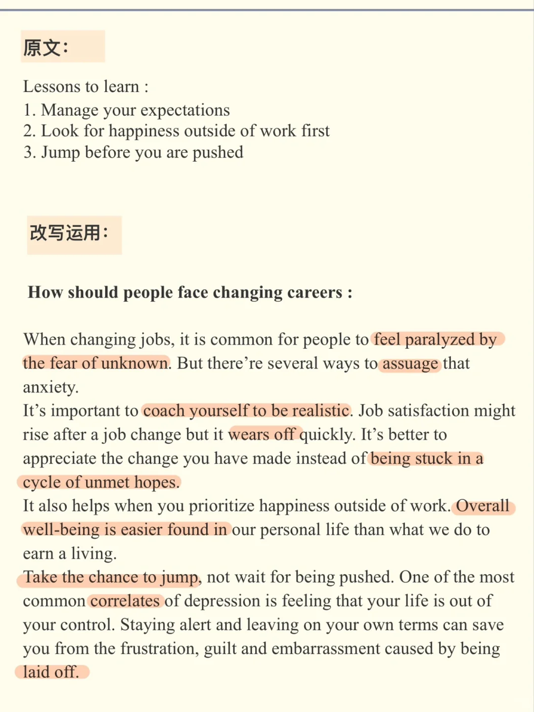
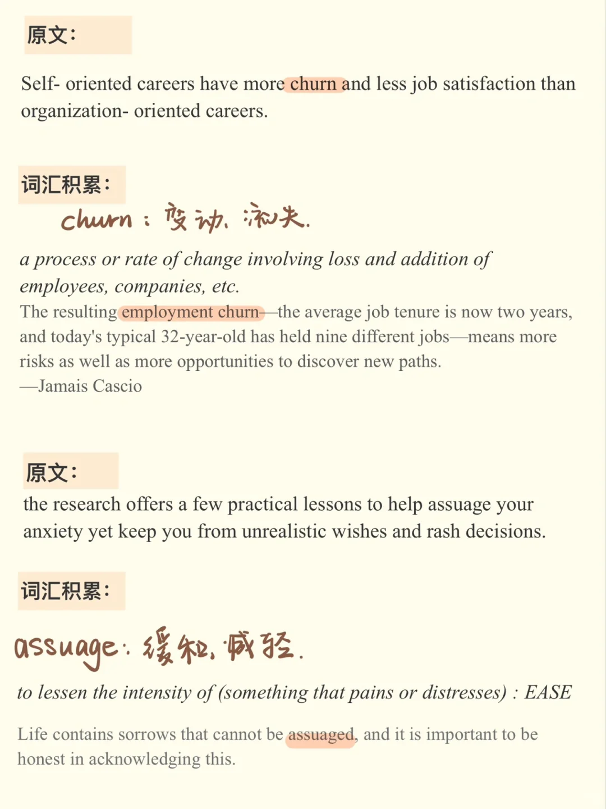

# 外刊如何变写作素材｜工作主题

文章来自 The Atlantic ： the happiest way to change jobs
	
可以用于“科技更新面临的工作变动”“工作不开心该不该换”等话题讨论
雅思口语part3也有类似话题
#雅思口语 #雅思备考 #写作素材 #外刊精读 #大西洋月刊 #雅思写作

## 图片
| 图1 | 图2 | 图3 | 图4 |
| --- | --- | --- | --- |
|  |  |  |  |
|  |  |   |   |

生成时间：2025-11-15 01:34:42