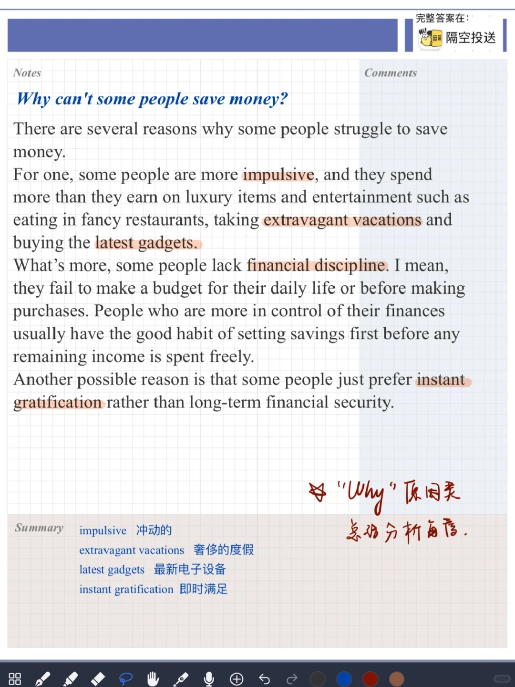
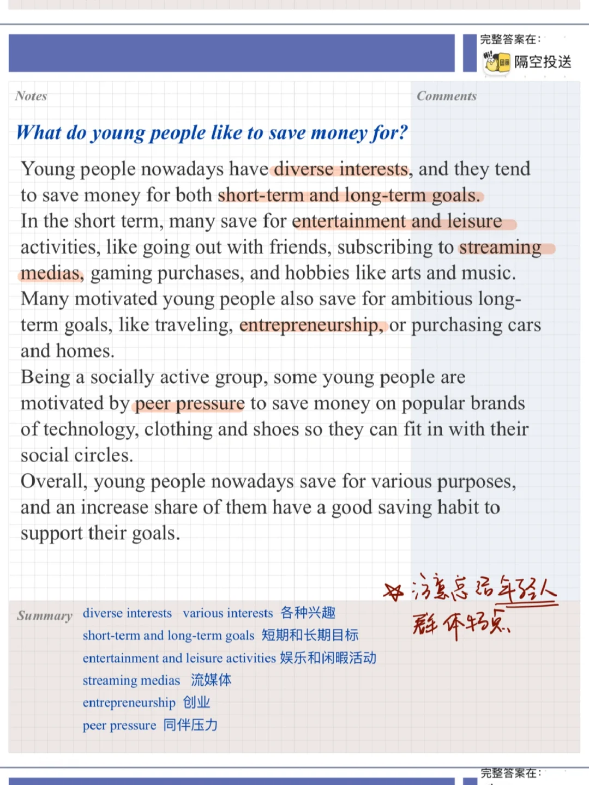
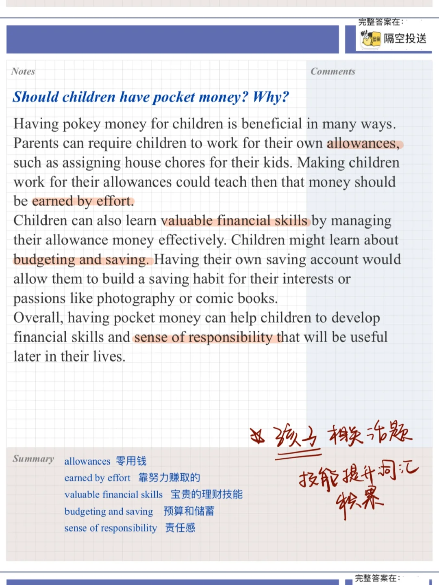
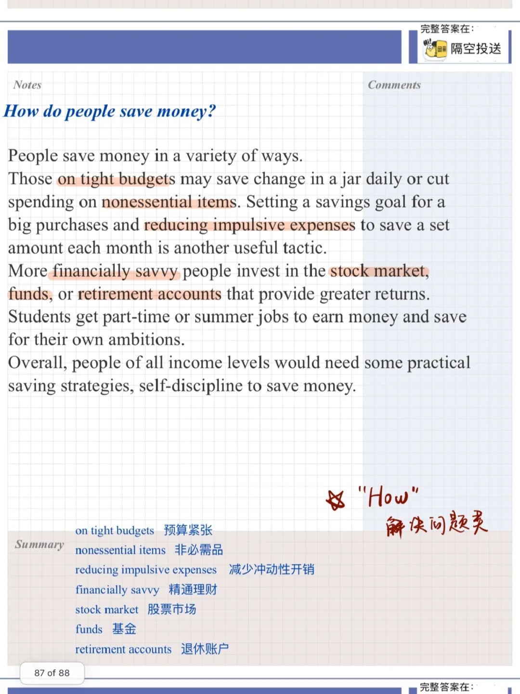

# 雅思口语part3高分参考｜省钱买礼物

今天练习的题目相关“省钱”主题
对应part2:
Describe an expensive gift that you would like to give someone when you save a lot of money 存钱买贵重礼物
What the gift is
Who you will give the gift to
How long it will take to save the money
And explain why you would like to give the gift to this person
#雅思口语 #雅思攻略 #雅思口语换题 #雅思口语高分示范 #雅思口语part3

## 图片
| 图1 | 图2 | 图3 | 图4 |
| --- | --- | --- | --- |
|  |  |  |  |

生成时间：2025-11-15 01:33:37