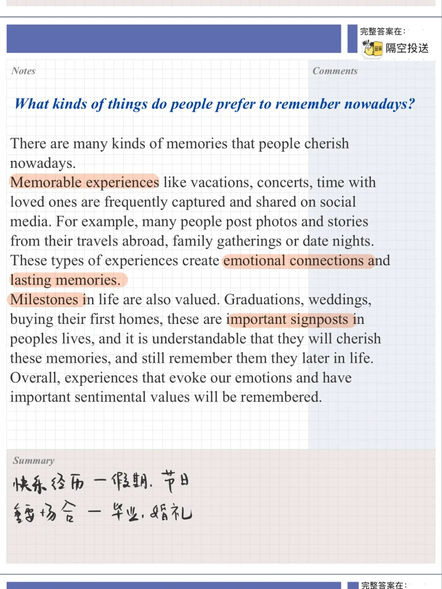
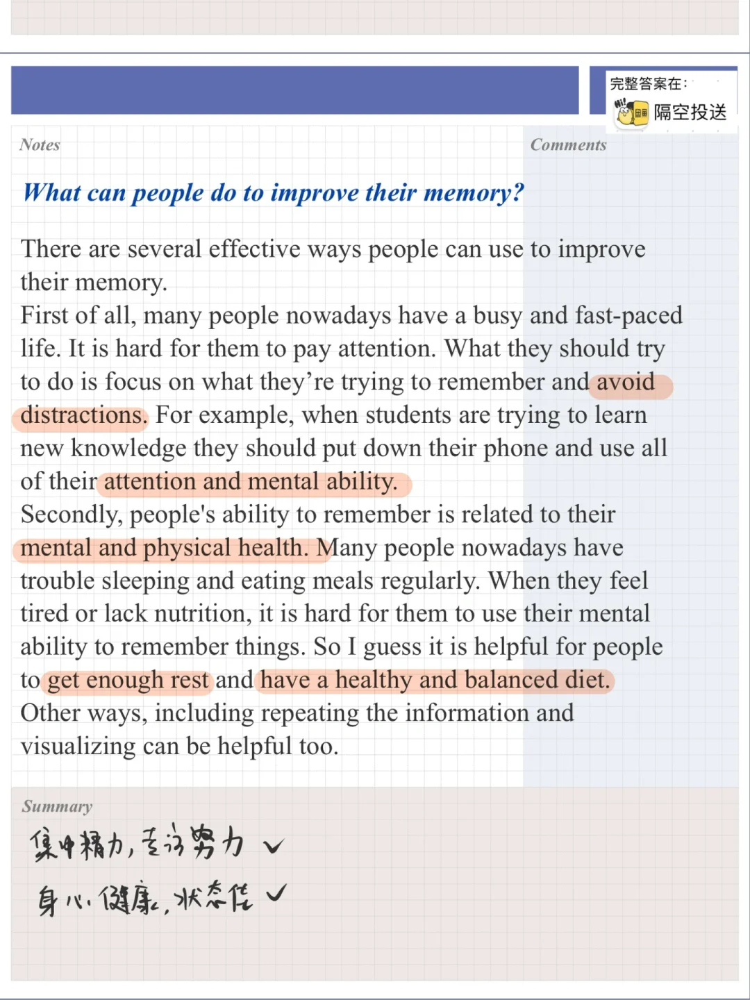
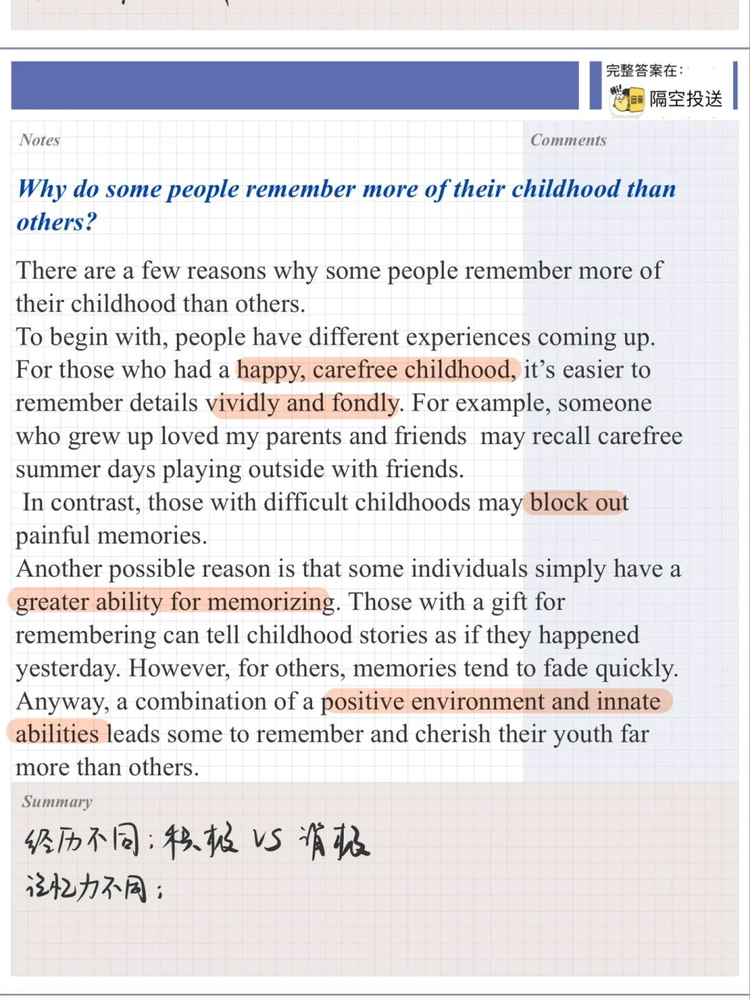
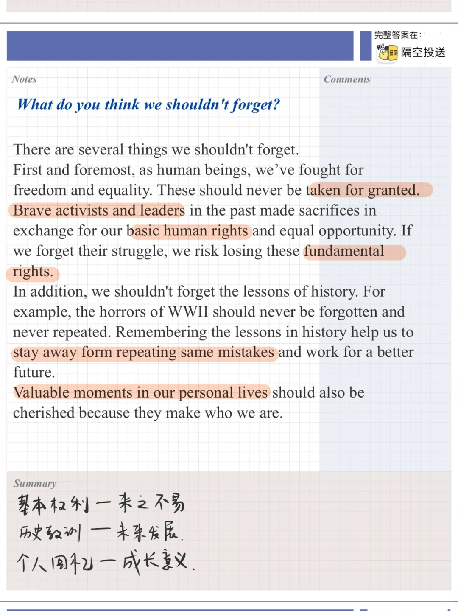

# 雅思口语part3高分参考答案｜童年趣事

今天的part3讨论关于记忆、回忆主题
相关part2:
Describe an enjoyable experience in your childhood 童年趣事
What it is
Who you were with
What you did
Why you felt happy
	
遇到抽象的问题，要自己在思路上努力具体化，想一类，比如 “有情感价值的事情值得记忆” 再想几个： 比如婚礼，毕业典礼，生日，重要的成就…
#雅思口语 #雅思攻略 #雅思备考 #雅思口语换题 #雅思口语高分示范

## 图片
| 图1 | 图2 | 图3 | 图4 |
| --- | --- | --- | --- |
|  |  |  |  |

生成时间：2025-11-15 01:32:31