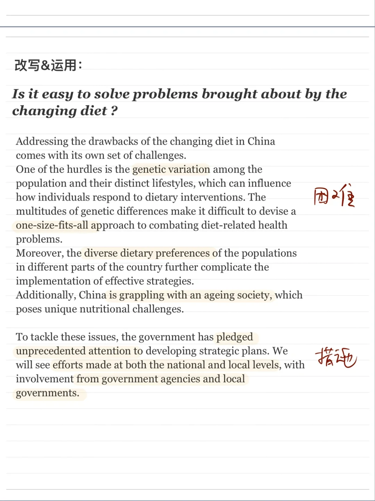
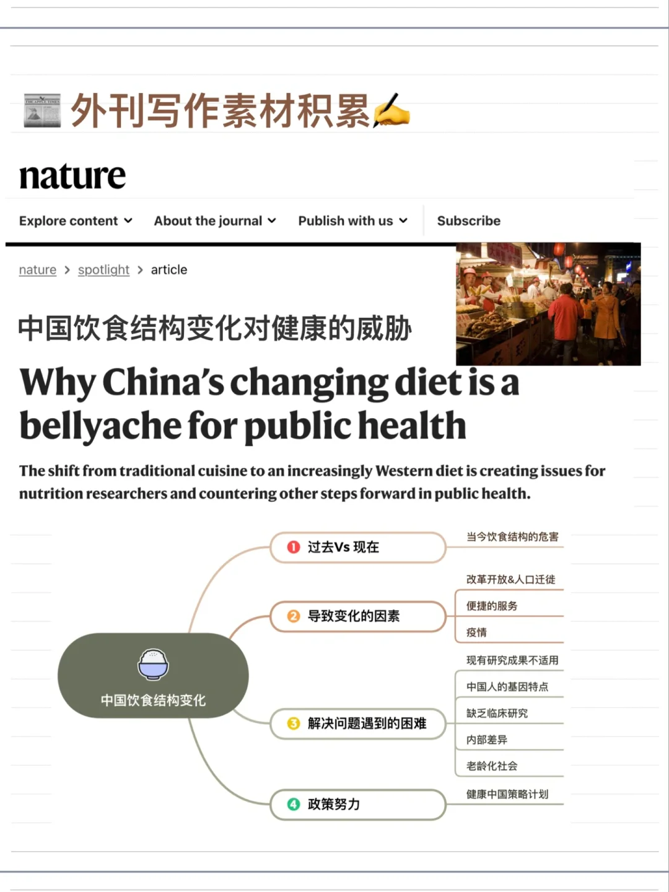
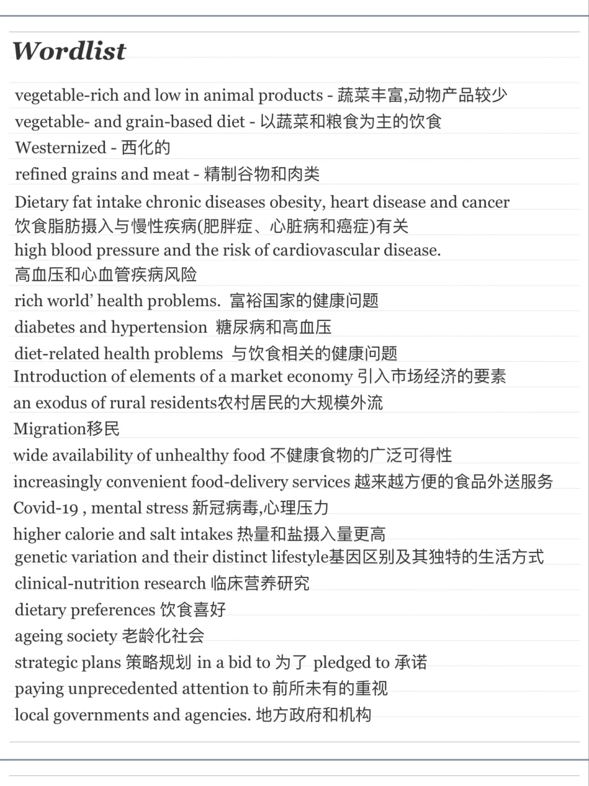
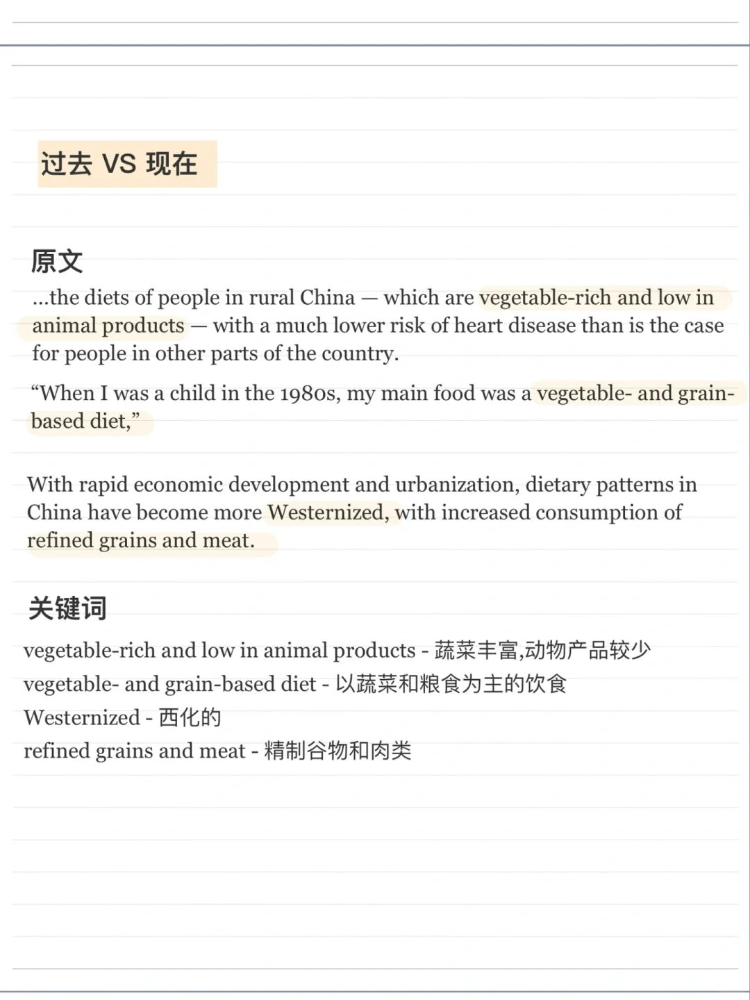
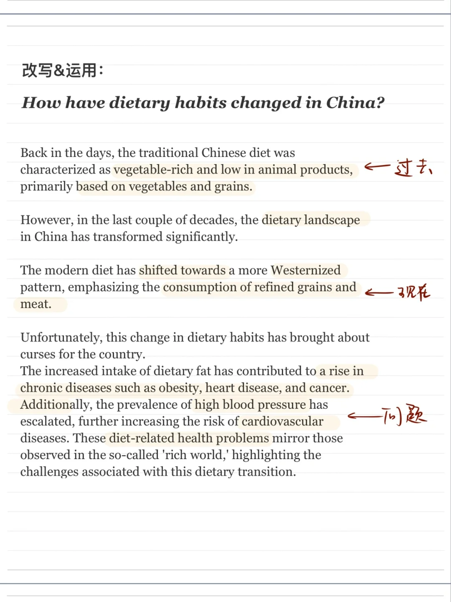
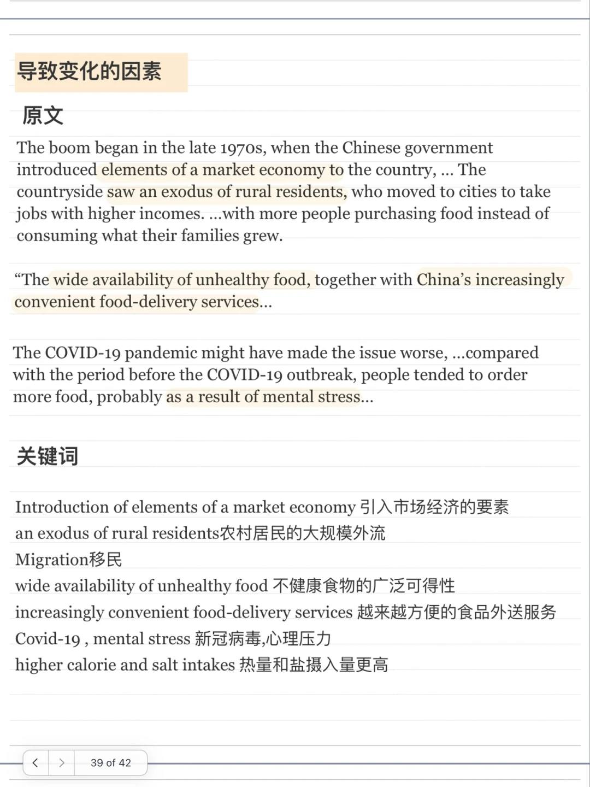
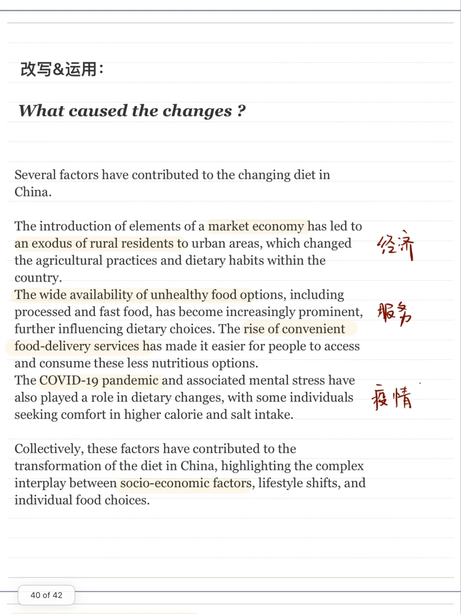
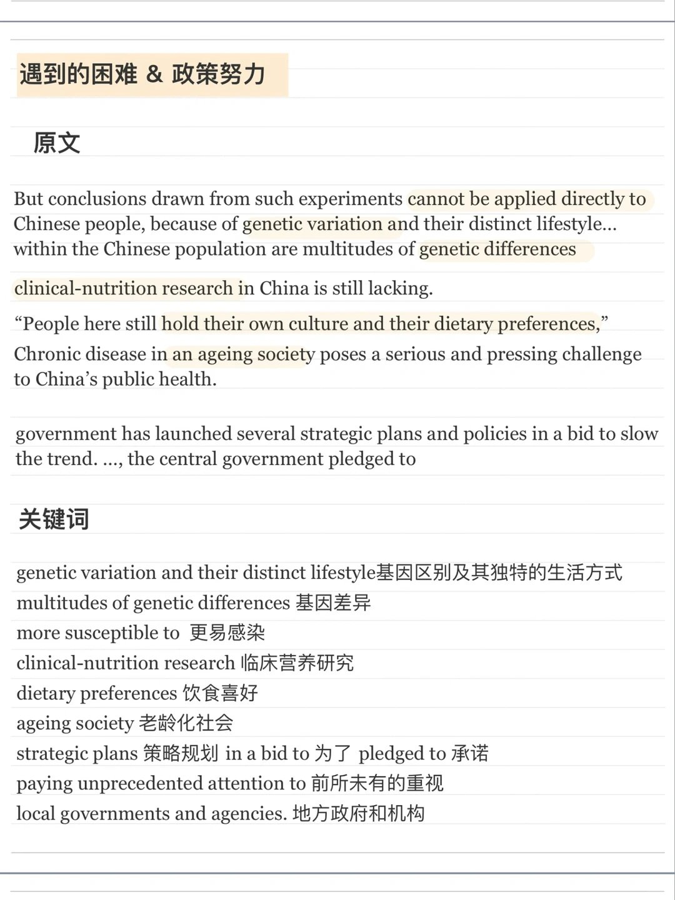

# 外刊变写作素材｜饮食健康主题

文章来自Nature
主要讨论中国居民饮食机构“西化”带来的健康忧虑以及应对时会遇到的中国特色的挑战。
	
针对以下方向改写了素材：
🌟饮食结构的变化有哪些负面影响？
🌟是什么导致了变化？
🌟应对变化遇到哪些困难？政府如何努力？
	
#外刊精读  #雅思口语 #雅思攻略 #雅思备考 #外刊 #雅思写作 #英语写作素材 #英语泛读

## 图片
| 图1 | 图2 | 图3 | 图4 |
| --- | --- | --- | --- |
|  |  |  |  |
|  |  |  |  |
|  |   |   |   |

生成时间：2025-11-15 01:31:26