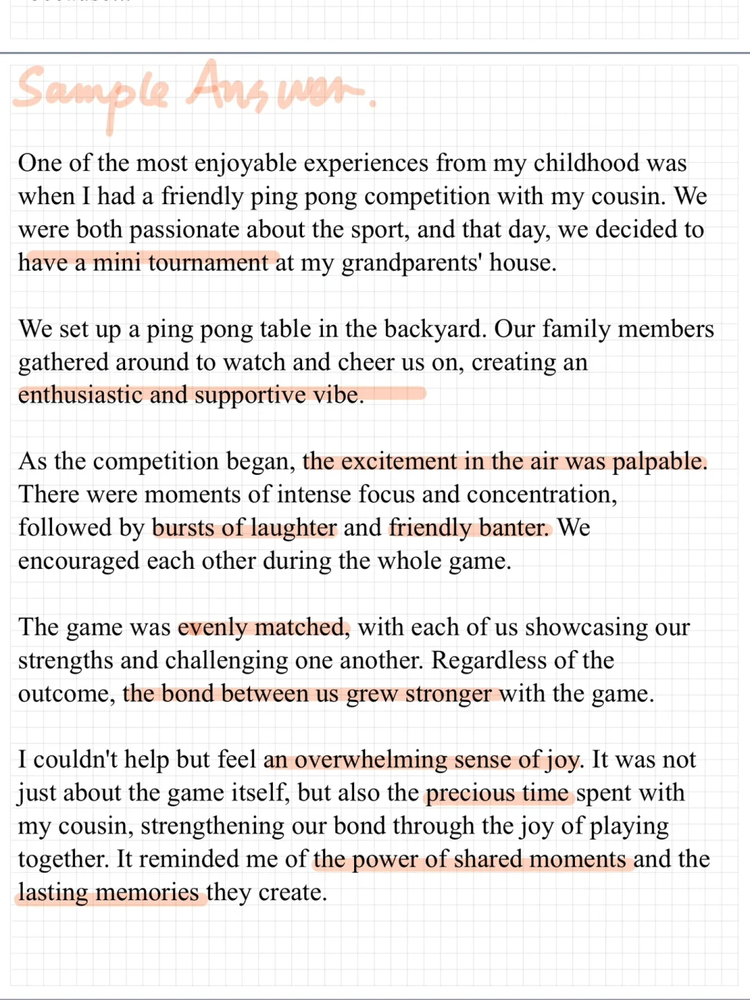
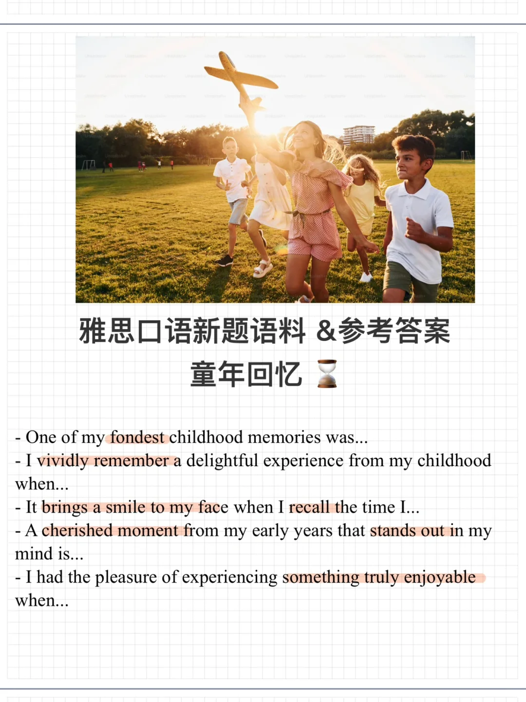
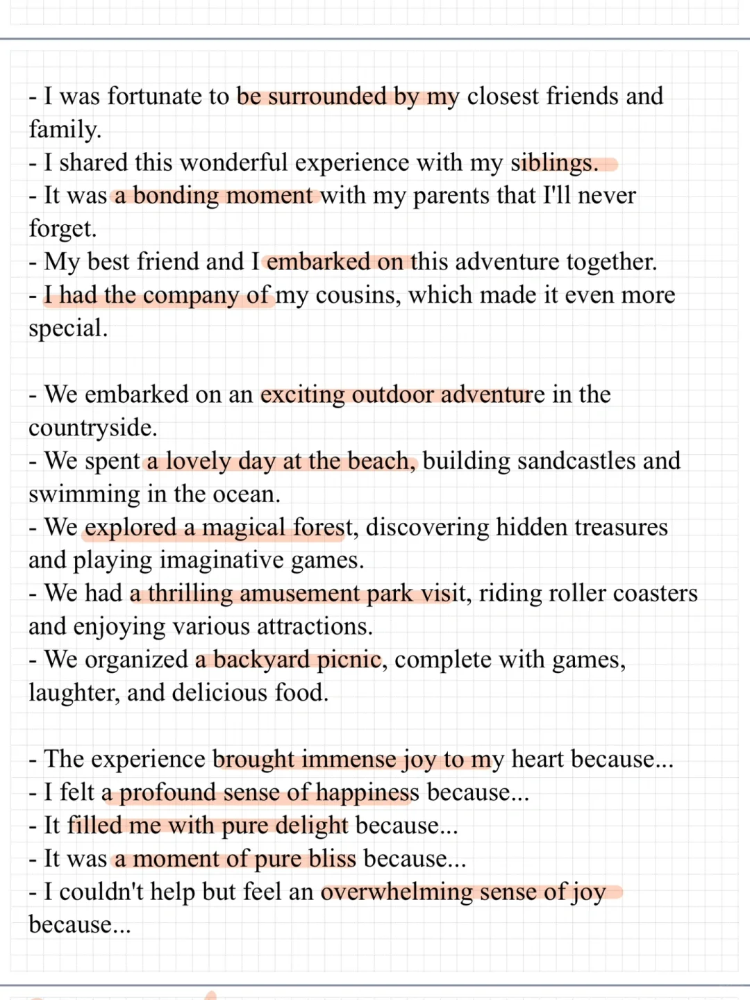

# 雅思口语PART2语料&amp;参考答案｜童年趣事

Describe an enjoyable experience in your childhood童年趣事
What it is
Who you were with
What you did
Why you felt happy
	
#雅思口语 #雅思攻略 #雅思备考 #童年 #雅思 #分手吧雅思 #雅思考试 #雅思口语part2

## 图片
| 图1 | 图2 | 图3 | 图4 |
| --- | --- | --- | --- |
|  |  |  |   |

生成时间：2025-11-15 01:30:18