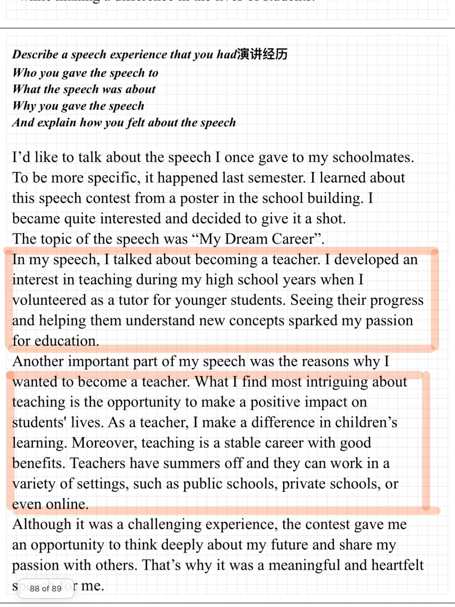
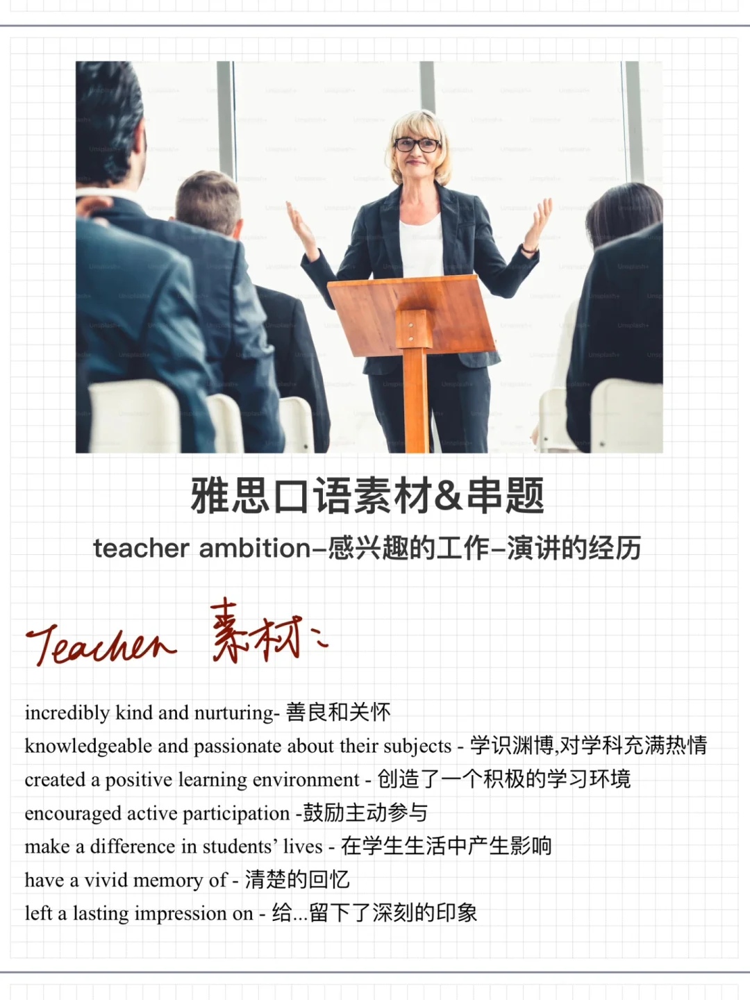
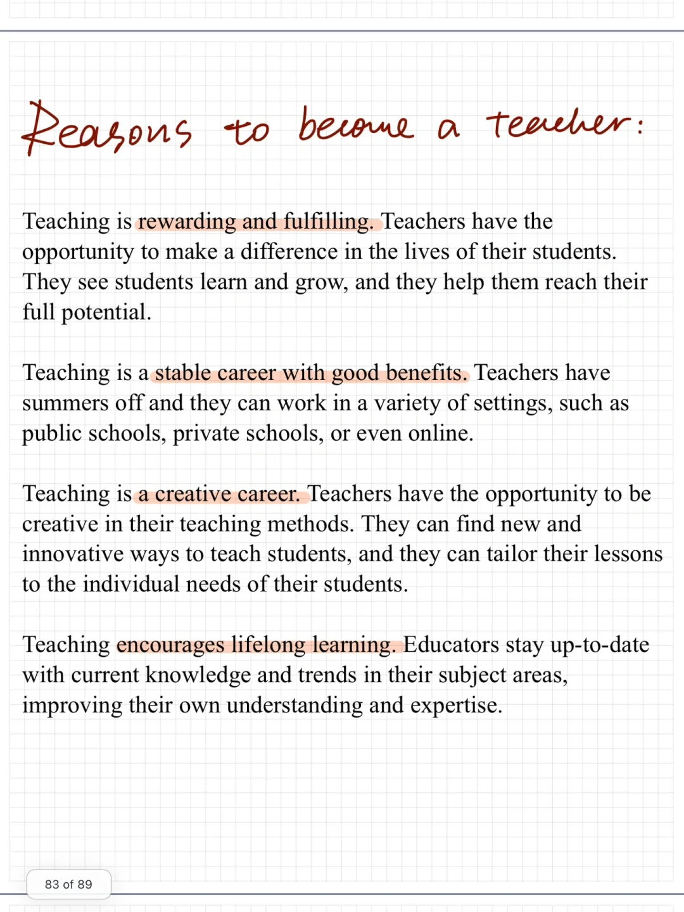
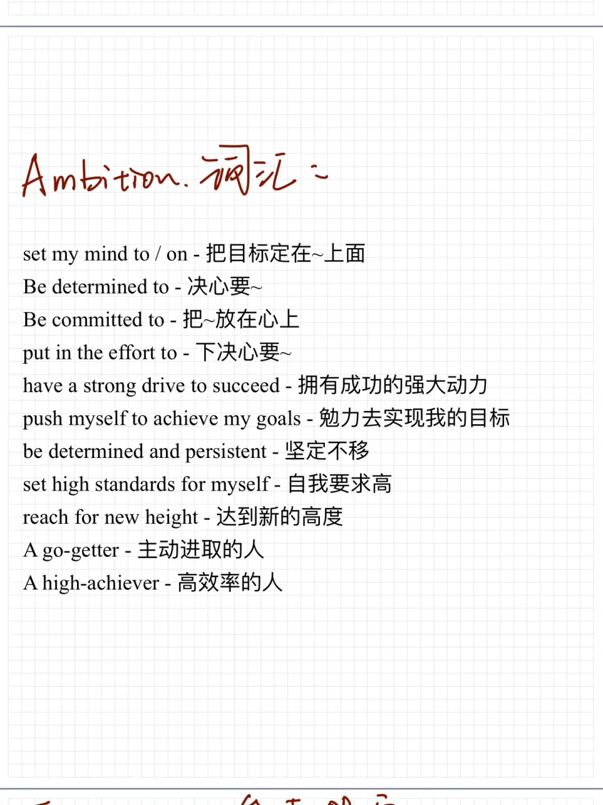
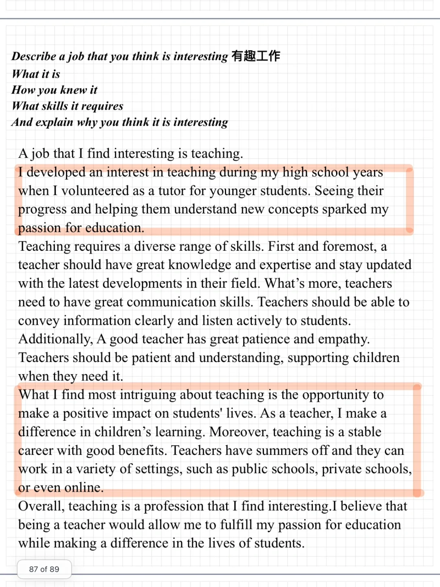

# 要口语素材&amp;串题｜工作&amp;梦想相关

Part 1 teacher ; ambition
Part 2 感兴趣的工作； 演讲的经历
可以串在一起训练，词汇和思路可以有适当重复
今天分享了相关素材和参考答案，快积累起来吧
#雅思口语 #雅思备考 #雅思备考 #雅思口语素材 #素材分享 #雅思

## 图片
| 图1 | 图2 | 图3 | 图4 |
| --- | --- | --- | --- |
|  |  |  |  |
|  |  |  |  |

生成时间：2025-11-15 01:29:13