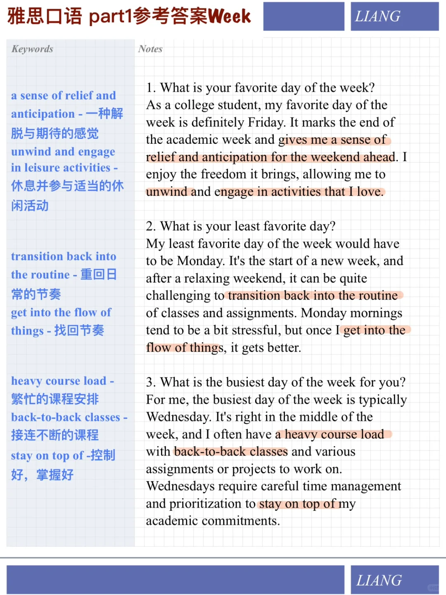

# 雅是口语参考答案｜Part 1 Week

分享讨论日常的话题"week"的参考答案
相关词汇很多适合回答学习计划、日常规划、兴趣等相关题目
快积累起来吧！
#雅思口语 #雅思攻略 #雅思备考 #雅思口语答案 #雅思口语Part1 #雅思口语换题 #学习

## 图片
| 图1 | 图2 | 图3 | 图4 |
| --- | --- | --- | --- |
|  |  |   |   |

生成时间：2025-11-15 01:28:06