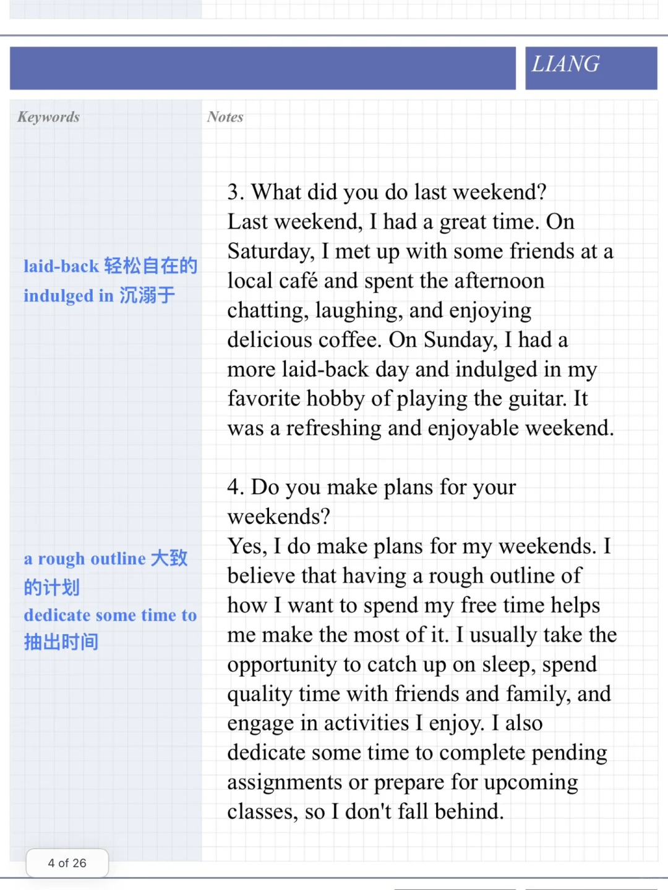
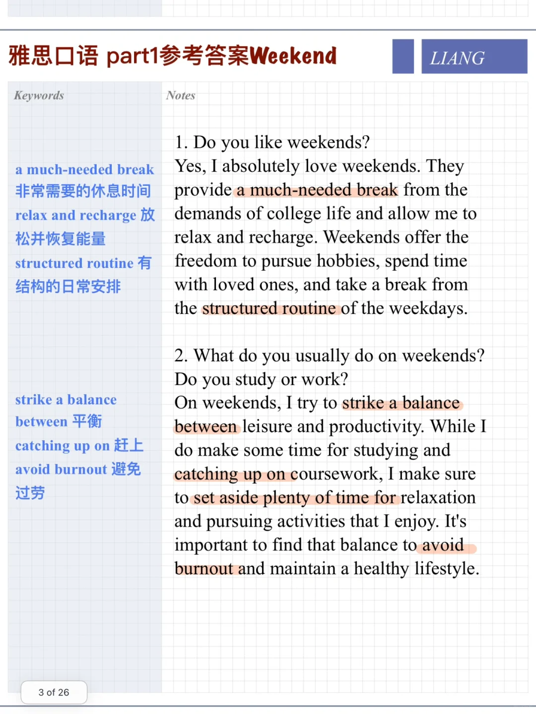

# 雅思口语参考答案｜part1 weekend

今天还是日常习惯类话题，讨论周末安排
可以多补充不同场景、自己的兴趣爱好等，体现答案具体性、个性
#雅思口语 #雅思攻略 #雅思备考 #雅思口语换题 #雅思 #英语口语 #分手吧雅思

## 图片
| 图1 | 图2 | 图3 | 图4 |
| --- | --- | --- | --- |
|  |  |   |   |

生成时间：2025-11-15 01:27:01