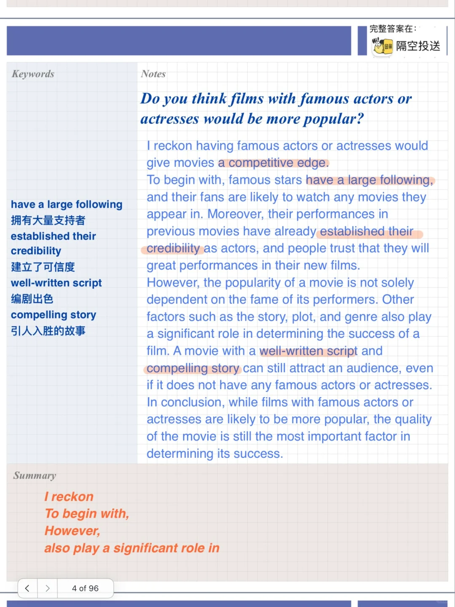
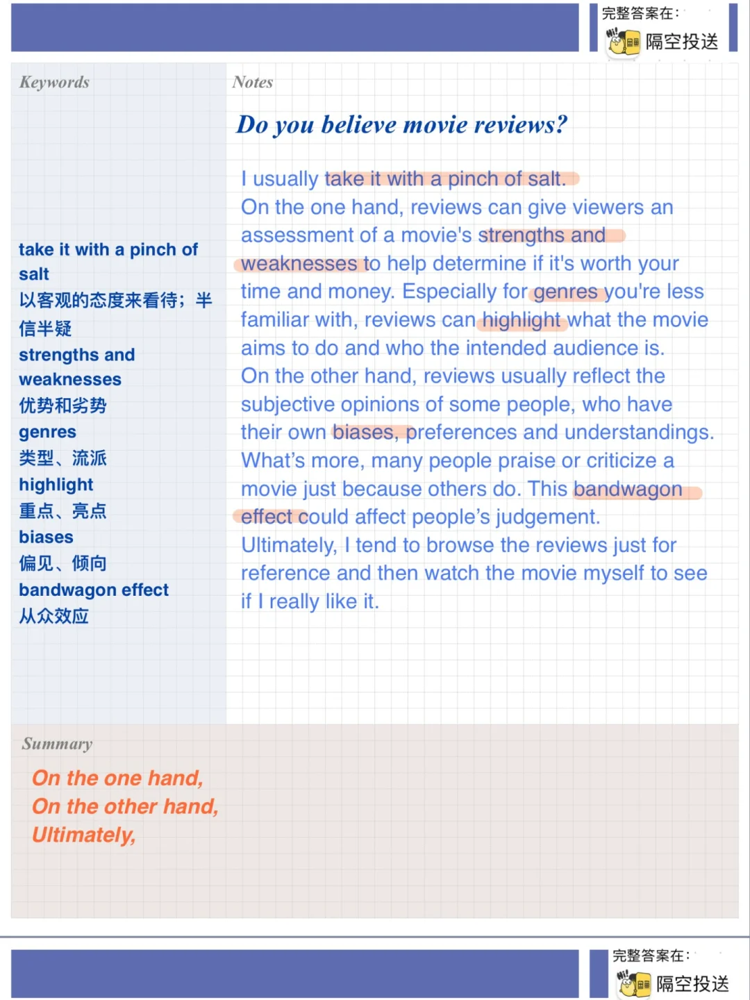
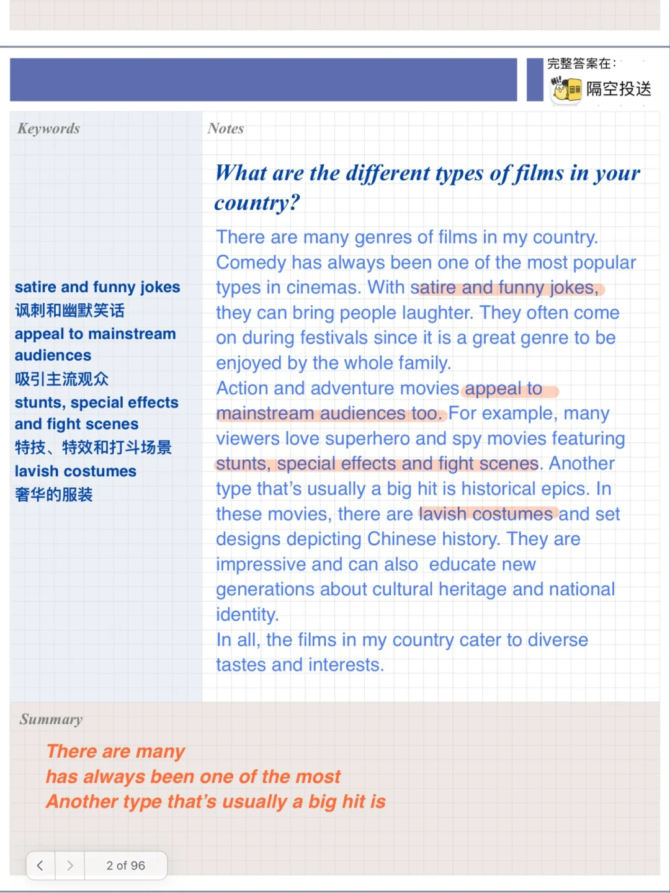
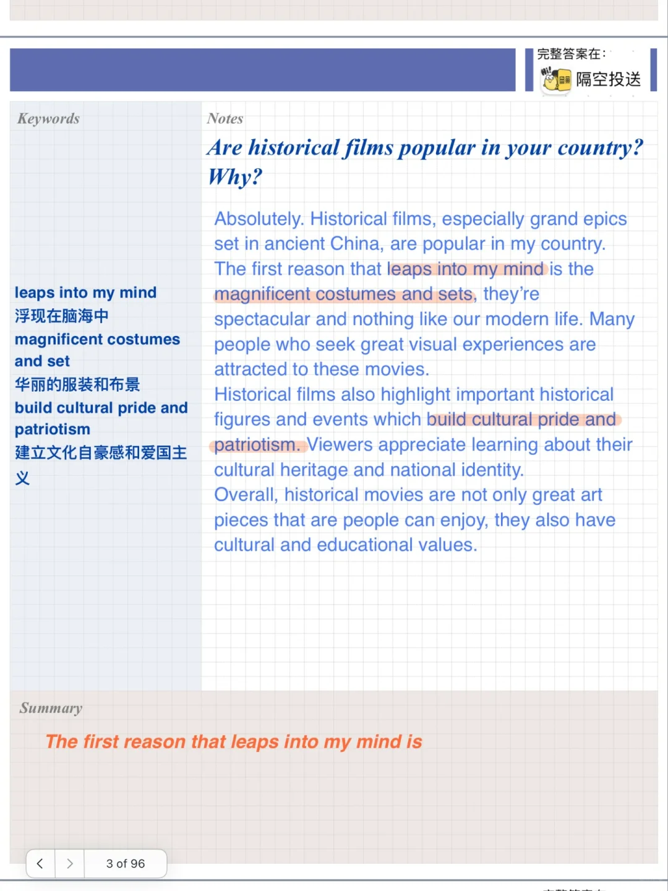

# 雅思口语PART3高分参考｜失望的电影

今天的part3关于电影
相对应part2:
Describe a movie you watched recently that you felt disappointed about让你失望的电影
What it is
What it is about
Why you decided to watch it
Why you were disappointed
	
素材内容涉及到电影类型、不同类型的特点、所吸引的观众等细节
适合讨论电影话题相关的客观、主观问题，快积累起来吧
#雅思口语 #雅思攻略 #雅思备考 #雅思口语素材 #雅思口语换题 #雅思 #雅思口语高分

## 图片
| 图1 | 图2 | 图3 | 图4 |
| --- | --- | --- | --- |
|  |  |  |  |

生成时间：2025-11-15 01:24:52