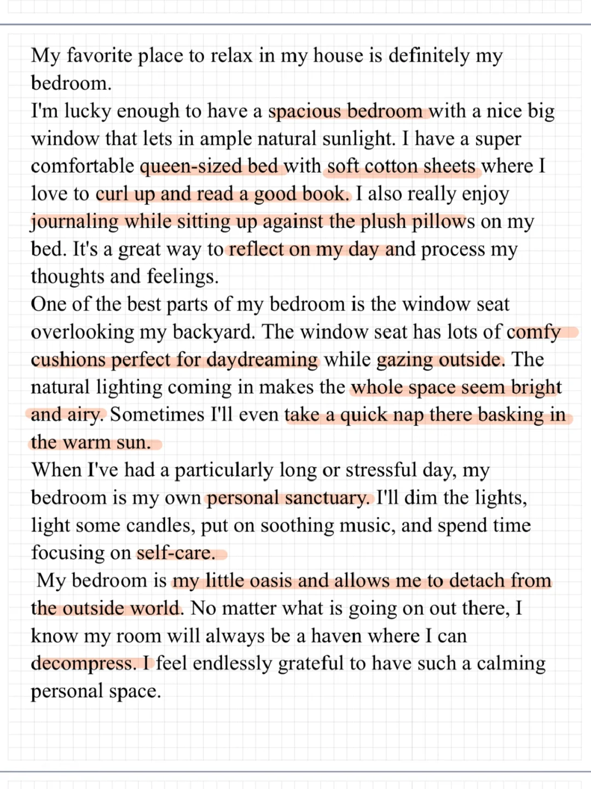
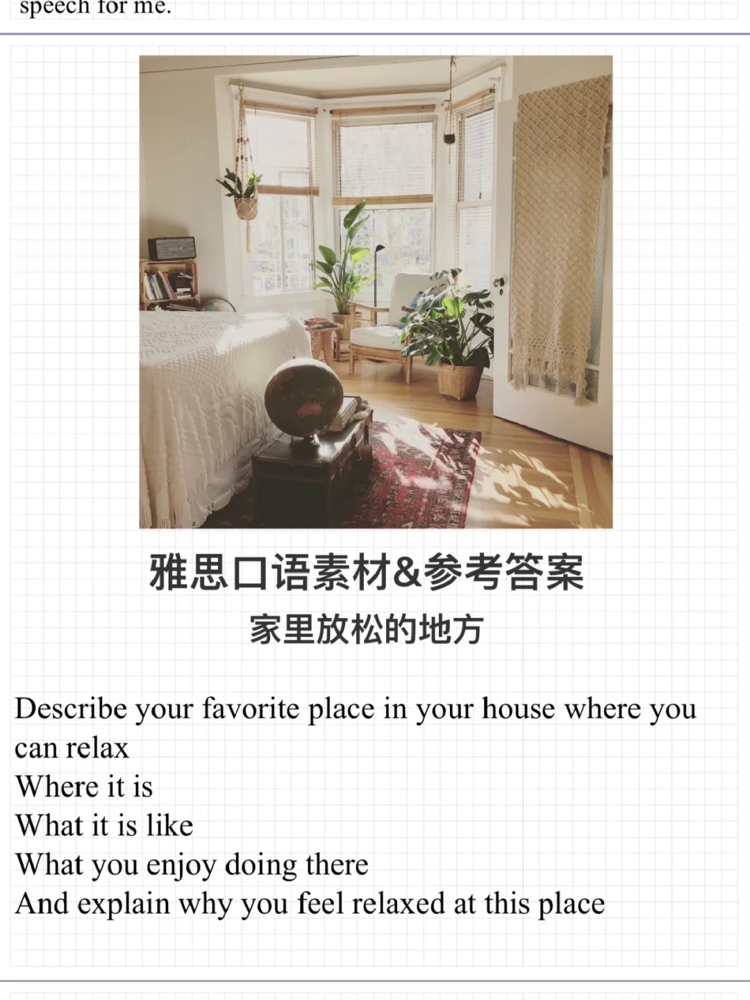
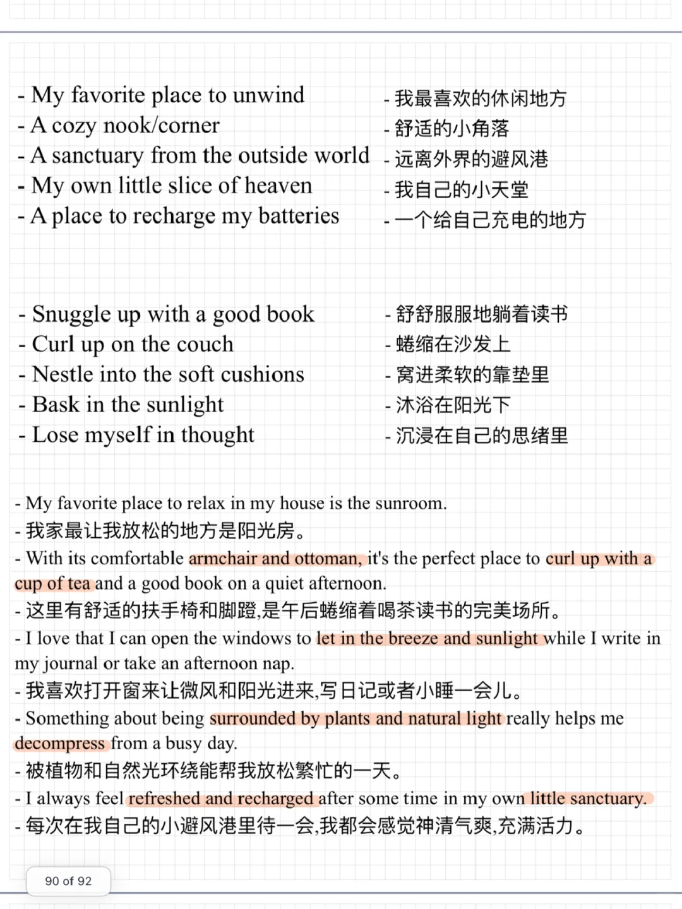

# 雅思口语素材&amp;答案｜PART2放松的地方

几个和放松相关的词组/习语：
- Recharge my batteries
- A breath of fresh air
- A weight off my shoulders
- Clear my head
- 给自己充电
- 让我神清气爽的事
- 压力一扫而空
- 清空大脑
	
你的personal sanctuary/oasis是哪里？你在这里如何放松呢？
#雅思口语 #雅思攻略 #雅思备考 #雅思口语素材 #雅思考试 #英语口语

## 图片
| 图1 | 图2 | 图3 | 图4 |
| --- | --- | --- | --- |
|  |  |  |   |

生成时间：2025-11-15 01:23:46