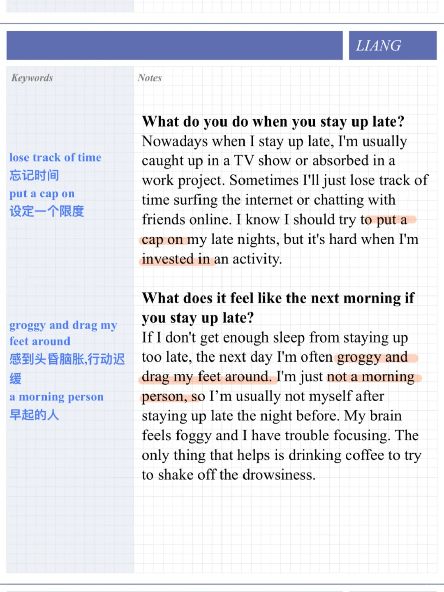
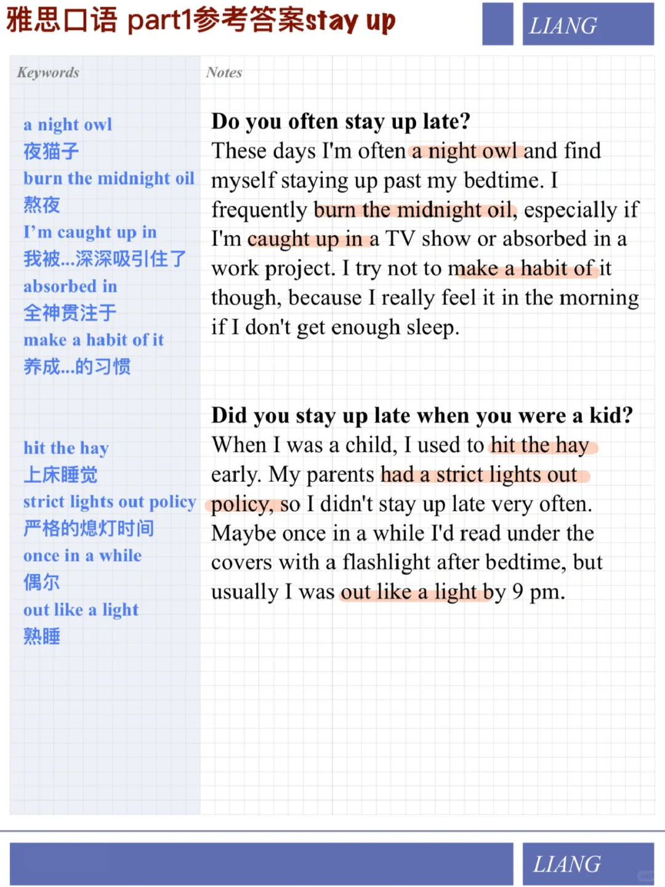

# 雅思口语参考答案｜part1 熬夜stay up

你也是个夜猫子吗
今天一些亮点表达：
a night owl夜猫子
burn the midnight oil熬夜
I’m caught up in我被...深深吸引住了
absorbed in全神贯注于
make a habit of it养成...的习惯
hit the hay上床睡觉
strict lights out policy严格的熄灯时间
once in a while偶尔
out like a light熟睡
lose track of time忘记时间
put a cap on设定一个限度
groggy and drag my feet around感到头昏脑胀,行动迟缓
a morning person早起的人
快积累起来吧
	
#雅思口语 #雅思攻略 #雅思备考 #雅思 #雅思考试 #英语口语 #分手吧雅思 #雅思口语Part1

## 图片
| 图1 | 图2 | 图3 | 图4 |
| --- | --- | --- | --- |
|  |  |   |   |

生成时间：2025-11-15 01:22:42