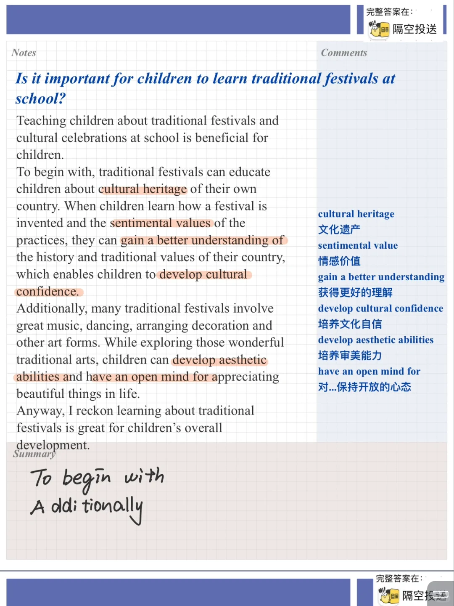
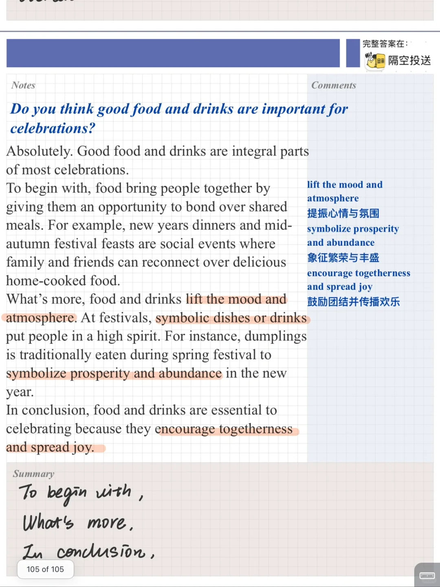
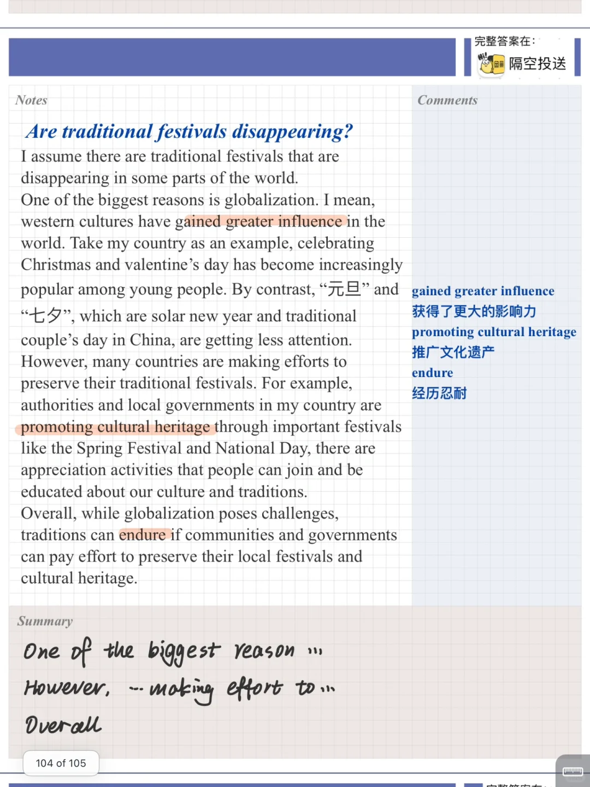
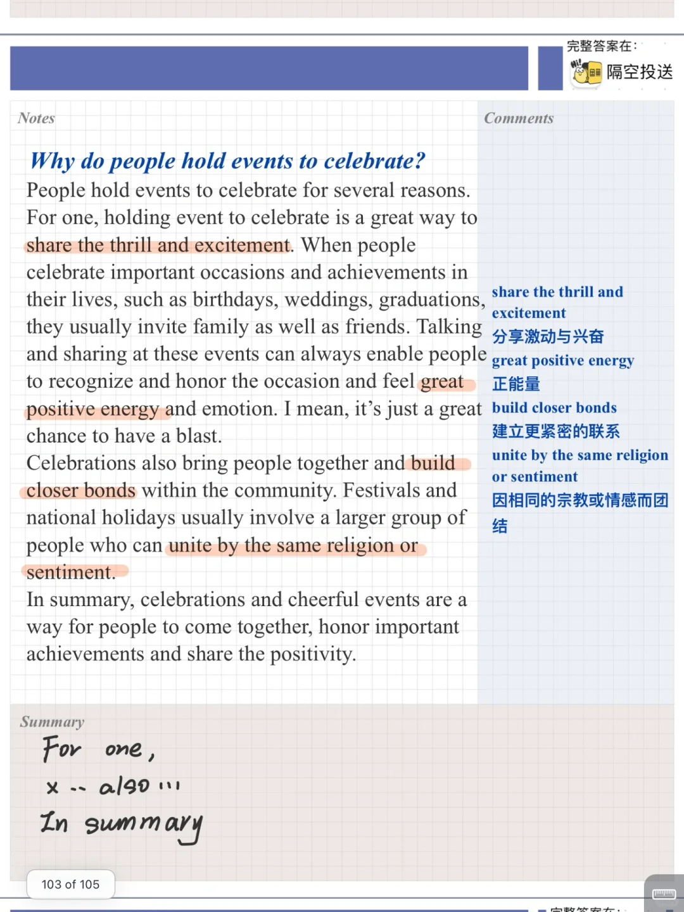

# 雅思口语Part3高分参考答案| 传统庆典

今天的part3 答案关于“传统”
相对应part2:
Describe a traditional celebration in your country that you enjoy传统庆典
What it is
What you do to celebrate it
Who you celebrate it with
And explain why you enjoy it
	
素材内容主要讨论传统节日的价值意义，不同文化间的影响等
有一定难度，快积累起来吧
	
#雅思口语 #雅思攻略 #雅思备考 #雅思口语换题 #雅思 #英语口语 #雅思口语part3 #雅思口语高分

## 图片
| 图1 | 图2 | 图3 | 图4 |
| --- | --- | --- | --- |
|  |  |  |  |

生成时间：2025-11-15 01:20:29