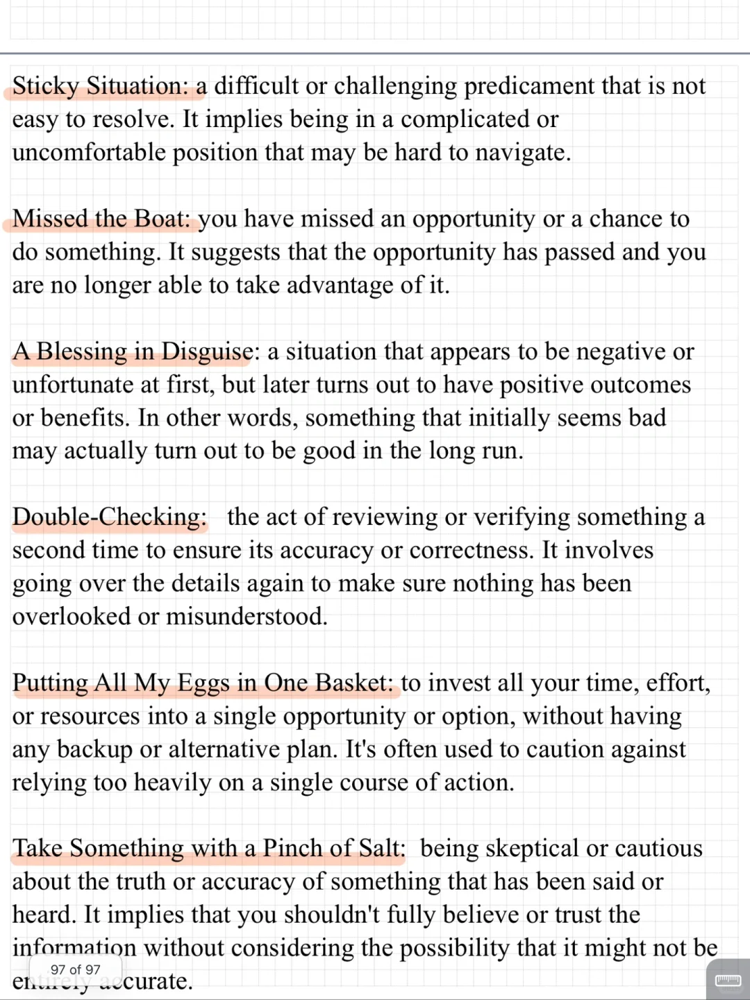
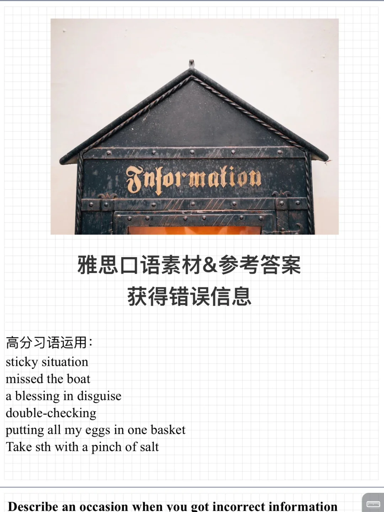
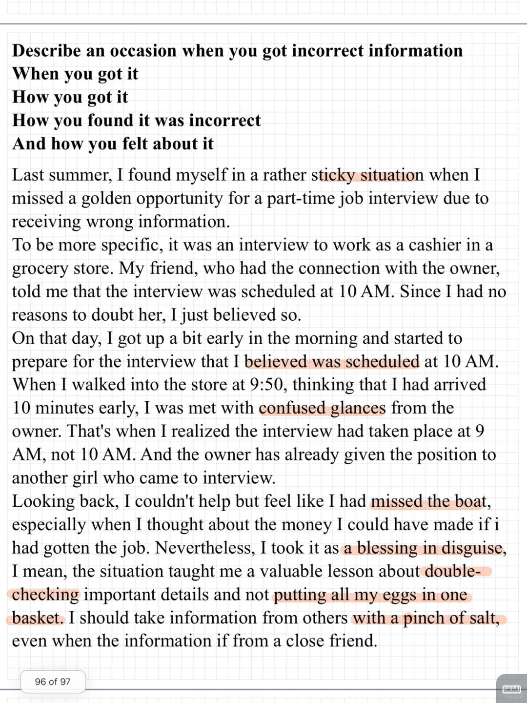

# 雅思口语PART2高分参考答案｜错误信息

Describe an occasion when you got incorrect information
When you got it
How you got it
How you found it was incorrect
And how you felt about it
	
习语积累：
sticky situation
missed the boat
a blessing in disguise
double-checking
putting all my eggs in one basket
Take sth with a pinch of salt
	
#雅思口语 #雅思攻略 #雅思备考 #雅思口语题库 #雅思 #雅思口语part2 #雅思口语高分

## 图片
| 图1 | 图2 | 图3 | 图4 |
| --- | --- | --- | --- |
|  |  |  |   |

生成时间：2025-11-15 01:19:24