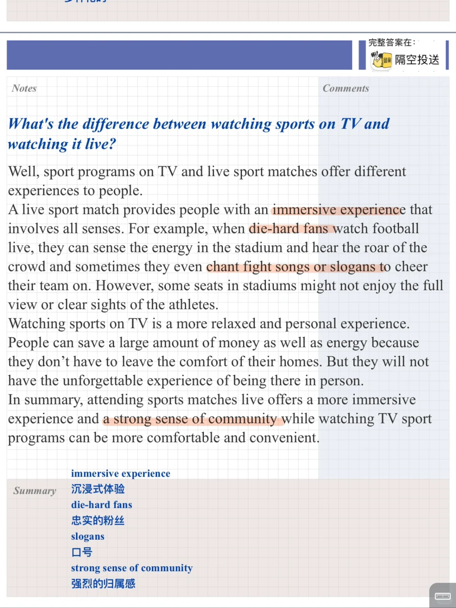
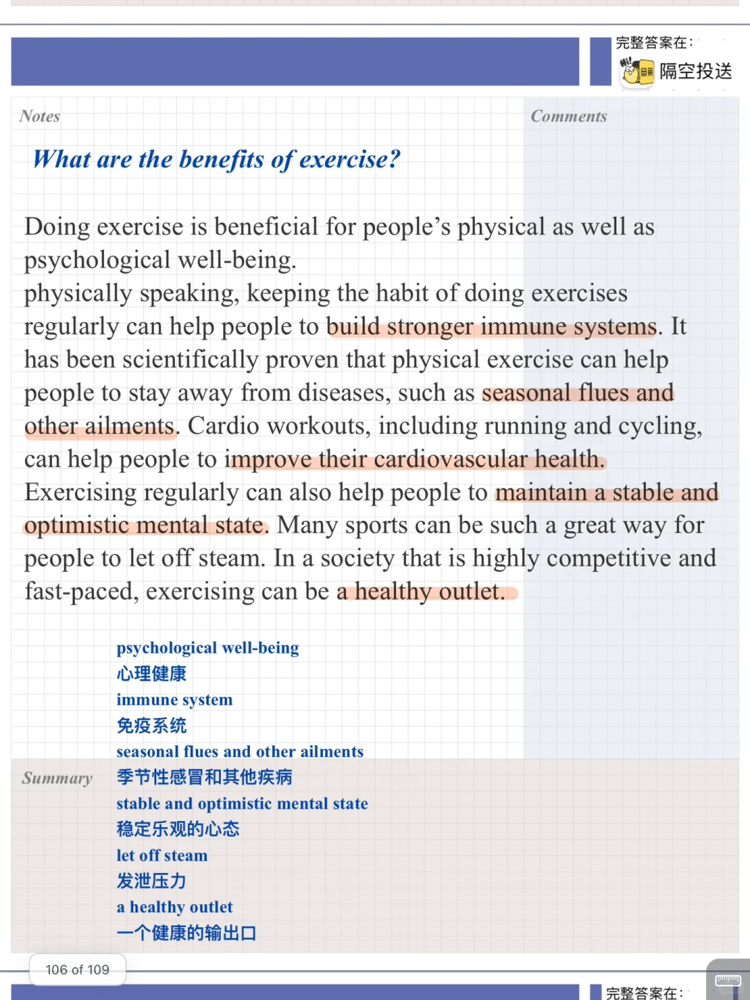
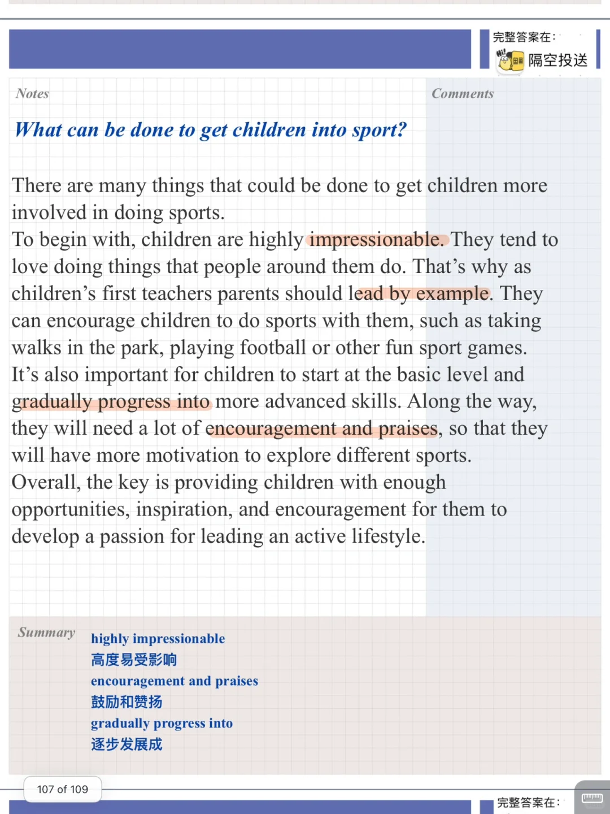
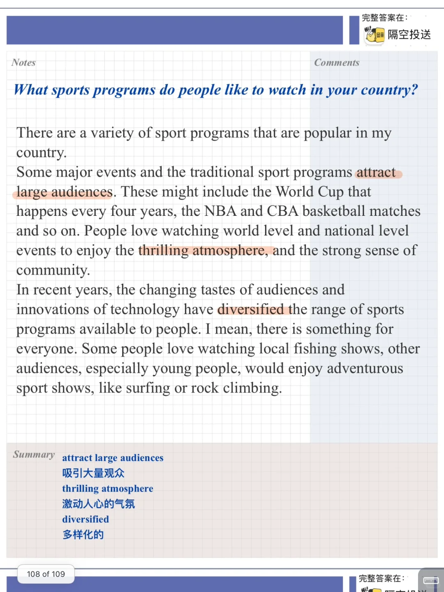

# 雅思口语高分PART3参考答案｜运动节目

对应 part2
Describe a sports program you like to watch 运动节目
What it is
Where you watch it
Who you watch it with
And explain why you enjoyed watching the program
	
讨论运动的好处，不同运动节目以及其特点
#雅思口语 #雅思攻略 #雅思备考 #雅思口语素材 #雅思 #雅思考试 #雅思口语高分示范 #雅思口语part3

## 图片
| 图1 | 图2 | 图3 | 图4 |
| --- | --- | --- | --- |
|  |  |  |  |

生成时间：2025-11-15 01:18:19