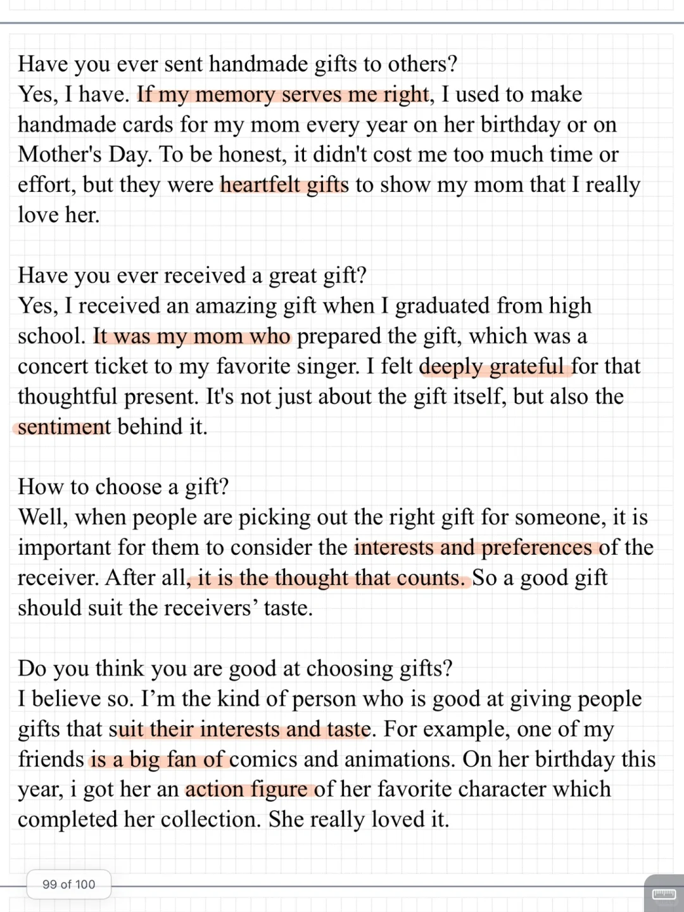
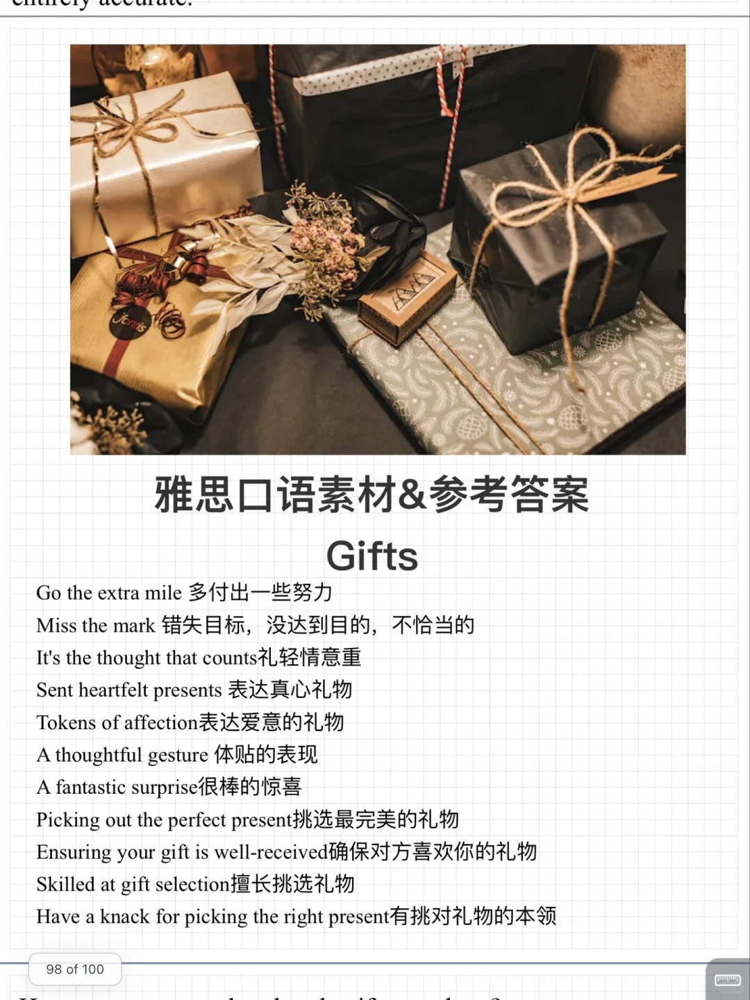

# 雅思口语23 9-12新题｜GIFTS

今天开始新题速递💪
part 1 内容 礼物🎁
主要讨论送礼物的原因感受方式，回答时适当补充个性话具体例子
	
九月训练营进行中，保留题新题一起练，30天打卡练完题库，需要的同学可以✉️
#雅思口语 #雅思备考 #雅思攻略 #雅思口语换题 #雅思口语打卡训练营

## 图片
| 图1 | 图2 | 图3 | 图4 |
| --- | --- | --- | --- |
|  |  |   |   |

生成时间：2025-11-15 01:17:13