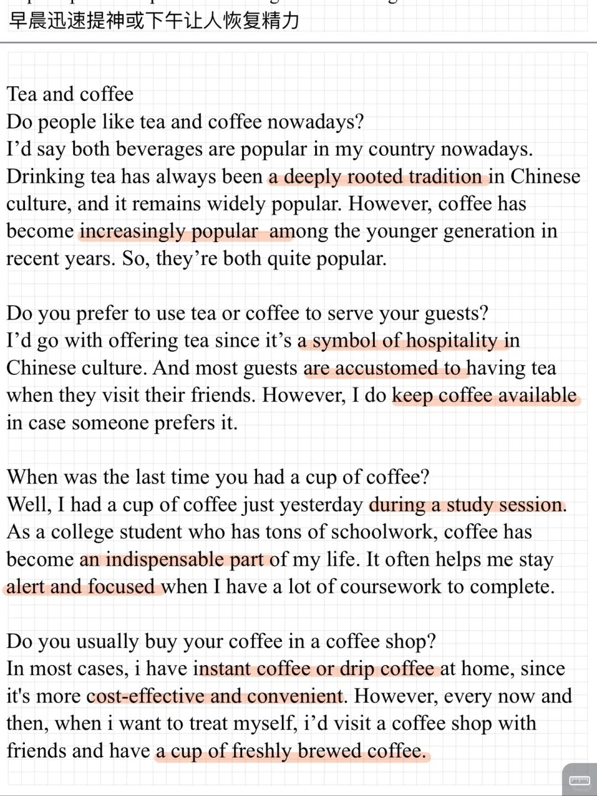
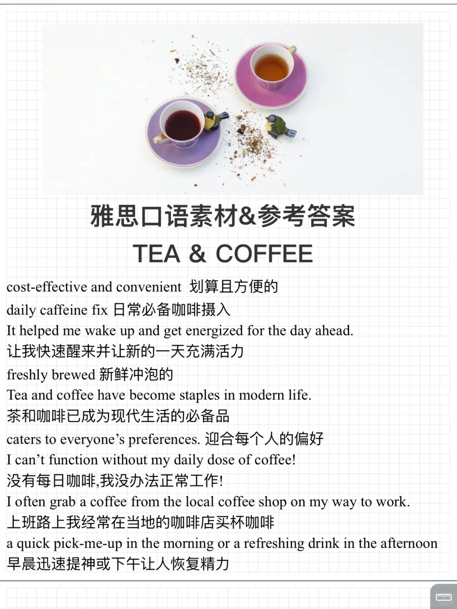

# 雅思口语 23 9-12新题 ｜TEA &amp; COFFEE

今天的话题： part 1 内容 tea and coffee ☕️
	
主要讨论 两者是否受欢迎，个人偏好习惯等。
九月训练营进行中，保留题新题一起练，30天打卡练完题库，需要的同学可以✉️
#雅思口语 #雅思攻略 #雅思备考 #雅思口语换题 #雅思口语题库 #雅思口语打卡训练营

## 图片
| 图1 | 图2 | 图3 | 图4 |
| --- | --- | --- | --- |
|  |  |   |   |

生成时间：2025-11-15 01:16:08