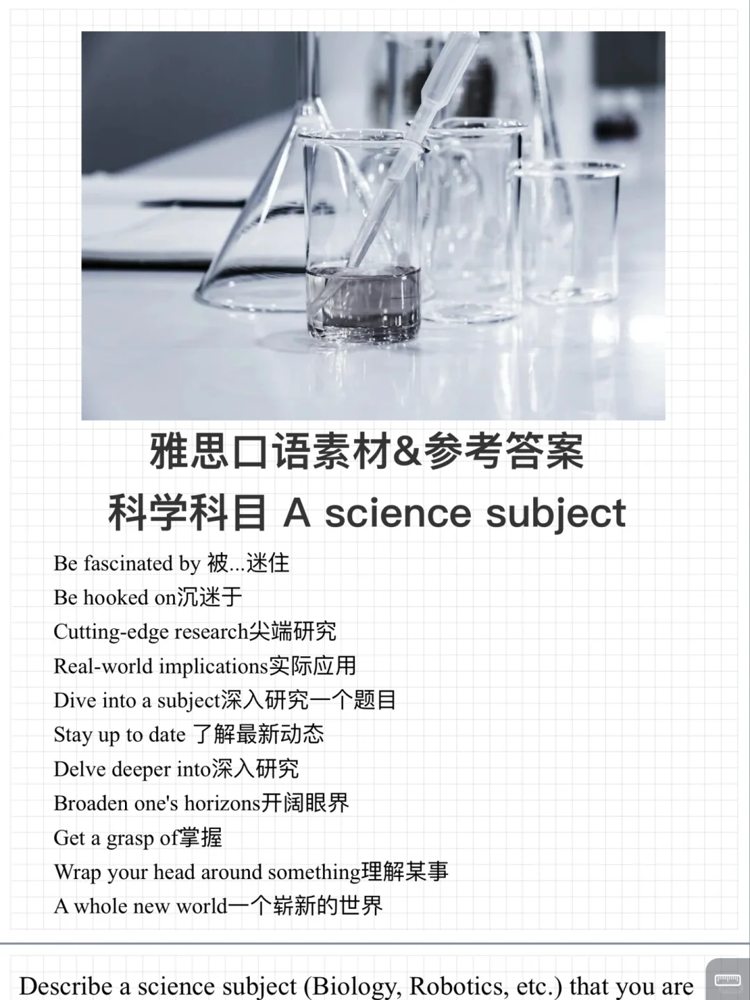

# 雅思口语23 9-12新题｜感兴趣的科学科目

今天更新的话题：感兴趣的科学科目
需要介绍： 什么科目，如何学习到，为何喜欢等细节 打卡训练营还可以参与，欢迎参加✉️
	
#雅思口语 #雅思攻略 #雅思备考 #雅思口语换题 #雅思口语题库 #雅思口语打卡训练营

## 图片
| 图1 | 图2 | 图3 | 图4 |
| --- | --- | --- | --- |
|  |  |   |   |

生成时间：2025-11-15 01:15:03