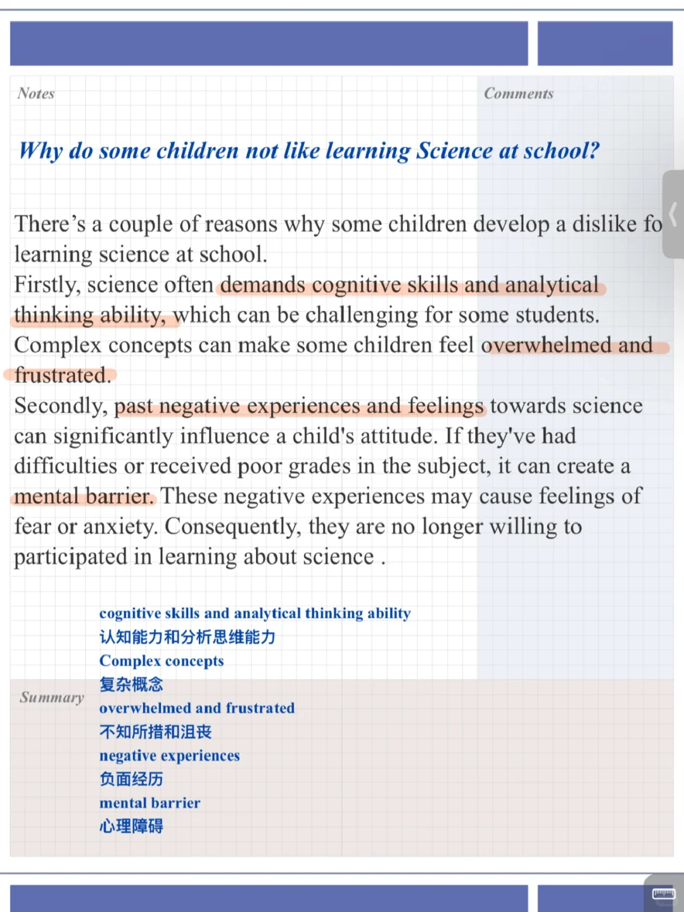
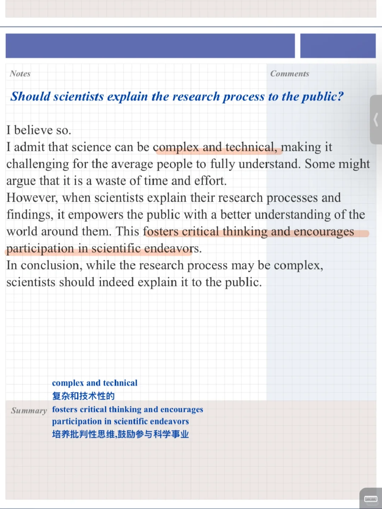
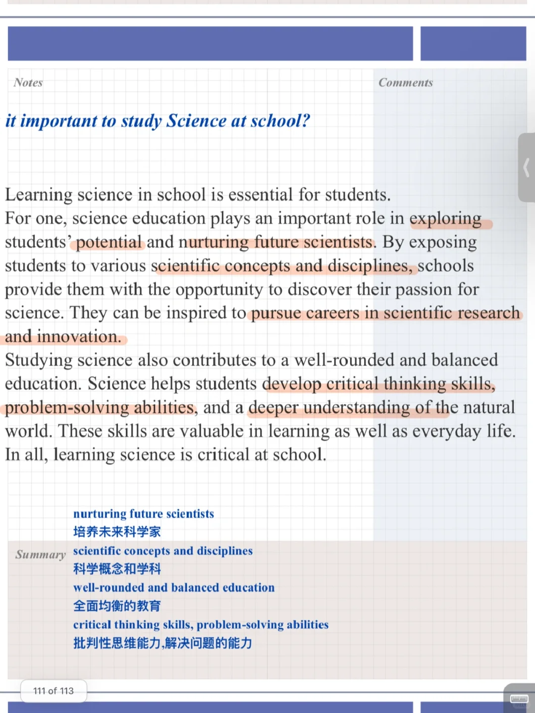

# 雅思口语23 9-12 新题答案｜科学P3

今天分享的part3对应话题:“描述一个感兴趣的科学科目”
讨论科学科目在学校中生活中的重要性
	
9月训练营今日第七天，加入可新题旧题一起练
#雅思口语 #雅思攻略 #雅思备考 #雅思口语换题 #雅思口语题库 #雅思口语打卡训练营

## 图片
| 图1 | 图2 | 图3 | 图4 |
| --- | --- | --- | --- |
|  |  |  |  |

生成时间：2025-11-15 01:13:59