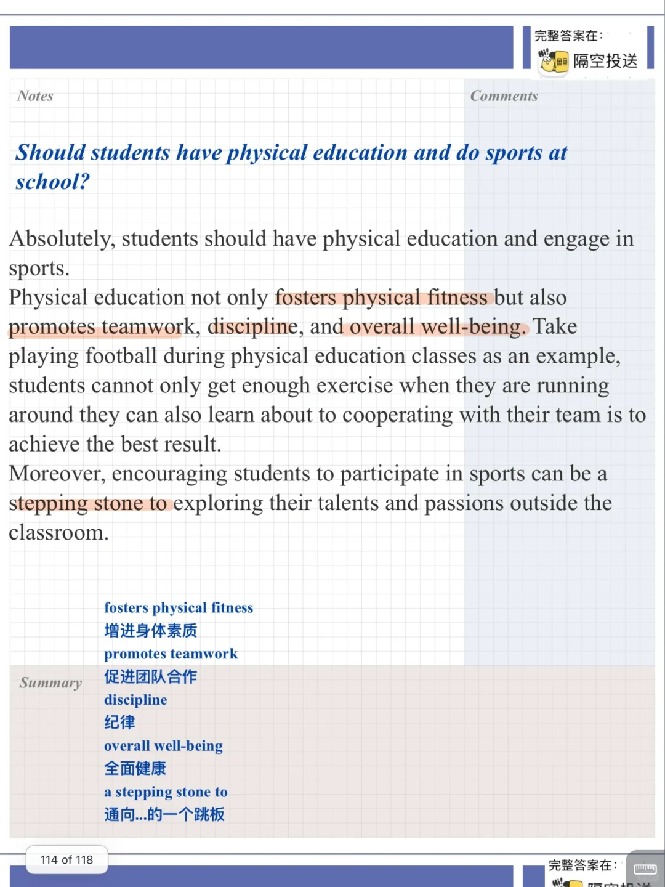
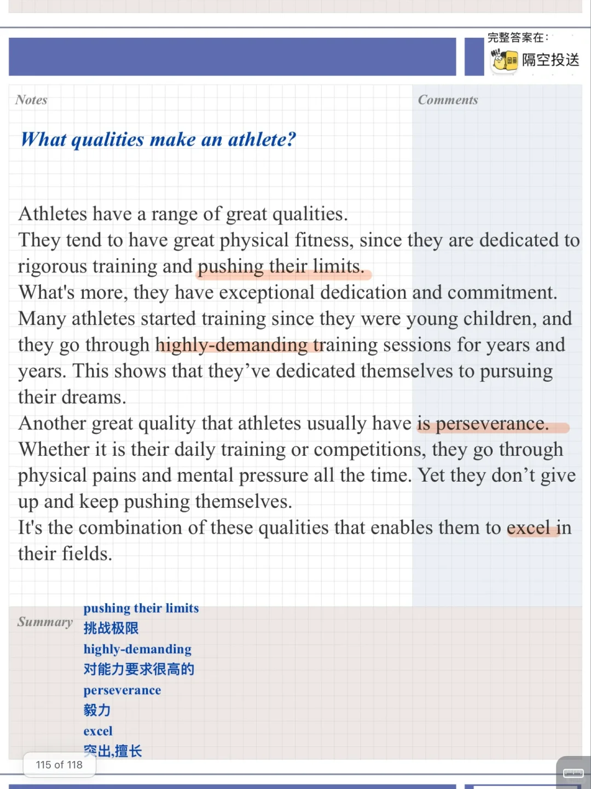
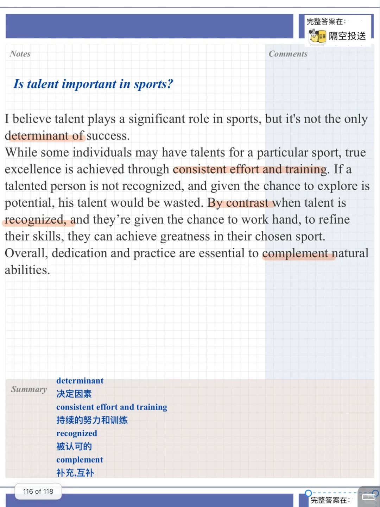
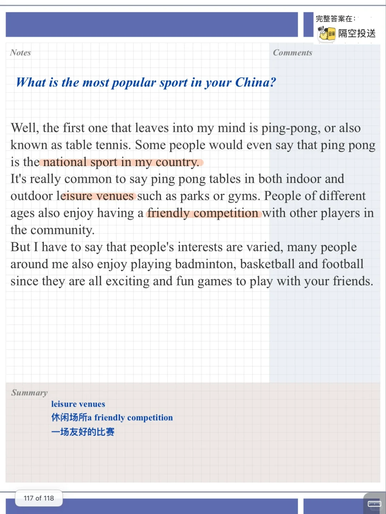

# 雅思口语part3高分参考｜敬佩的运动员

今天分享关于运动员的话题
包括运动员的品质、天赋、受欢迎的运动形式等。
2023 9-12 月题库的 part3 答案准备好啦
贤余 隔空投送
#雅思口语 #雅思攻略 #雅思备考 #雅思口语题库 #雅思口语换题 #雅思考试 #雅思口语part3 #雅思口语答案  #雅思口语高分示范

## 图片
| 图1 | 图2 | 图3 | 图4 |
| --- | --- | --- | --- |
|  |  |  |  |
|  |   |   |   |

生成时间：2025-11-15 01:11:49