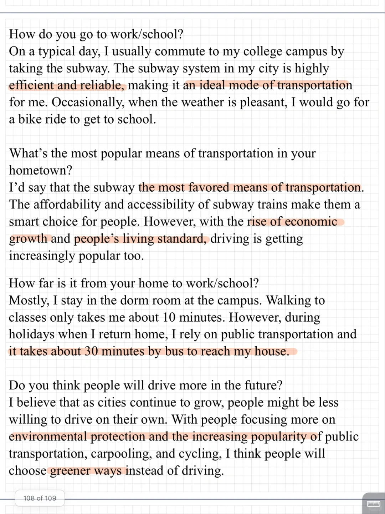
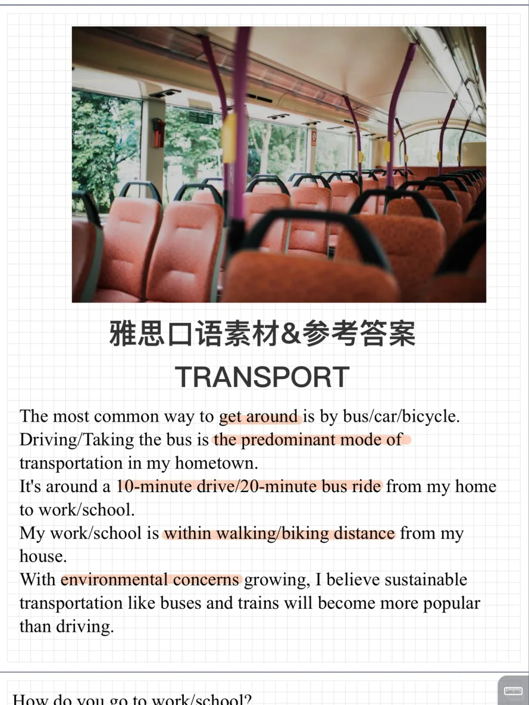

# 23 9-12雅思口语新题｜PART1 transport

交通一直是雅思口语题库中常见话题
本季度中侧重讨论 个人习惯 大众常用的交通方式 以及未来推测
#雅思口语 #雅思攻略 #雅思备考 #雅思口语换题 #雅思口语题库 #雅思口语素材 #雅思考试 #雅思口语Part1

## 图片
| 图1 | 图2 | 图3 | 图4 |
| --- | --- | --- | --- |
|  |  |   |   |

生成时间：2025-11-15 01:10:43