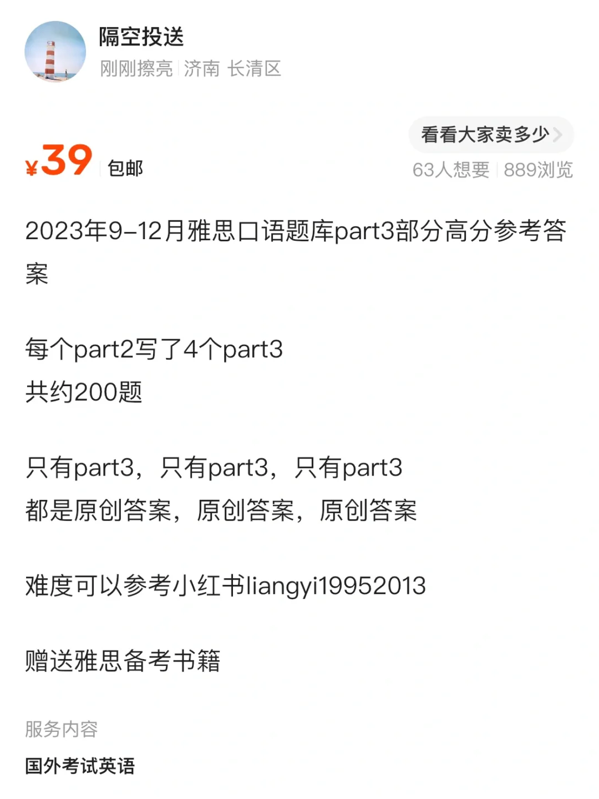
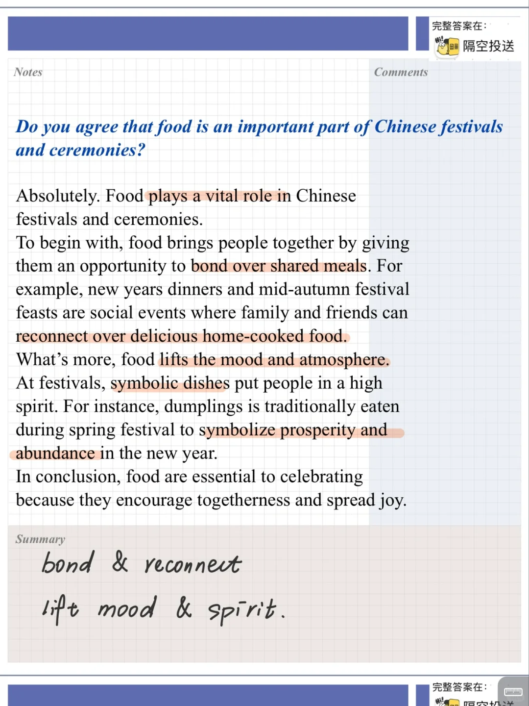
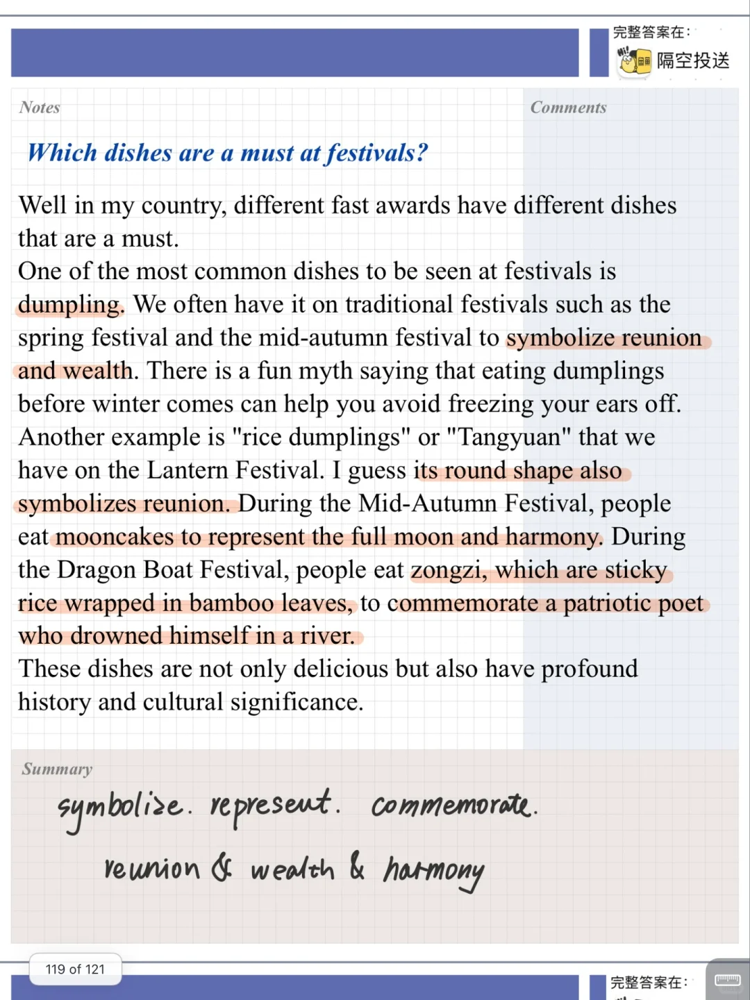
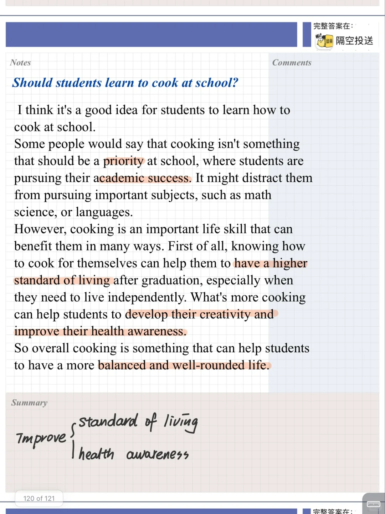
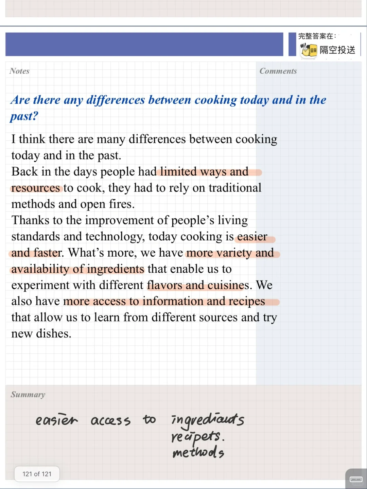

# 23 9-12 雅思口语参考答案｜part3 食物

今天分享的四个part3问题 相关题库中的part2: 喜欢做饭的人
主要讨论食物与文化、食物与节日的问题
#雅思口语 #雅思攻略 #雅思备考 #雅思口语题库 #雅思口语换题 #雅思口语part3

## 图片
| 图1 | 图2 | 图3 | 图4 |
| --- | --- | --- | --- |
|  |  |  |  |
|  |   |   |   |

生成时间：2025-11-15 01:08:33