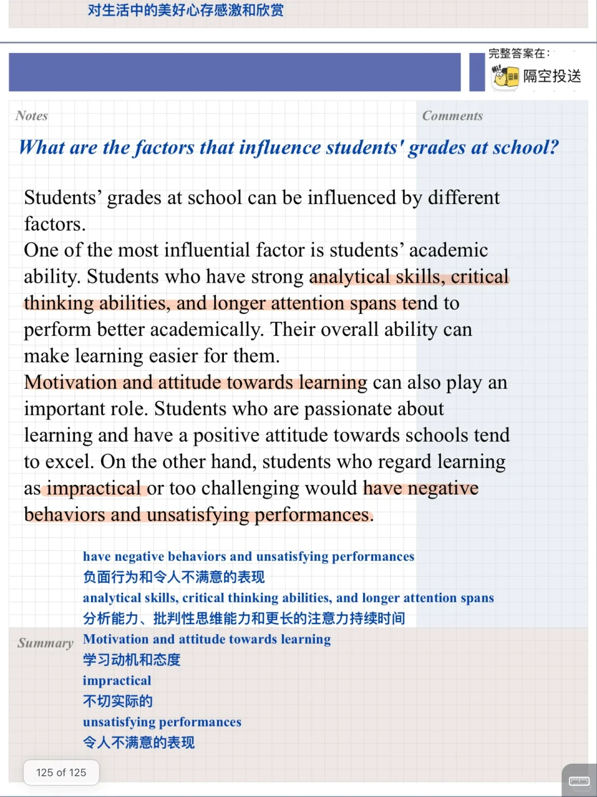
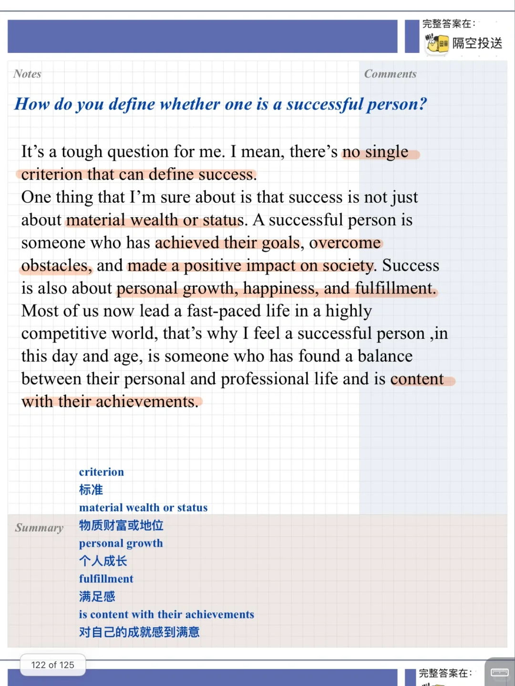
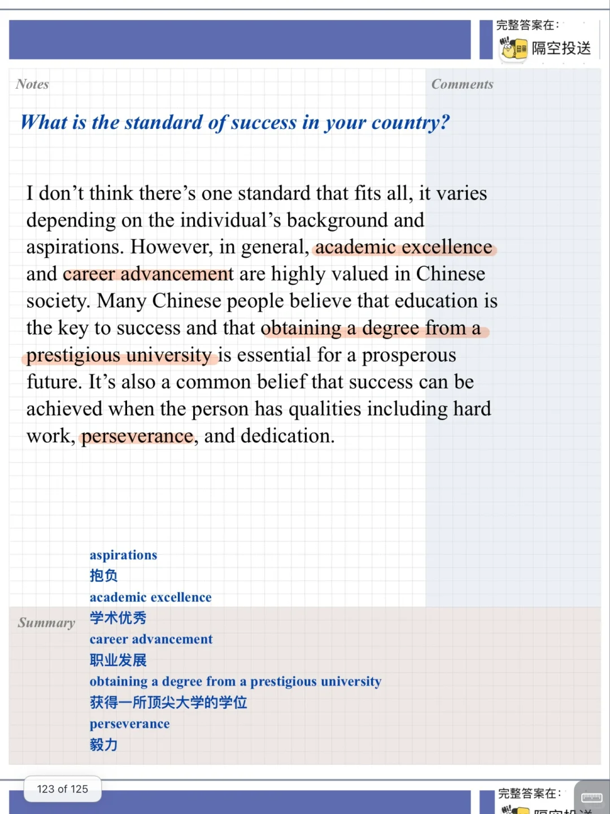
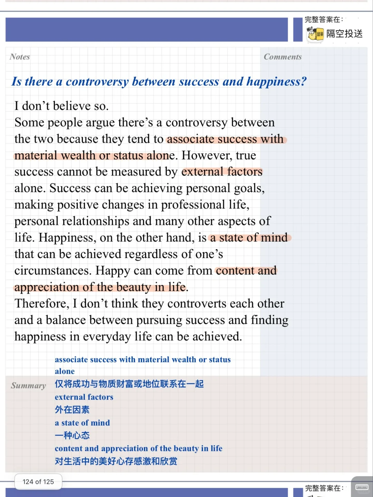

# 雅思口语高分答案｜一起工作成功人士P3

今天分享新题： Describe a successful person who you once studied or worked with
相关的Part3
主要讨论成功概念、因素等
一起积累起来吧
#雅思口语 #雅思攻略 #雅思备考 #雅思口语题库 #雅思 #雅思口语高分示范

## 图片
| 图1 | 图2 | 图3 | 图4 |
| --- | --- | --- | --- |
|  |  |  |  |

生成时间：2025-11-15 01:07:26