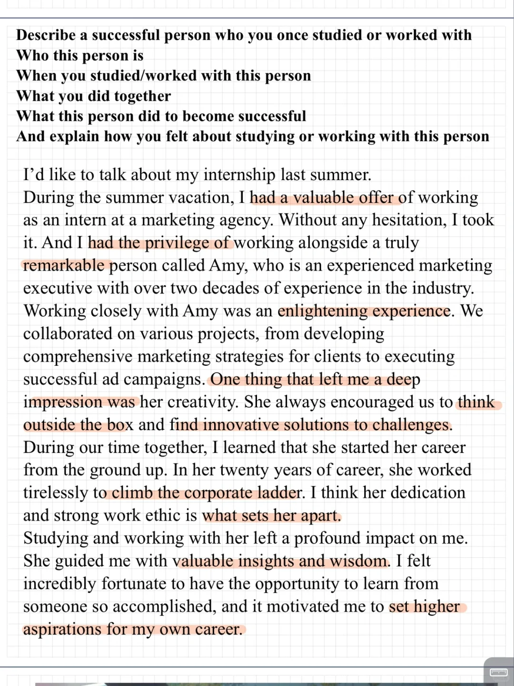
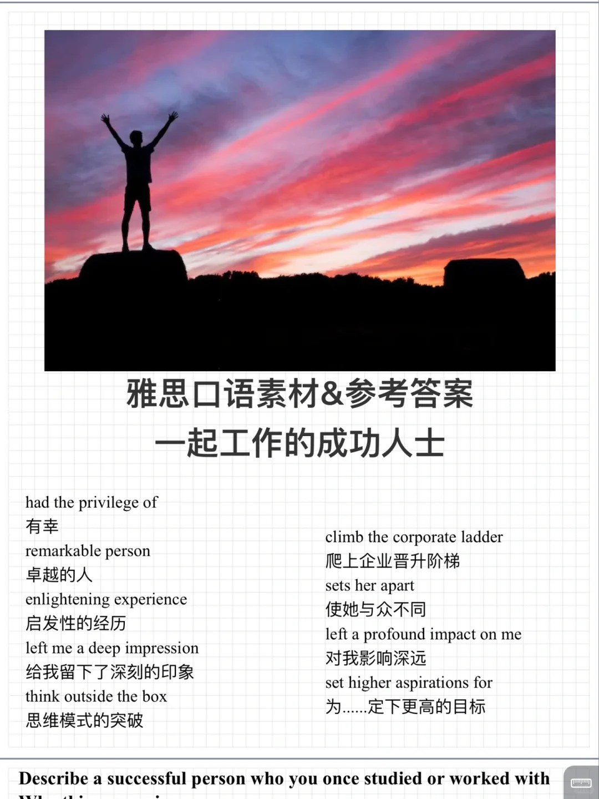

# 雅思口语素材&amp;答案｜一起工作的成功人士

今天分享新题part2:
Describe a successful person who you once studied or worked with
Who this person is
When you studied/worked with this person
What you did together
What this person did to become successful
#雅思口语 #雅思攻略 #雅思备考 #雅思口语题库 #雅思口语换题 #雅思口语part2

## 图片
| 图1 | 图2 | 图3 | 图4 |
| --- | --- | --- | --- |
|  |  |   |   |

生成时间：2025-11-15 01:06:21