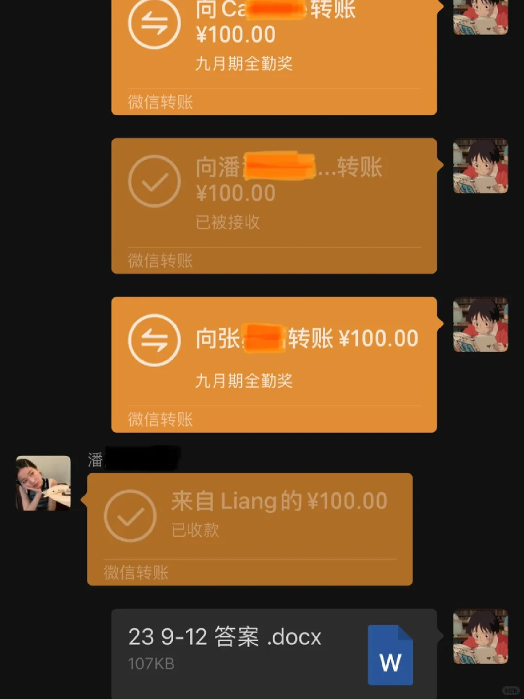
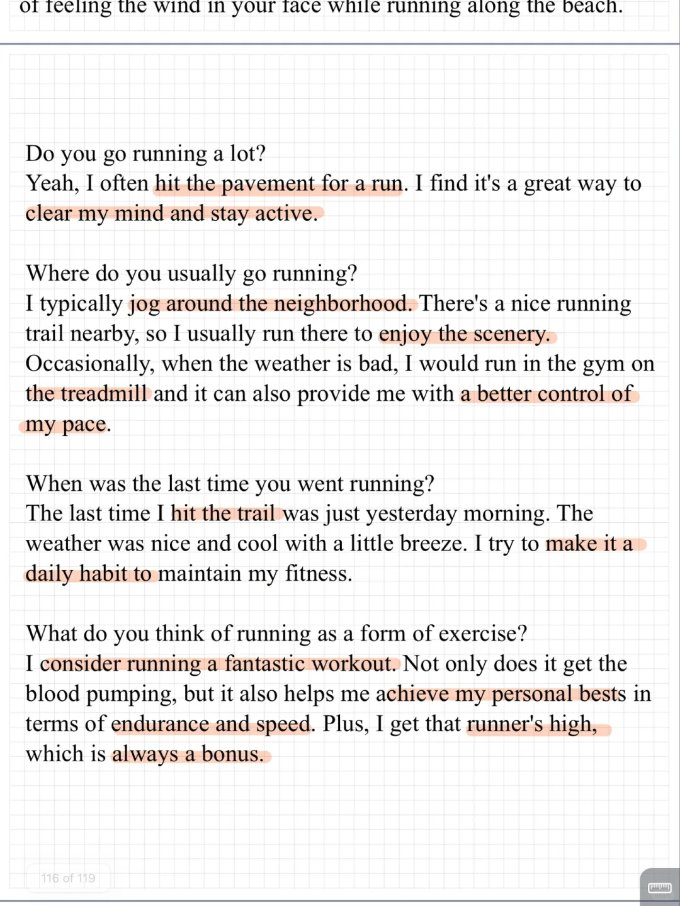

# 雅思口语素材答案｜PART1 RUNNING

今天分享关于running话题的新题
主要积累跑步习惯、原因感受等素材
一起联系起来💪
	
九月期训练营圆满结束，全勤奖发放🎉
十月打卡训练营开放报名，欢迎加入👏
#雅思口语 #雅思攻略 #雅思备考 #雅思口语素材 #雅思口语题库 #雅思口语换题 #雅思口语打卡群 #雅思口语打卡训练营#雅思口语Part1

## 图片
| 图1 | 图2 | 图3 | 图4 |
| --- | --- | --- | --- |
|  |  |  |  |

生成时间：2025-11-15 01:04:12