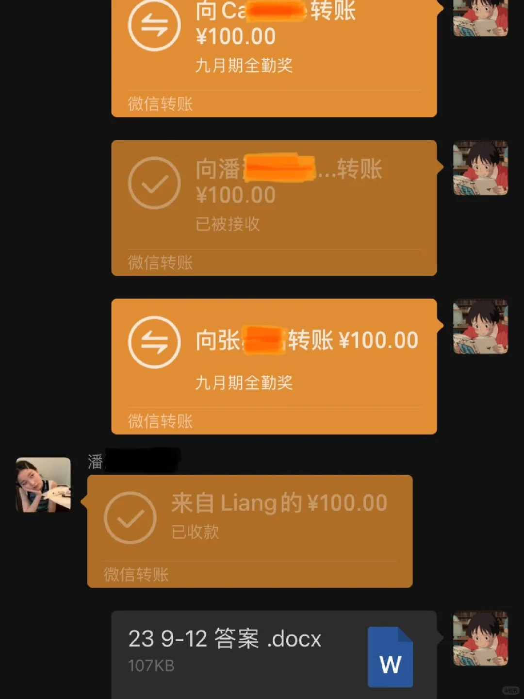
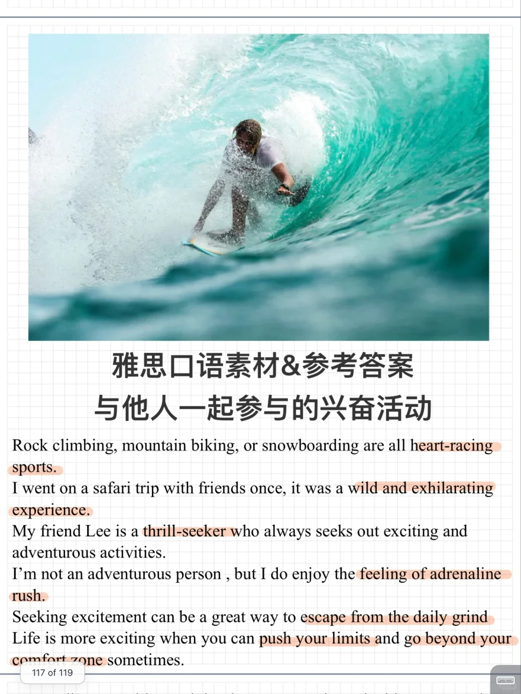
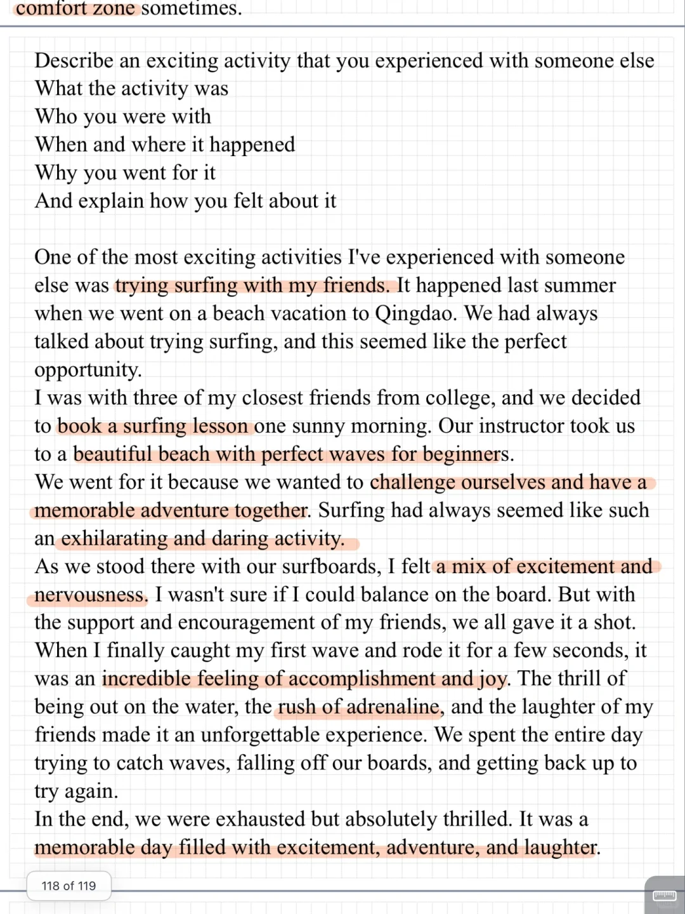
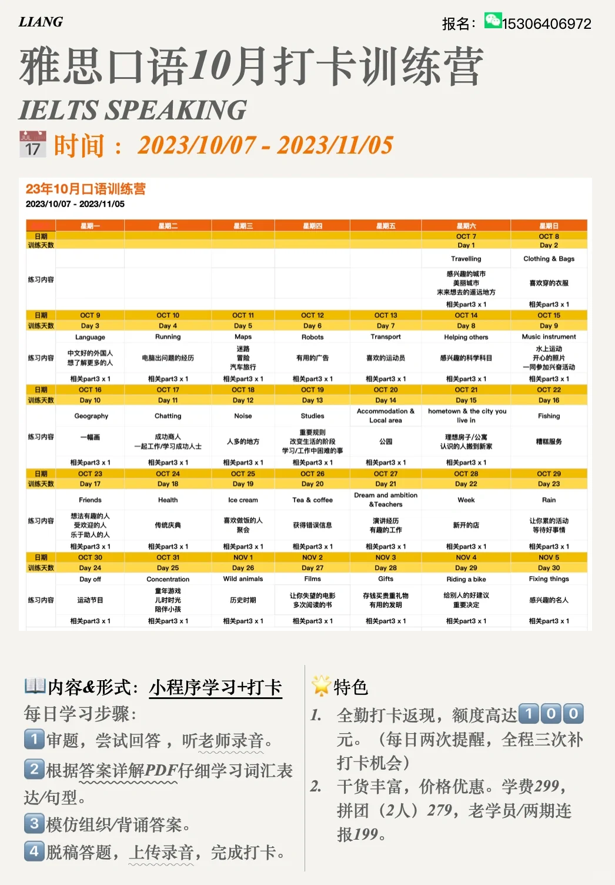

# 雅思口语素材答案｜PART2 兴奋的活动

今天分享part2题目: Describe an exciting activity that you experienced with someone else
What the activity was
Who you were with
When and where it happened
Why you went for it
And explain how you felt about it
	
该题目也比较适合“串题” 考虑与“水上运动”“开心照片”等题目合并，一同描述一个关于尝试冲浪、潜水、摩托艇等类似活动的经历。十月雅思口语打卡训练营开始报名，欢迎加入👏
	
#雅思口语 #雅思攻略 #雅思备考 #雅思口语part2 #雅思口语新题库 #雅思口语答案 #雅思口语打卡营

## 图片
| 图1 | 图2 | 图3 | 图4 |
| --- | --- | --- | --- |
|  |  |  |  |

生成时间：2025-11-15 01:03:06