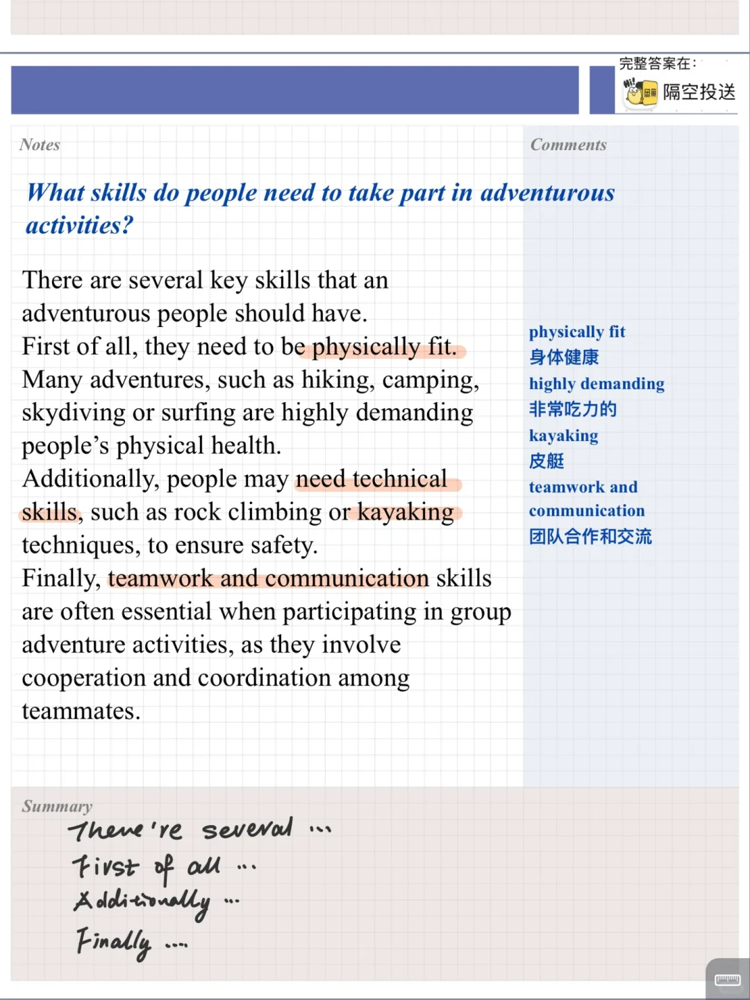
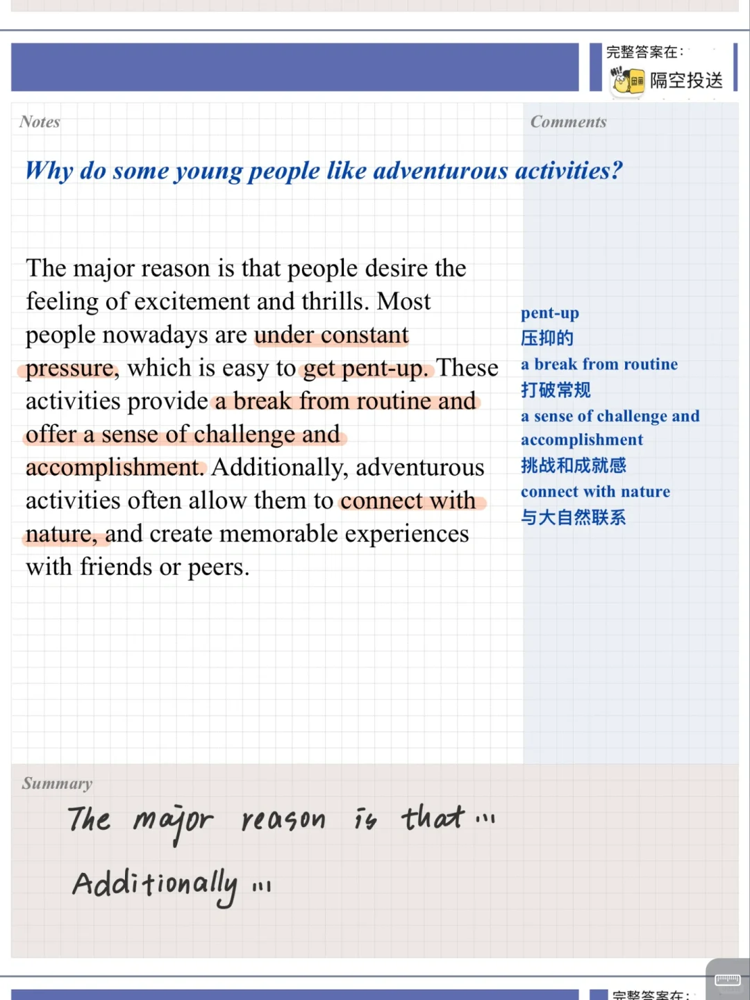
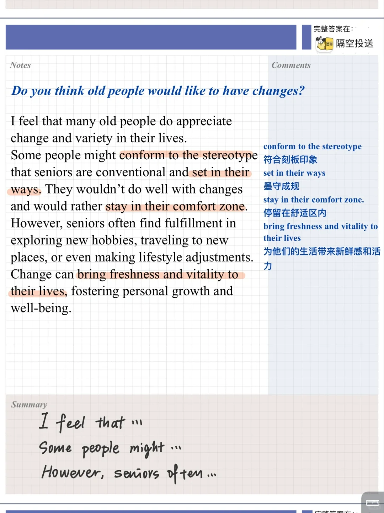
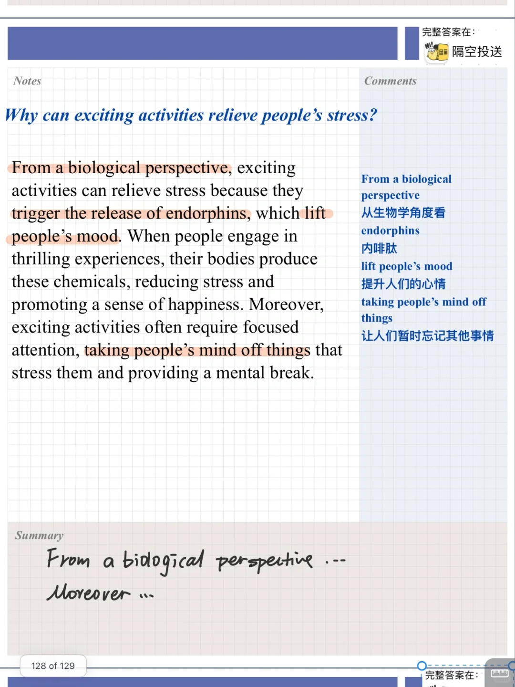

# 雅思口语高分参考｜兴奋活动PART3

part2 与他人一起参与的令人兴奋的活动
相对应的part3 主要讨论兴奋活动类型感受原因等
一起积累起来吧
#雅思口语 #雅思攻略 #雅思备考 #雅思口语高分示范 #雅思口语part3 #雅思口语打卡营

## 图片
| 图1 | 图2 | 图3 | 图4 |
| --- | --- | --- | --- |
|  |  |  |  |

生成时间：2025-11-15 01:02:01