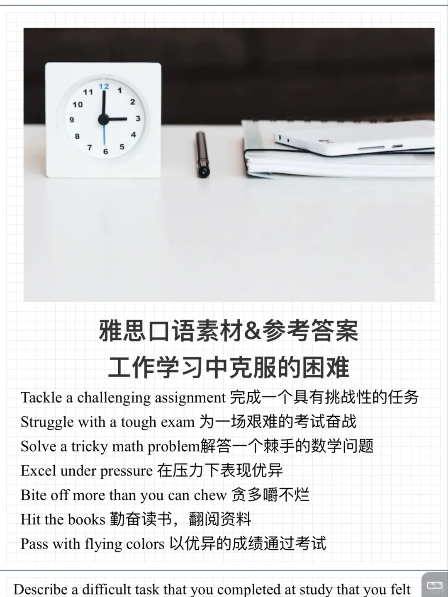
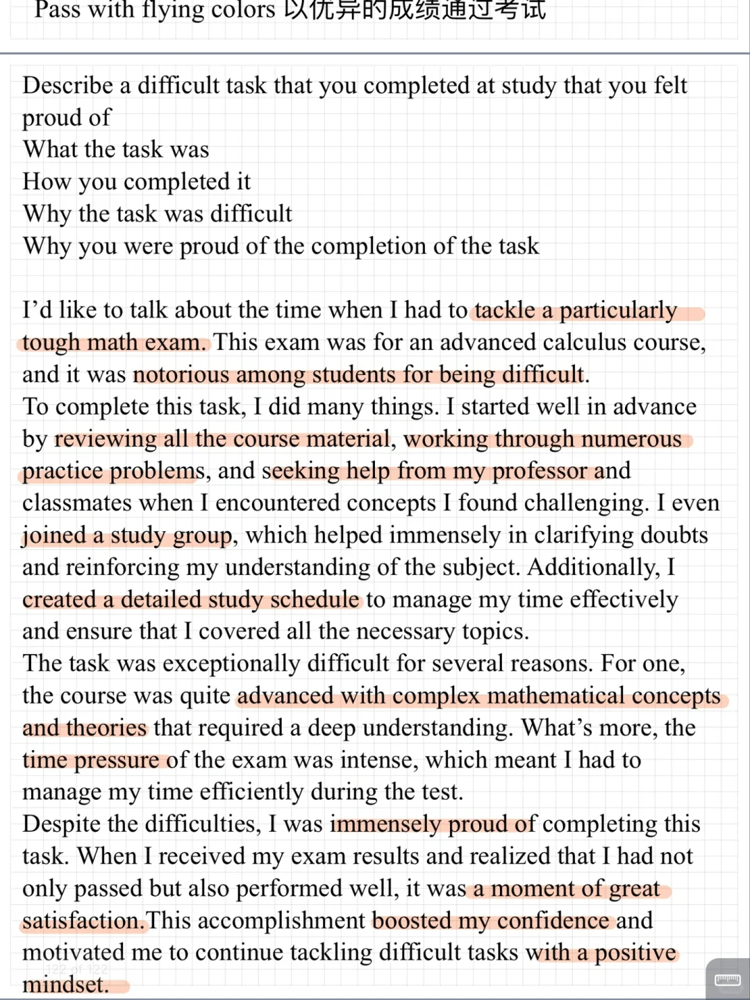

# 雅思口语新题素材答案｜P2 克服困难

参考答案写了学习中的困难，具体分享一次备考的经历，你也有类似的经历吗？可以参考答案的机构和词组表达
	
十月份口语训练营报名中，七号正式开始啦🌹
#雅思口语 #雅思攻略 #雅思备考 #雅思口语答案 #雅思口语part2 #雅思口语训练营

## 图片
| 图1 | 图2 | 图3 | 图4 |
| --- | --- | --- | --- |
|  |  |  |   |

生成时间：2025-11-15 00:59:51