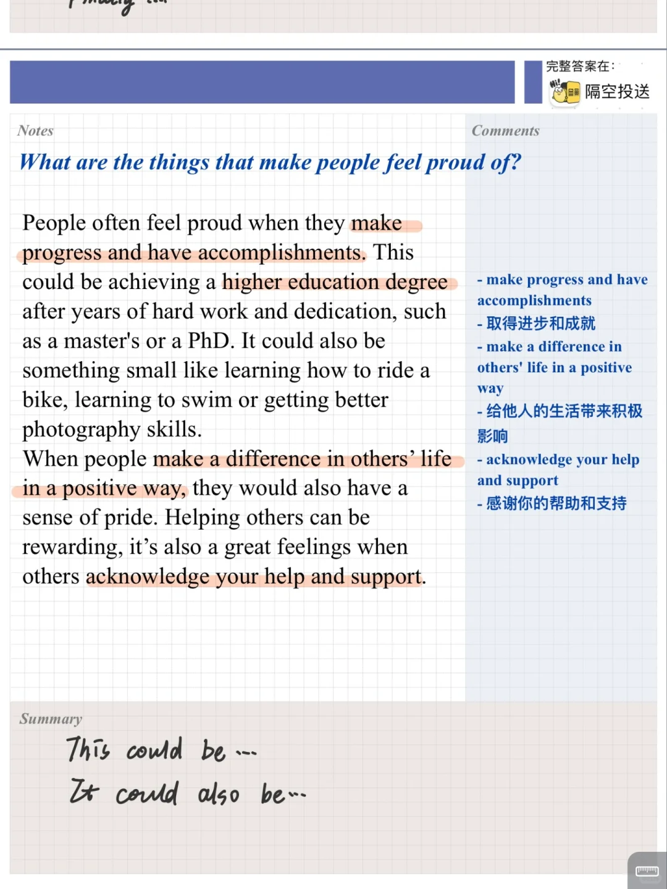
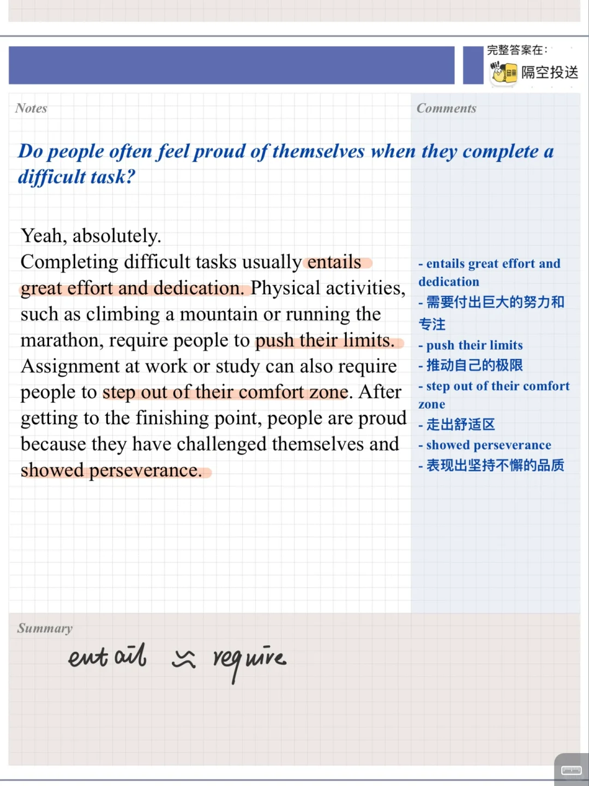
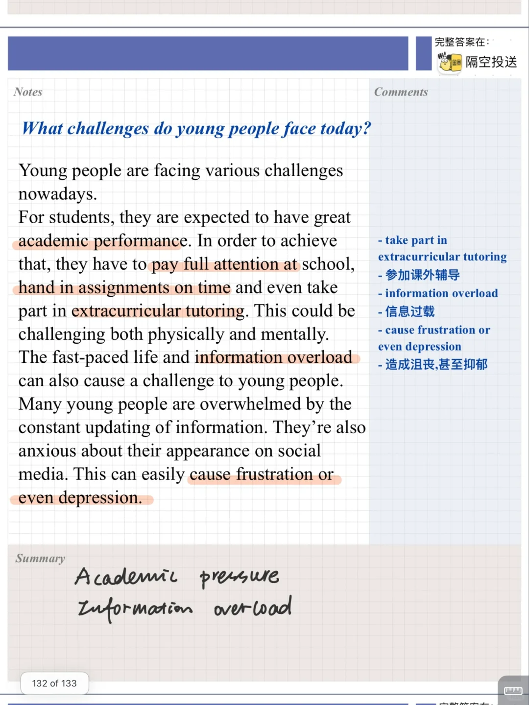
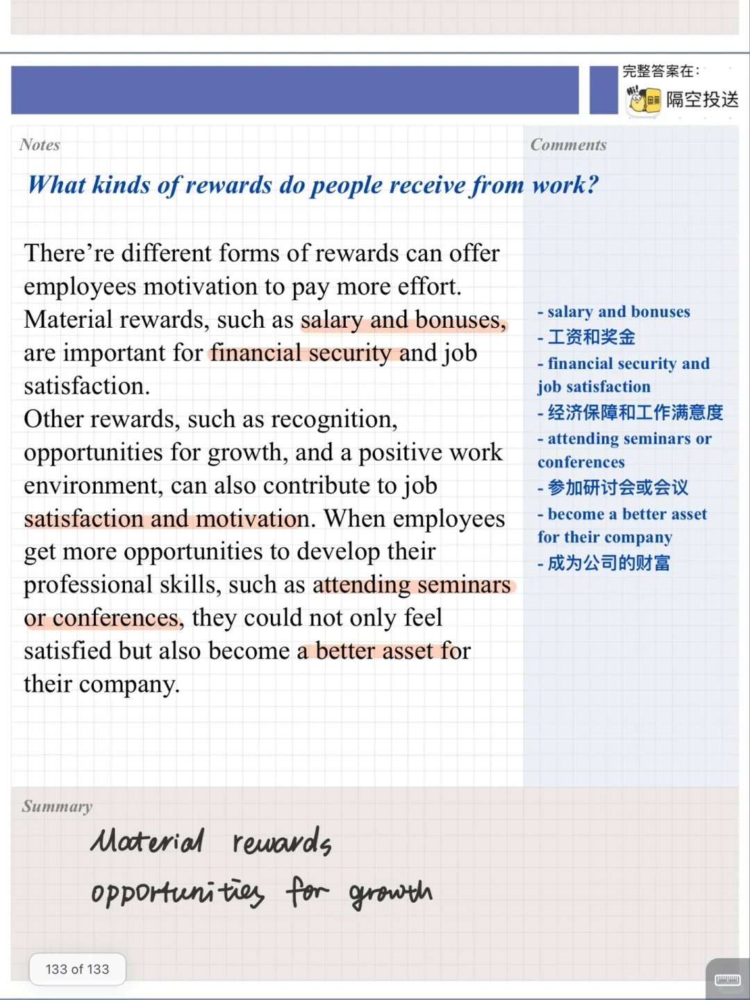

# 雅思口语新题答案｜克服困难Part3

part2:克服困难的感觉自豪的事
相关part3主要讨论 为何感到自豪、年轻人遇到的困难、工作学习中的奖励等
	
十月雅思口语打卡训练营正式开营，今日第一天打卡，欢迎加入👏
#雅思备考 #雅思口语 #雅思口语答案 #雅思口语part3 #雅思口语高分示范 #雅思口语打卡营

## 图片
| 图1 | 图2 | 图3 | 图4 |
| --- | --- | --- | --- |
|  |  |  |  |
|  |   |   |   |

生成时间：2025-11-15 00:58:46