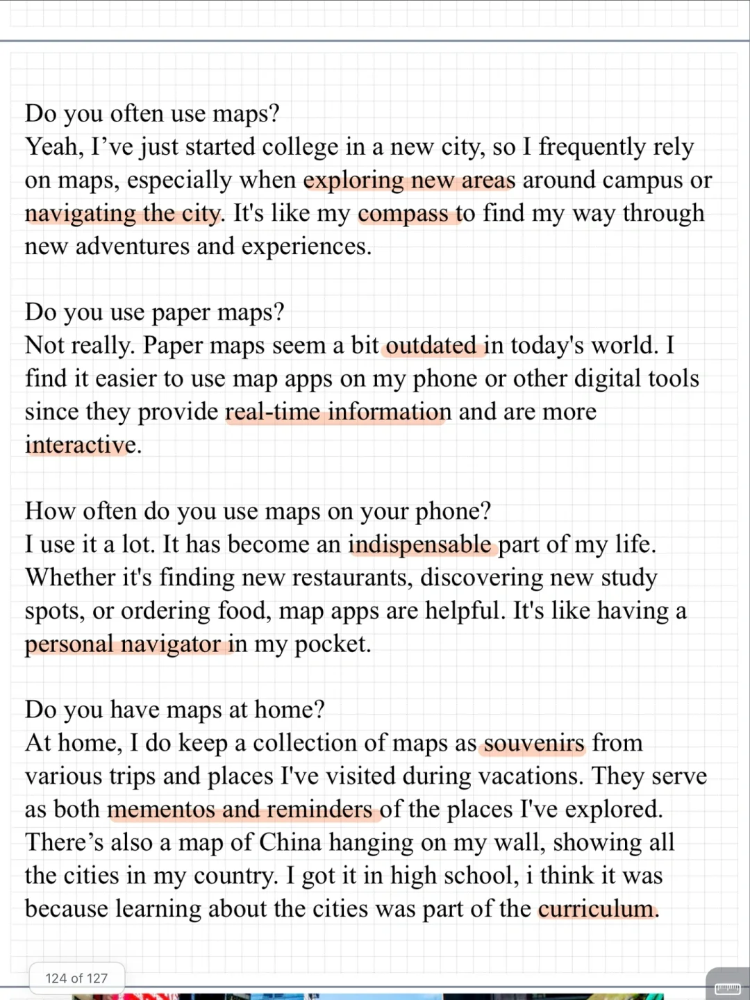
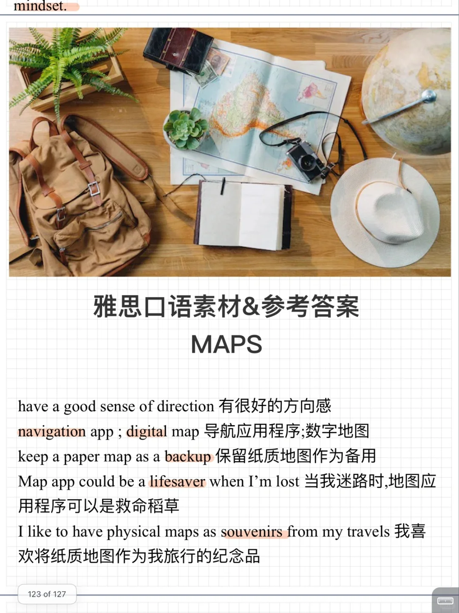

# 雅思口语素材答案｜PART1 Maps

9-12月新题 maps 讨论日常使用习惯，电子纸质地图等。
十月打卡训练营进行中，欢迎加入👏
#雅思口语 #雅思攻略 #雅思备考 #雅思口语素材 #雅思口语换题 #雅思口语Part1 #雅思口语打卡训练营

## 图片
| 图1 | 图2 | 图3 | 图4 |
| --- | --- | --- | --- |
|  |  |   |   |

生成时间：2025-11-15 00:57:41