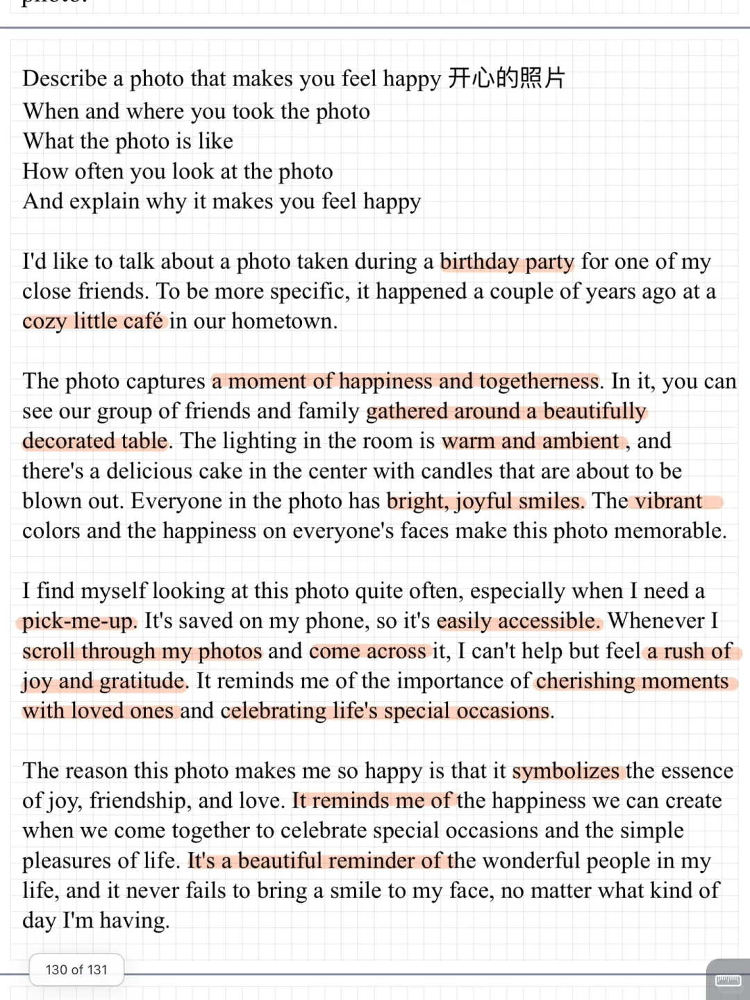
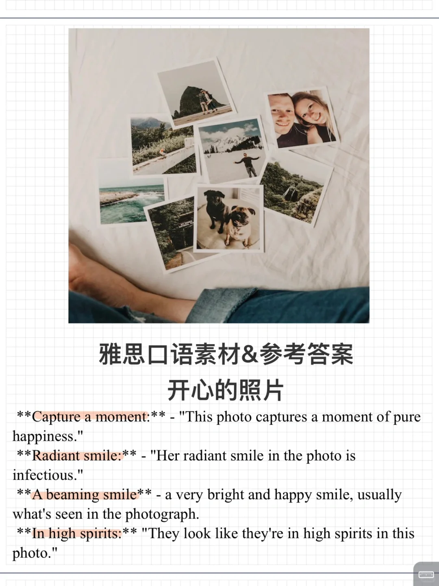

# 雅思口语素材参考答案｜part2 开心的照片

照片本身描述细节可以不必太多 更多侧重拍照片时快乐场景和氛围
	
可以思考串题 派对、聚会相关题目
#雅思口语 #雅思攻略 #雅思备考 #雅思口语素材 #雅思 #雅思口语part2

## 图片
| 图1 | 图2 | 图3 | 图4 |
| --- | --- | --- | --- |
|  |  |   |   |

生成时间：2025-11-15 00:53:20