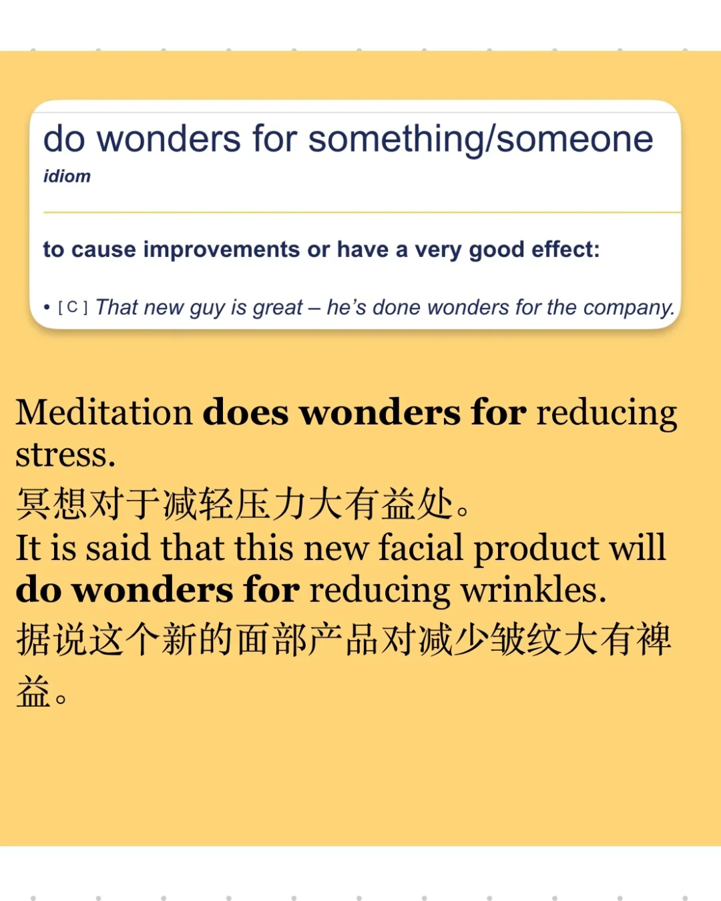
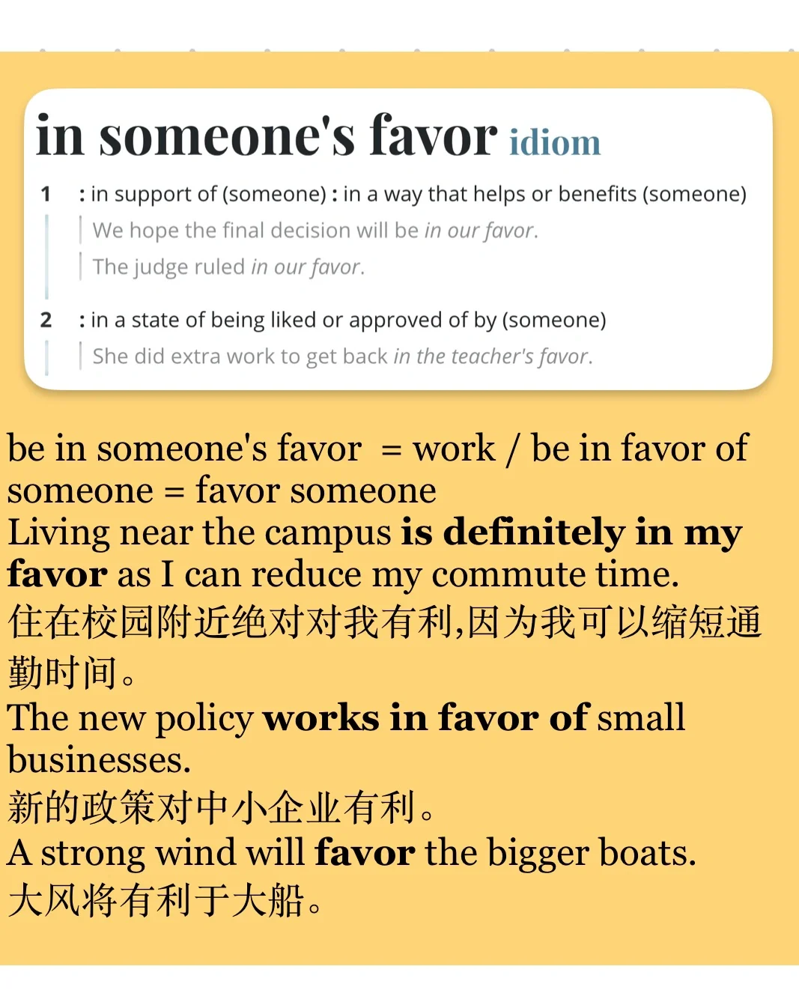

# “有利于”可以怎么表达？有哪些替换？

积累一些be benificial to 的同义替换
欢迎大家评论区补充👏
	
🌟do wonders for something/someone
🌰 Meditation does wonders for reducing stress.
It is said that this new facial product will do wonders for reducing wrinkles.
🌟be in someone's best interest(s)
🌰 Further education is in students’ best interests if they want a stable and well-paid job."
🌟be in someone's favor / favour = work / be in favor of someone = favor someone
🌰 Living near the campus is definitely in my favor as I can reduce my commute time.
The new policy works in favor of small businesses.
A strong wind will favour the bigger boats.
🌟serve someone well
🌰 Her experience serving customers has served her well in her new sales job.
The lake serves recreational business.
	
#雅思 #雅思口语 #雅思备考 #英语口语 #词汇积累
#同义替换

## 图片
| 图1 | 图2 | 图3 | 图4 |
| --- | --- | --- | --- |
|  |  |  |  |
|  |  |  |   |

生成时间：2025-11-15 00:51:09