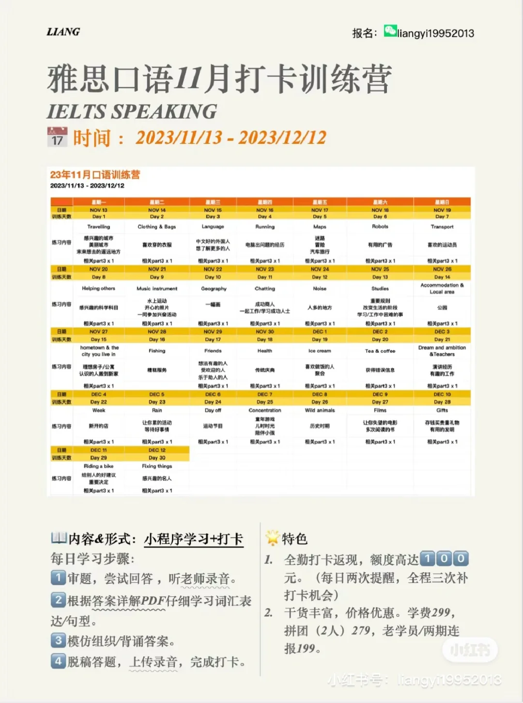
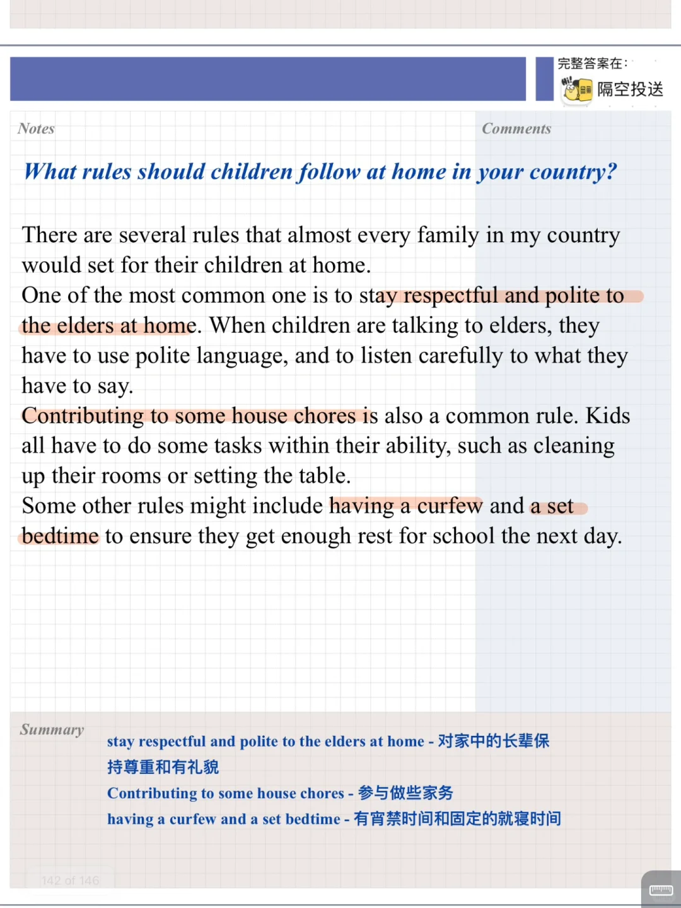
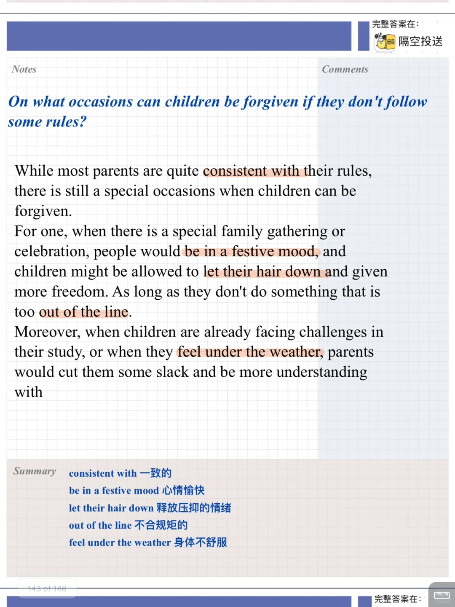
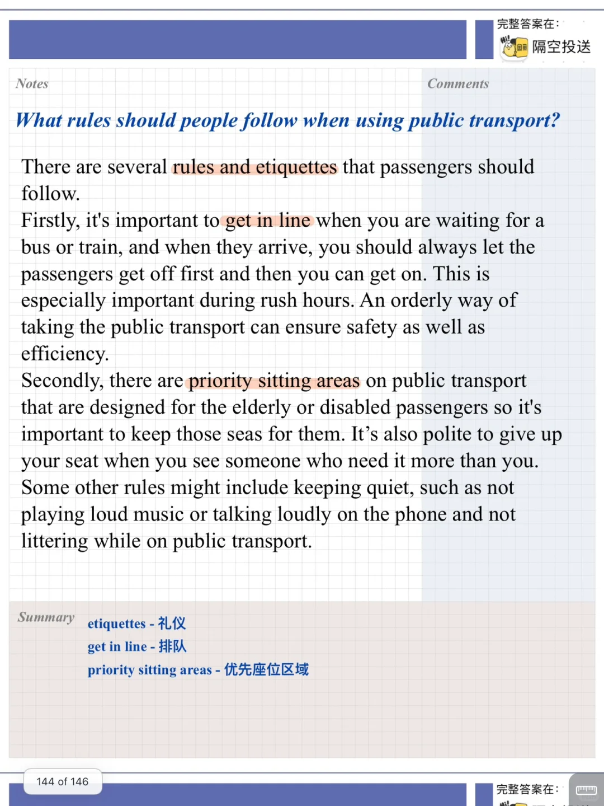
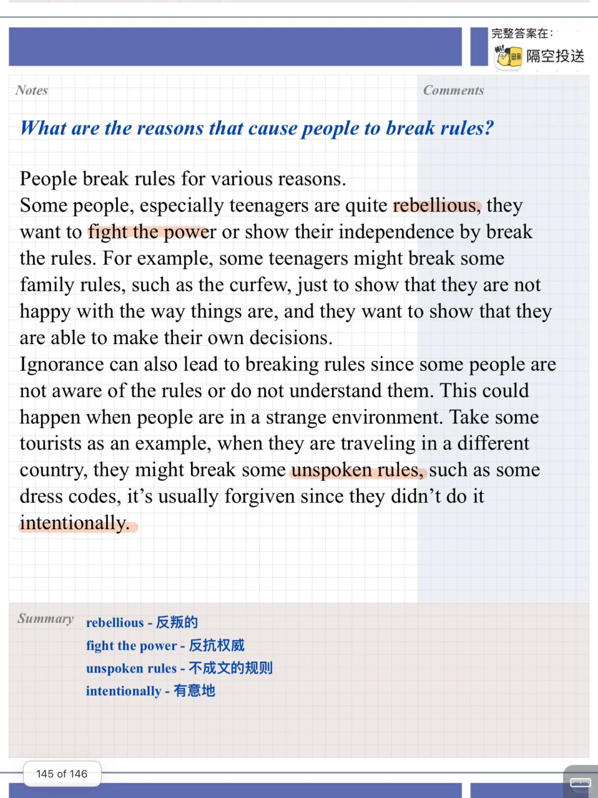

# 雅思口语素材答案｜part 3 规则

分享题库中规则相关的part3题目，涉及到学校、社会、家庭的规则，思考时注意深入扩展答案，有例子、解释等💪
#雅思口语 #雅思攻略 #雅思备考 #雅思口语素材 #雅思口语题库 #雅思口语训练营 #雅思口语打卡 #雅思口语part3

## 图片
| 图1 | 图2 | 图3 | 图4 |
| --- | --- | --- | --- |
|  |  |  |  |
|  |   |   |   |

生成时间：2025-11-15 00:50:03