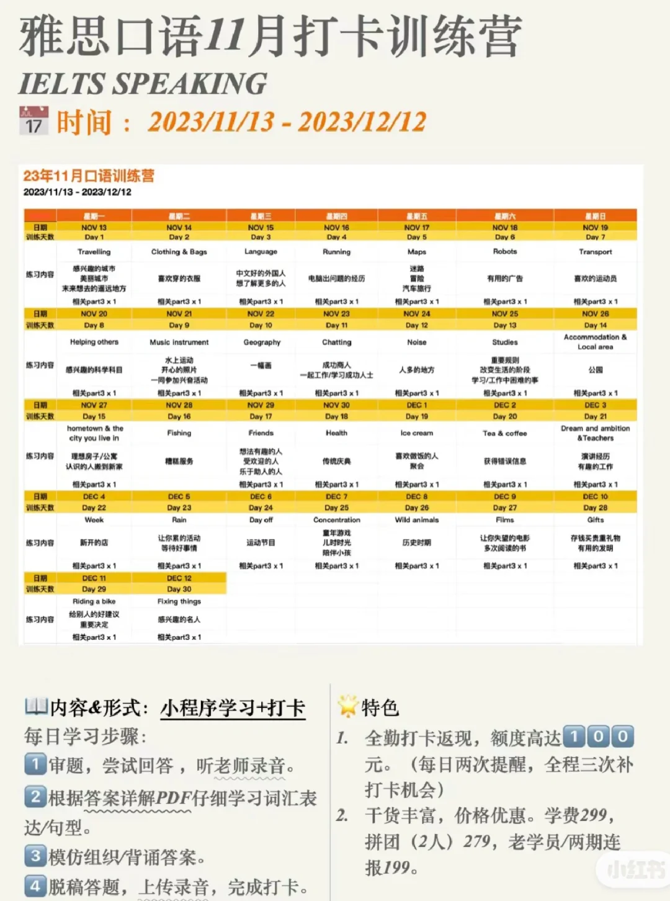
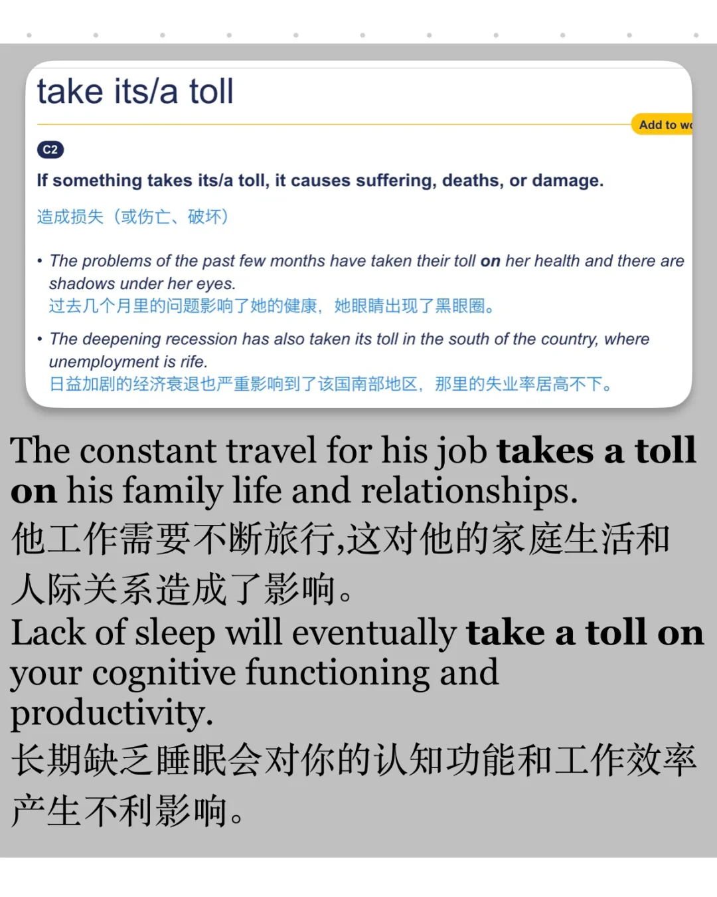
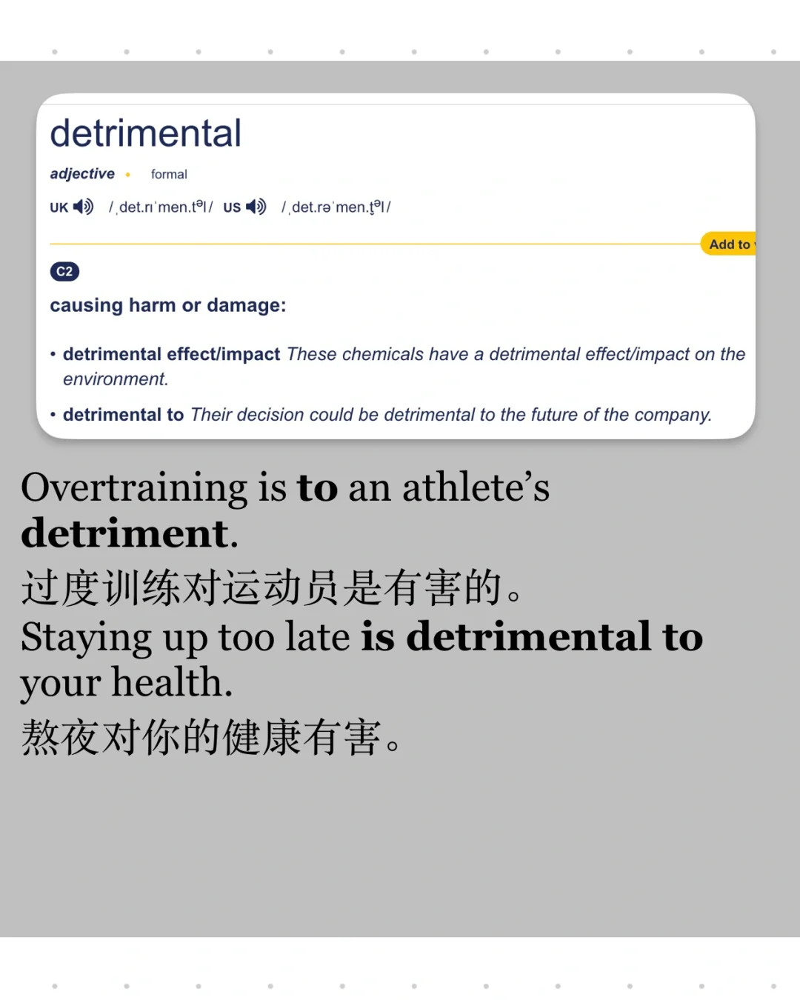
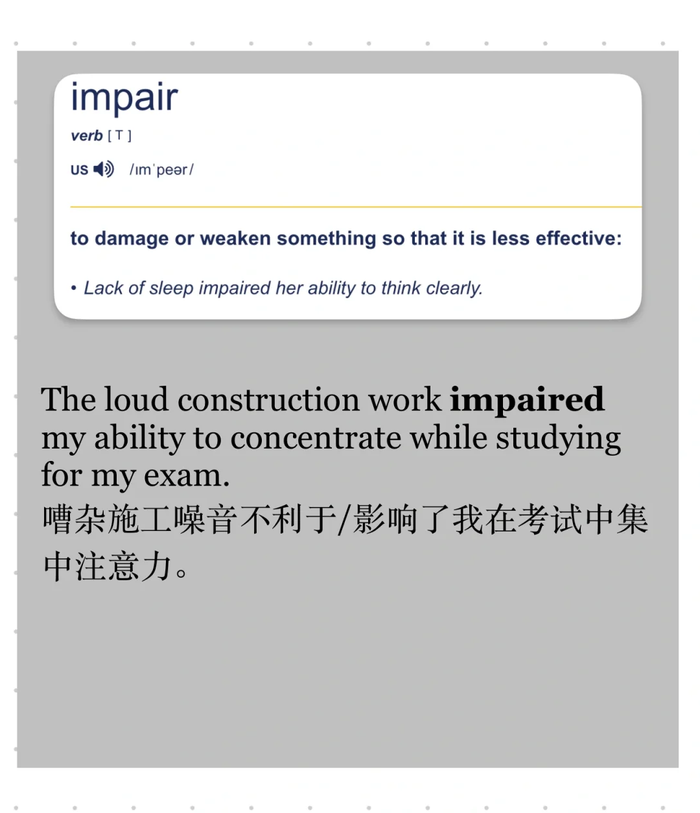
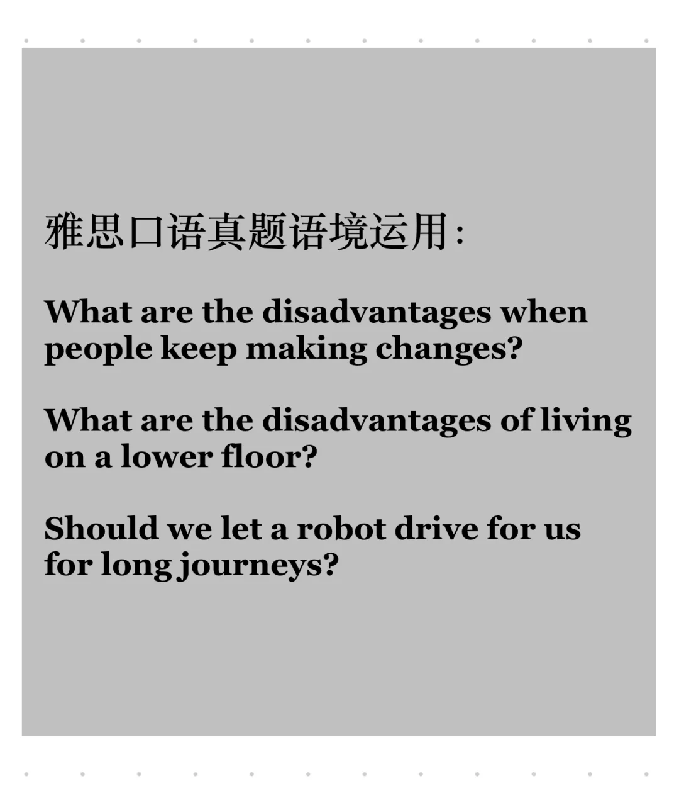

# “不利于”怎么表达？有什么替换？

积累一些 “不利于”的表达
还有哪些灵活表达，欢迎补充👏
	
🌟 Impair
🌰 The loud construction work impaired my ability to concentrate while studying for my exam.
🌟 be detrimental to... = - be to someone's detriment
🌰 Overtraining is to an athlete's detriment.
Staying up too late is detrimental to your health."
🌟 work against...
Anxiety works against your ability to focus.
🌰 Sedentary lifestyle works against people’s overall well-being.
🌟 take a toll on ...
🌰 The constant travel for his job takes a toll on his family life and relationships.
Lack of sleep will eventually take a toll on your cognitive functioning and productivity.
	
11月雅思口语打卡训练营下周一开始，30天打卡练完题库，有优秀素材、教师录音、串题思路🧑‍🏫
全勤打卡还有🧧100返现
	
#英语口语 #雅思 #雅思口语 #雅思备考 #词汇积累 #雅思同意替换

## 图片
| 图1 | 图2 | 图3 | 图4 |
| --- | --- | --- | --- |
|  |  |  |  |
|  |  |  |   |

生成时间：2025-11-15 00:47:53