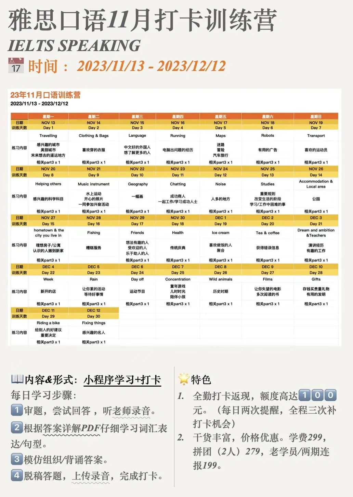
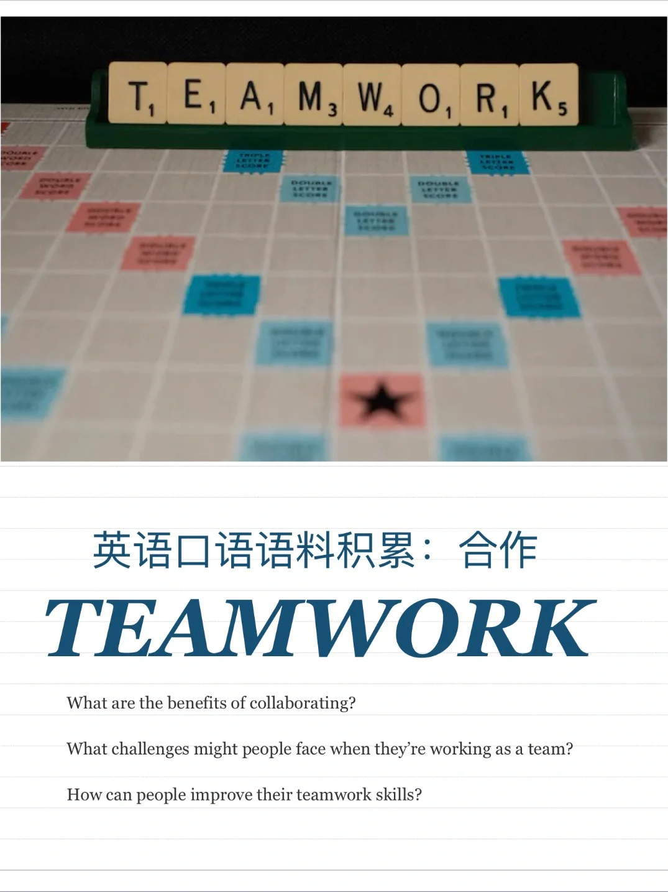
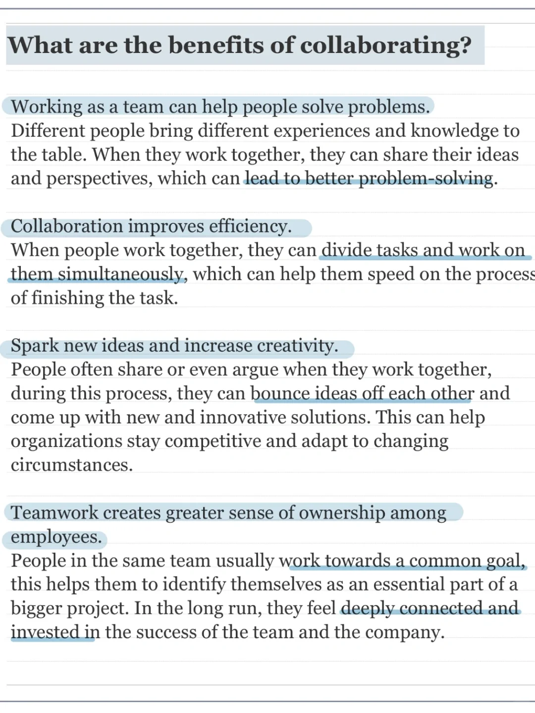
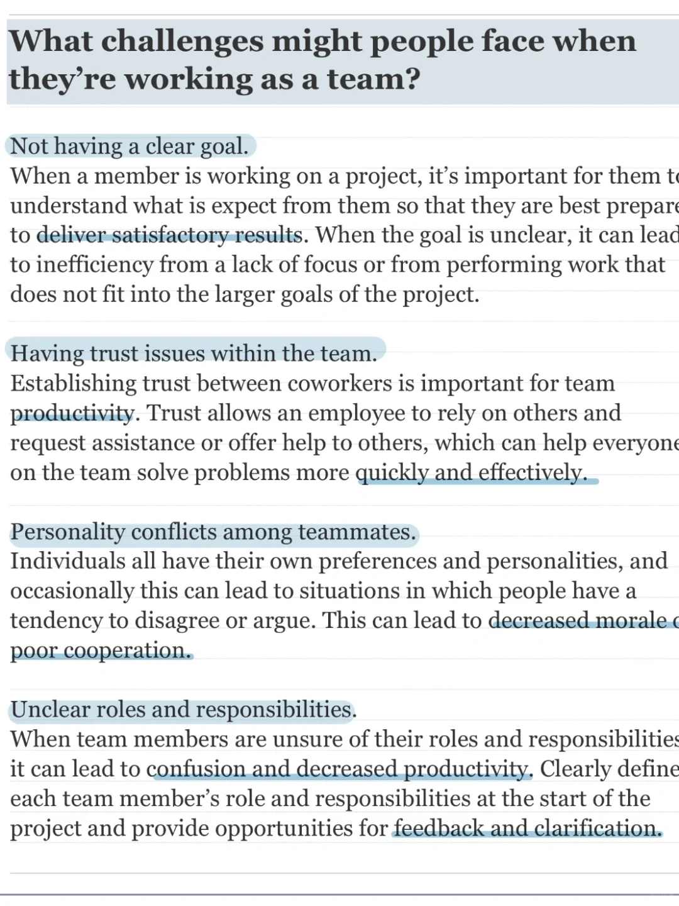
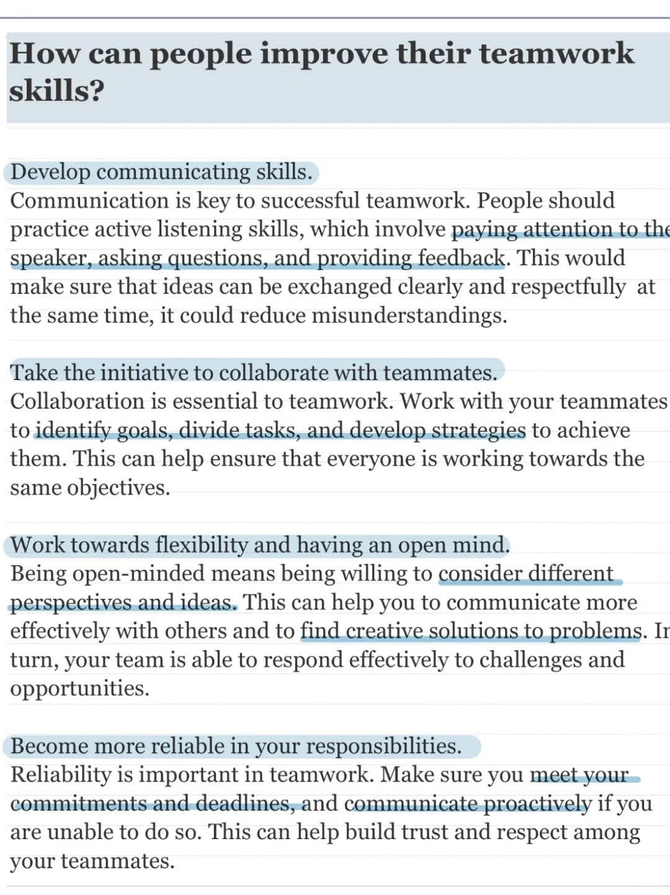

# 雅思口语话题语料积累｜合作

合作的相关讨论一般围绕其好处、方法、遇到的困难等，今天分别从这三个角度分享一些语料段落，快快积累起来吧
	
11月雅思口语打卡营今天也正式开始啦👏
	
#雅思 #雅思口语 #英语口语 #语料积累 #雅思词汇 #英语学习 #英语词汇

## 图片
| 图1 | 图2 | 图3 | 图4 |
| --- | --- | --- | --- |
|  |  |  |  |
|  |   |   |   |

生成时间：2025-11-15 00:46:47