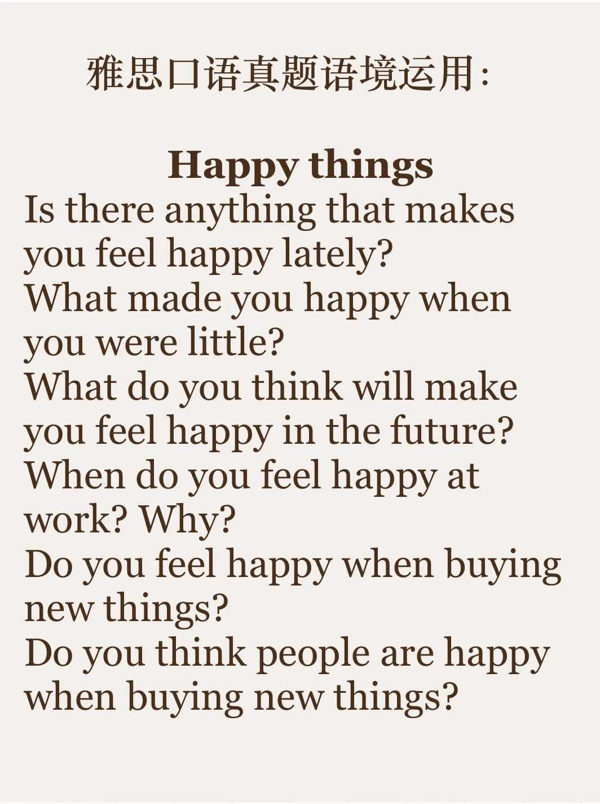
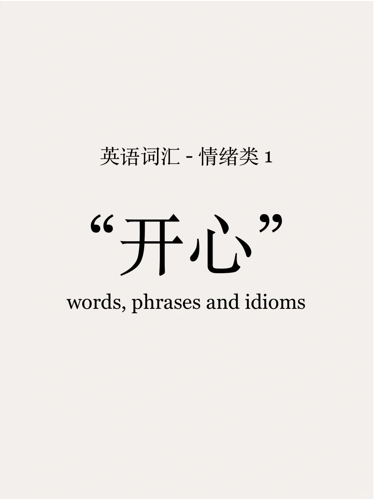
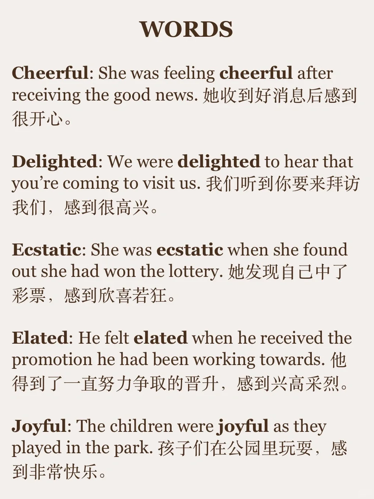
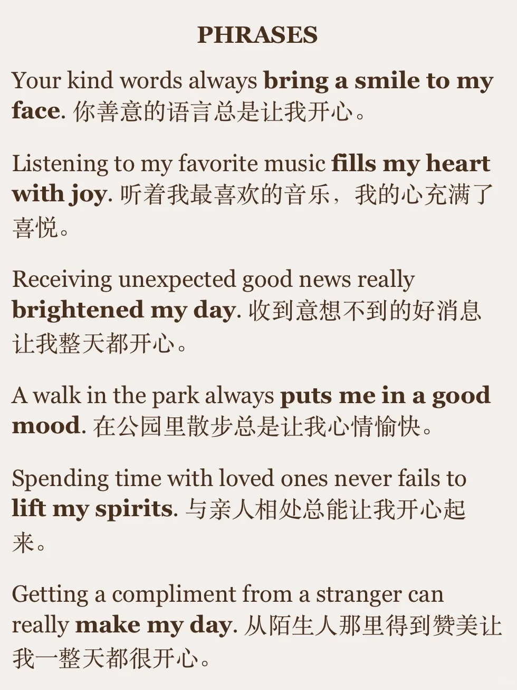
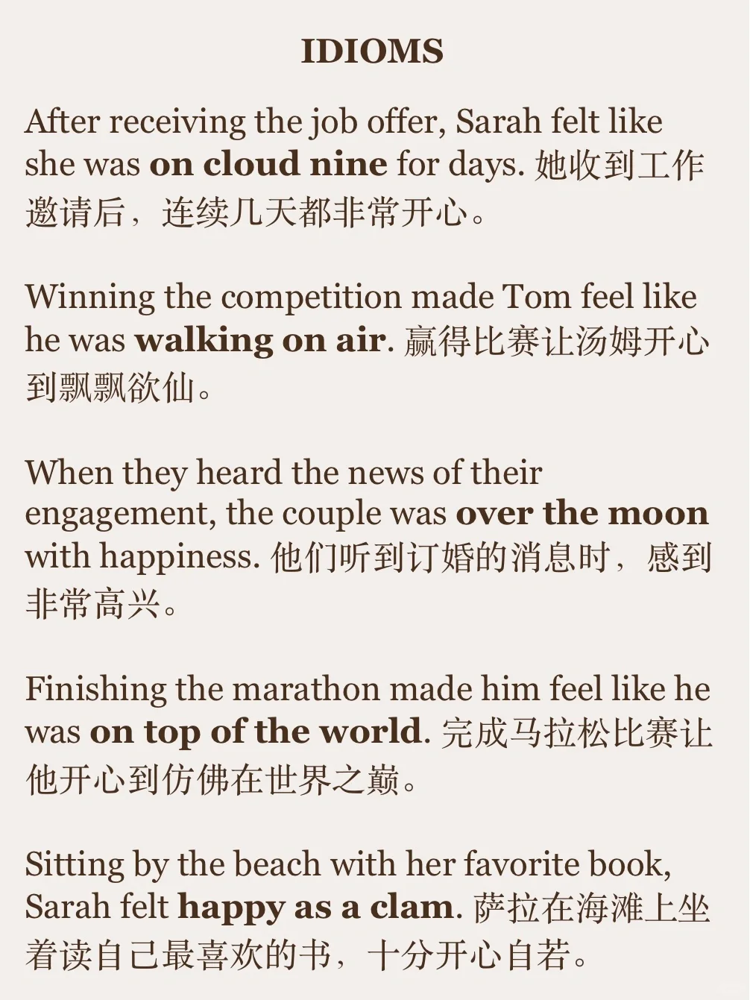
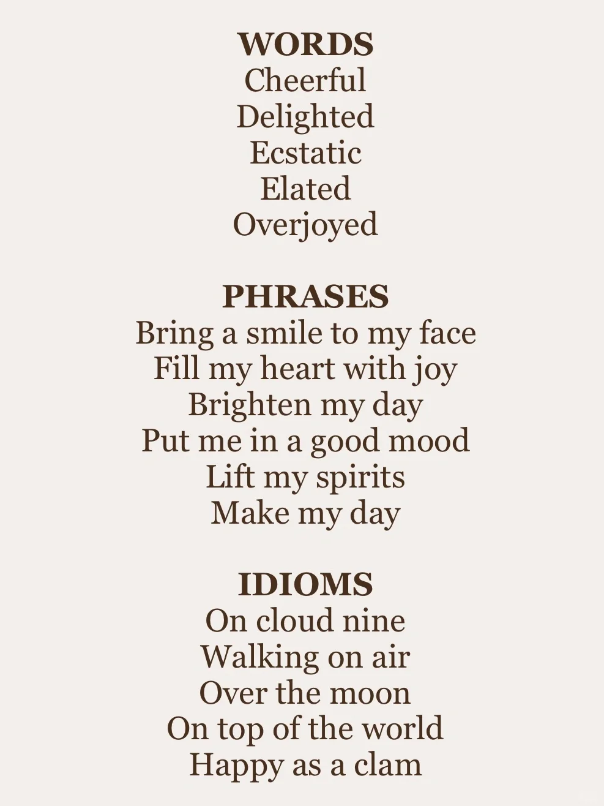

# “开心、快乐” 的表达｜英语替换积累

想到“快乐，开心”，很多同学的第一反应都是“make me happy” 今天来学习一波其他的替换，有词汇、词组、习语，大家可以多看例句体会语境运用。
	
11月雅思口语训练营每日打卡，出声练习口语🌹
#雅思口语 #英语口语 #英语地道表达 #每日英语 #英语词汇 #英语习语 #英语单词

## 图片
| 图1 | 图2 | 图3 | 图4 |
| --- | --- | --- | --- |
|  |  |  |  |
|  |  |   |   |

生成时间：2025-11-15 00:45:41