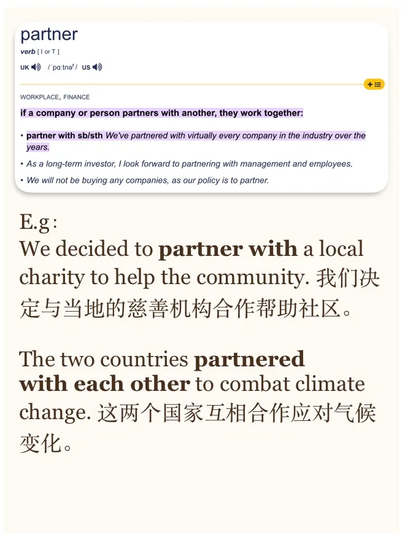
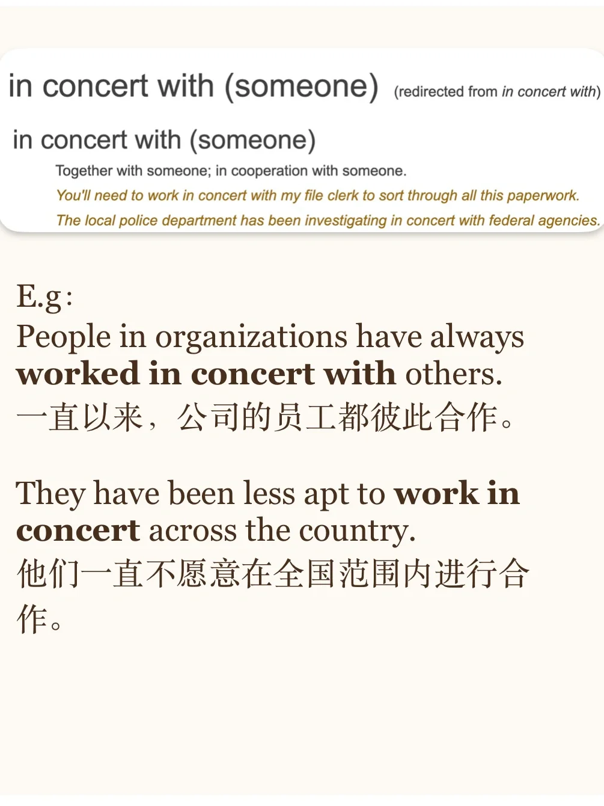
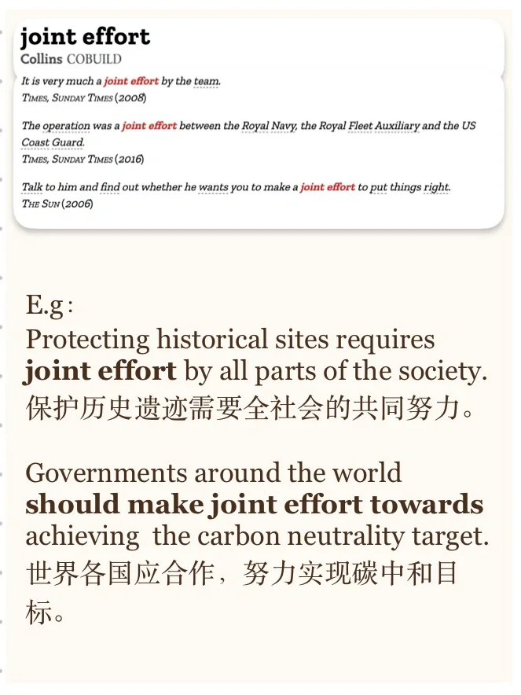
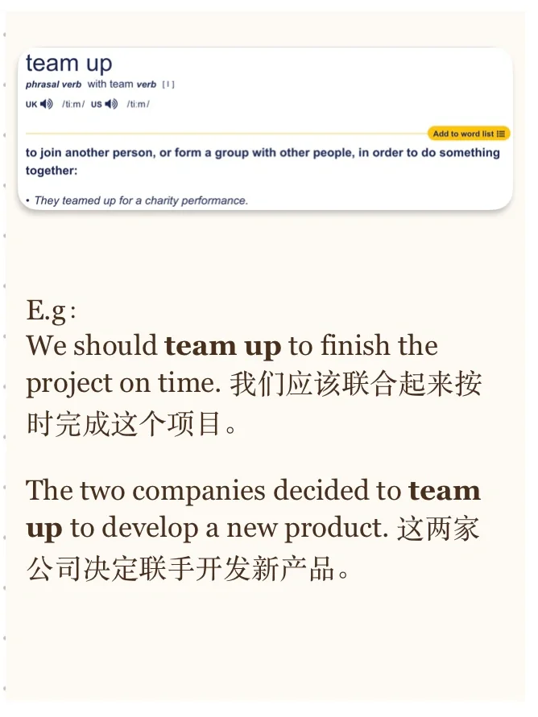

# 合作只有“cooperate”？

继续分享同意替换
	
最近读到关于合作和个人的文章，顺便整理了合作的相关表达，欢迎大家持续补充
#雅思口语 #英语词汇 #英语同意替换 #雅思 #雅思备考 #雅思攻略 #英语口语 #英语写作 #翻译

## 图片
| 图1 | 图2 | 图3 | 图4 |
| --- | --- | --- | --- |
|  |  |  |  |
|  |   |   |   |

生成时间：2025-11-15 00:44:35