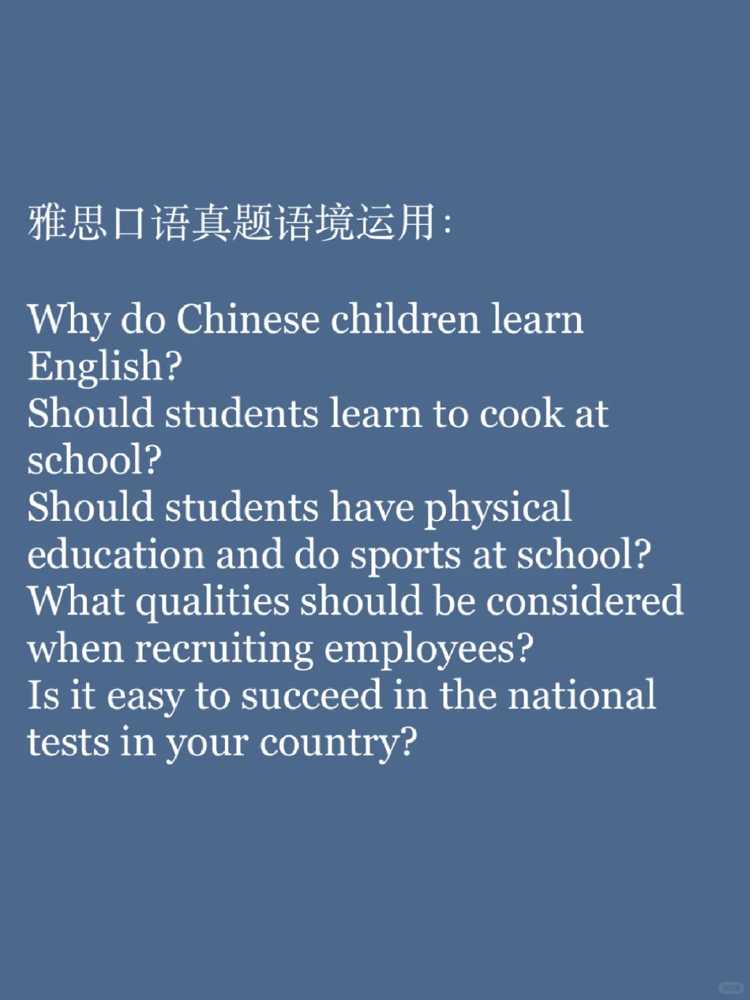
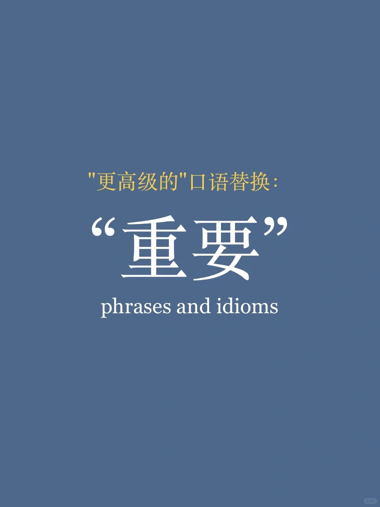
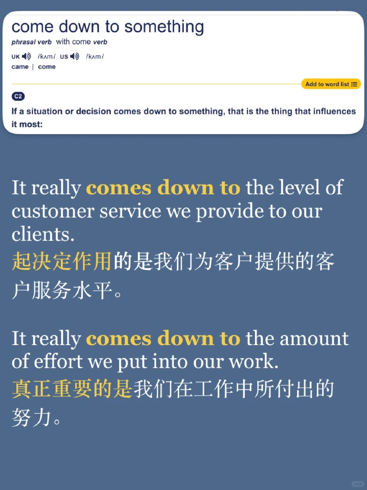
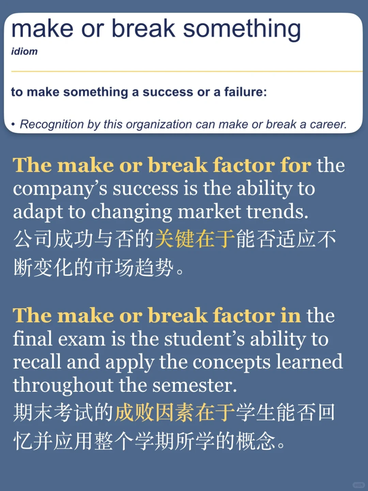
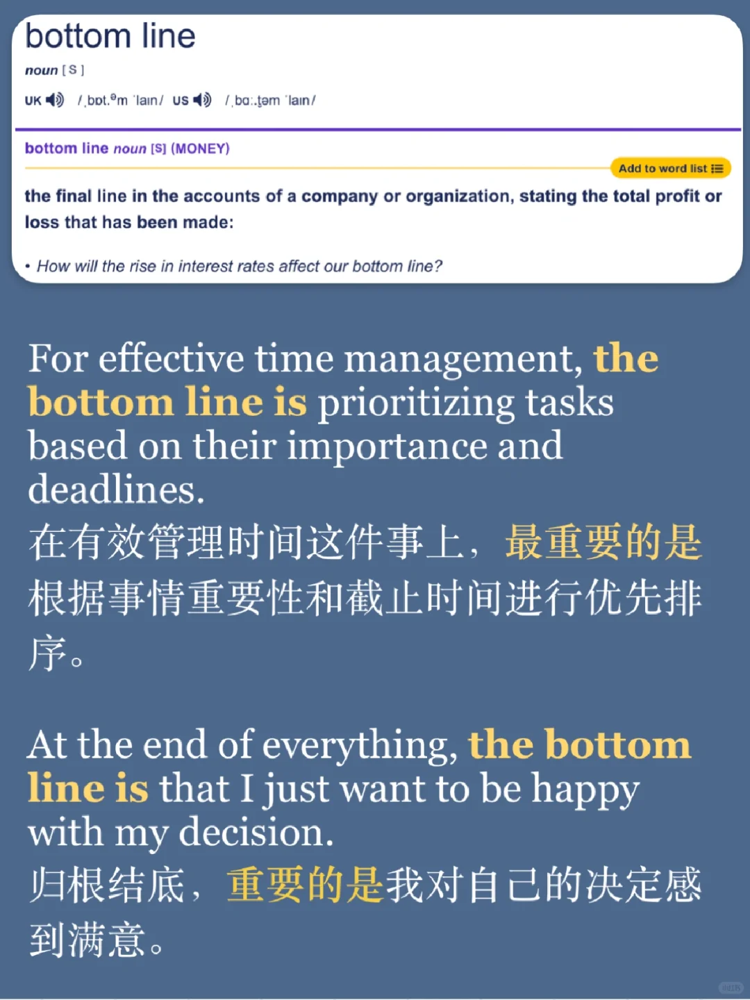
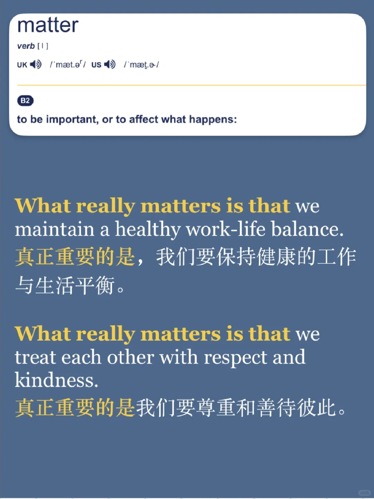

# 考生喜欢的“高级”替换词｜ 重要

分享一些大家可能平时不太常用的替换词，来表达某件事情的“关键、重要”
积累词汇还是要多看例句，多理解语境，才会越用越地道
	
#英语口语 #口语 #每日英语口语学习 #英语口语攻略 #英语地道表达 #雅思口语 #英语高级词汇替换 #

## 图片
| 图1 | 图2 | 图3 | 图4 |
| --- | --- | --- | --- |
|  |  |  |  |
|  |  |  |   |

生成时间：2025-11-15 00:43:29