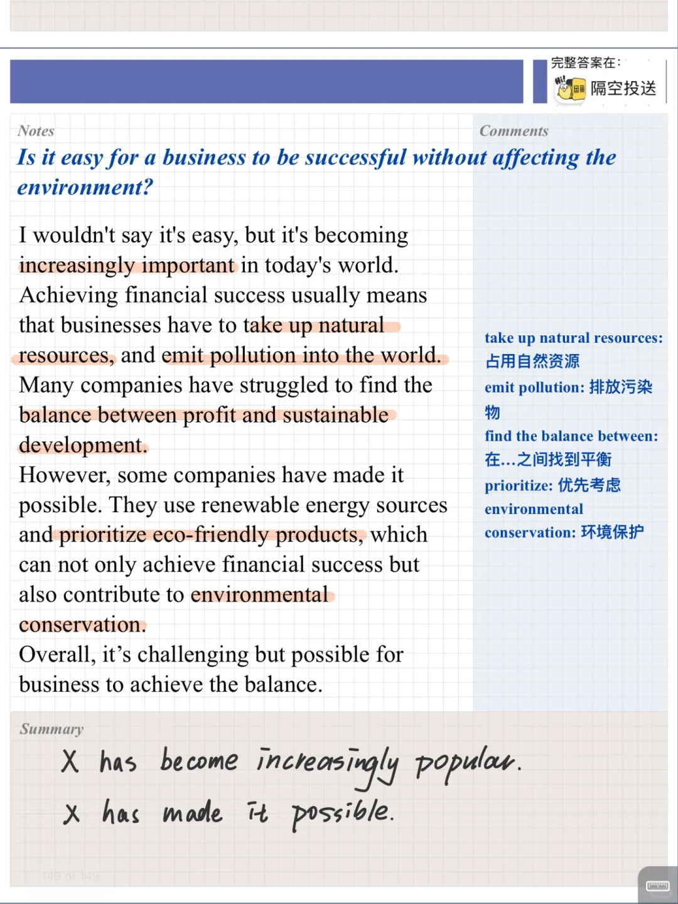
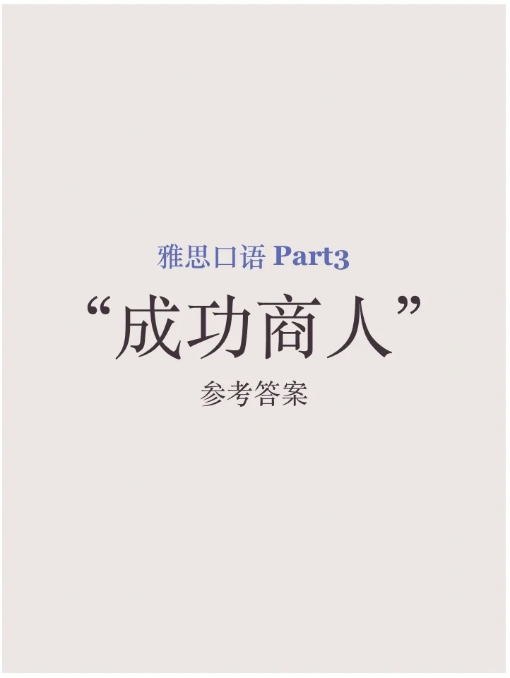
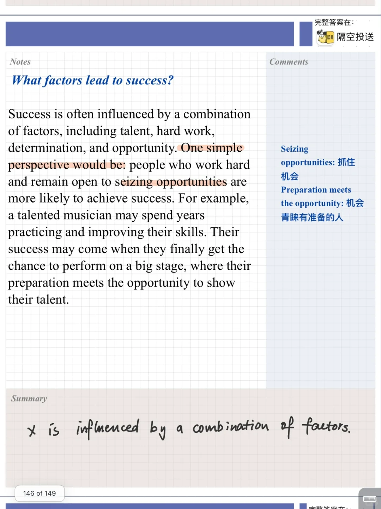
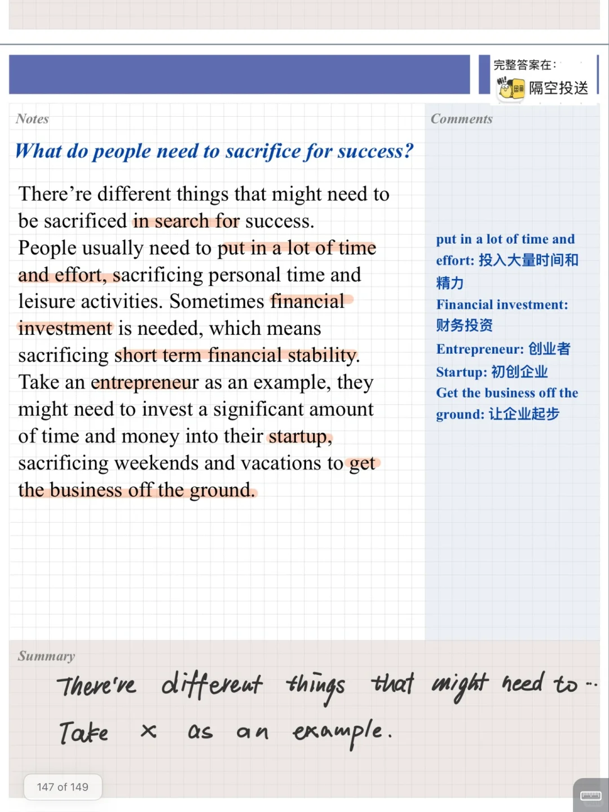
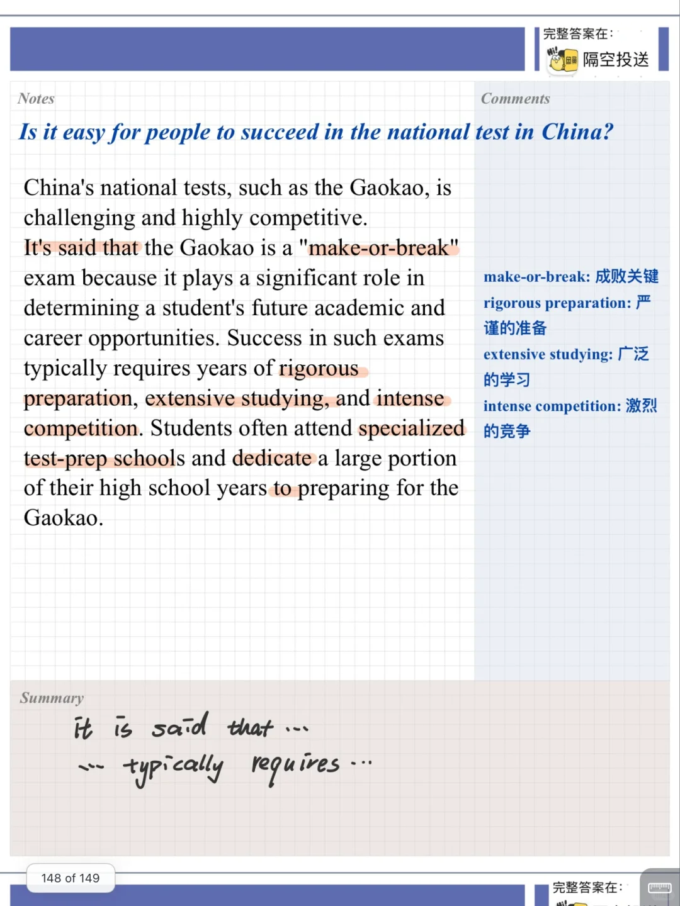

# 雅思口语参考答案｜成功商人 Part 3

继续分享当季雅思题库的参考答案
今天是“成功商人” successful businessman 相关的part3话题，有比较抽象的“成功的定义、因素”问题，也有很具体化的“中国考试难度”的问题。
一起积累起来吧💪
#雅思口语 #雅思攻略 #雅思备考 #雅思口语题库 #雅思口语part3 #雅思口语高分素材

## 图片
| 图1 | 图2 | 图3 | 图4 |
| --- | --- | --- | --- |
|  |  |  |  |
|  |   |   |   |

生成时间：2025-11-15 00:42:23