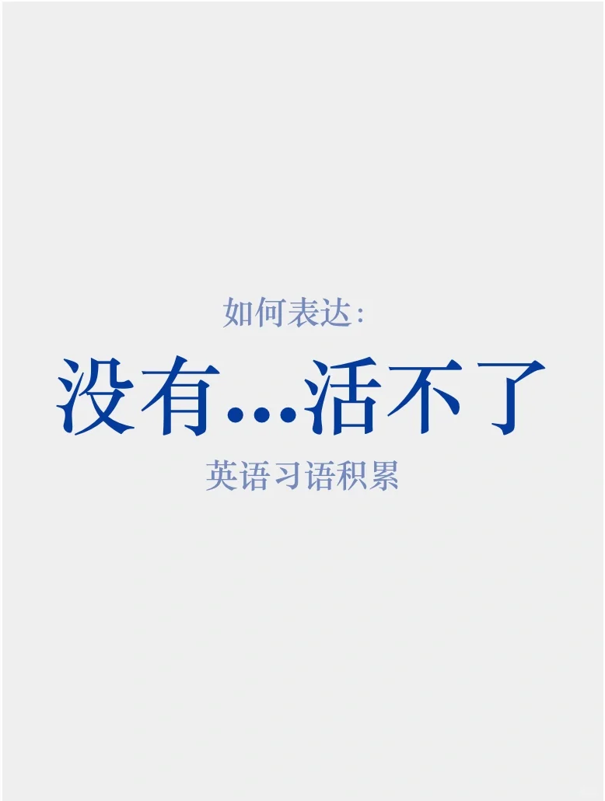
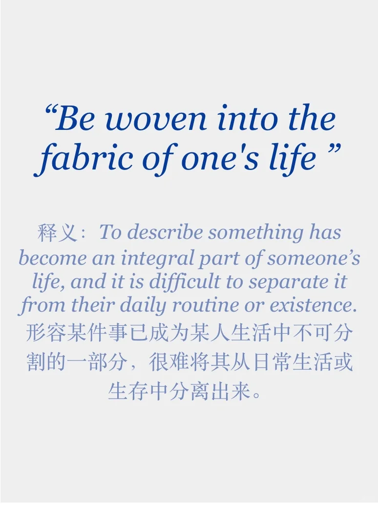
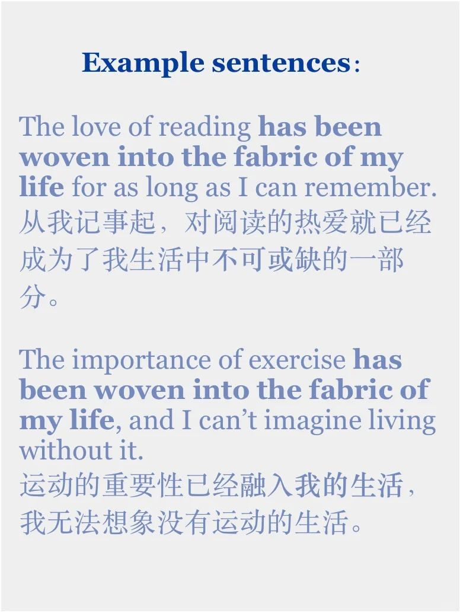

# 你的生活离不开什么？

Be woven into the fabric of one’s life
Sth is part and parcel of one’s life
都可以表达 “某件事在生活中十分重要，没有某事生活不能继续”
书面和口语都可以运用，是很地道的习语，快积累起来吧
#雅思口语 #英语口语 #英语地道表达 #英语习语 #每日英语 #词汇积累 #高级词汇

## 图片
| 图1 | 图2 | 图3 | 图4 |
| --- | --- | --- | --- |
|  |  |  |  |

生成时间：2025-11-15 00:41:16