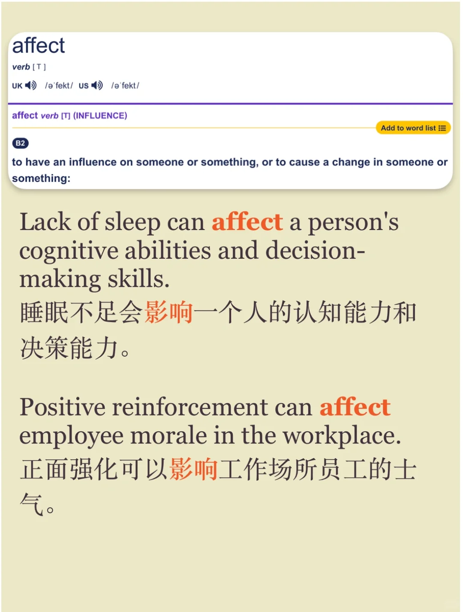
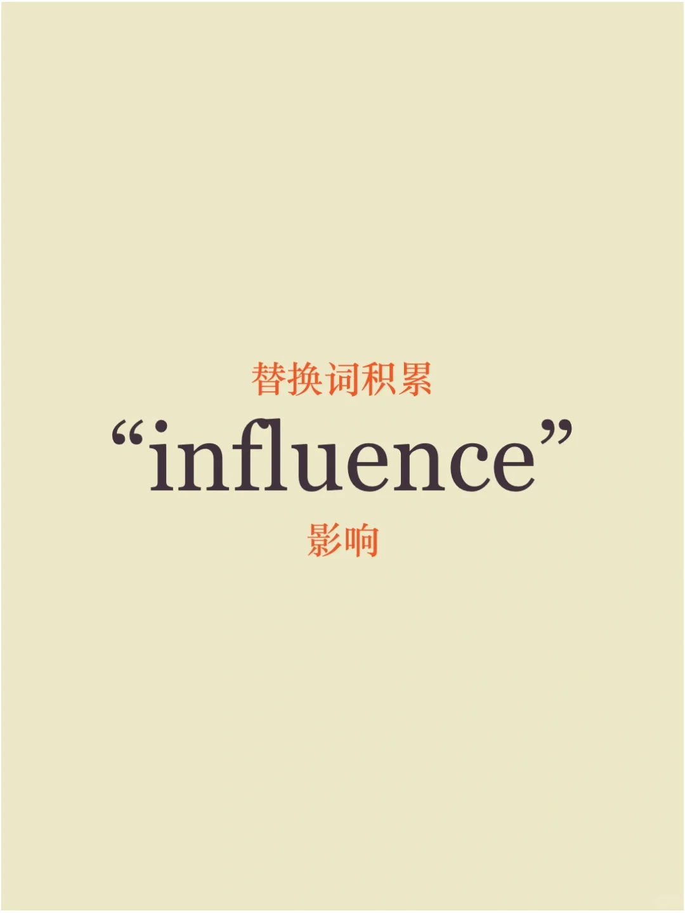
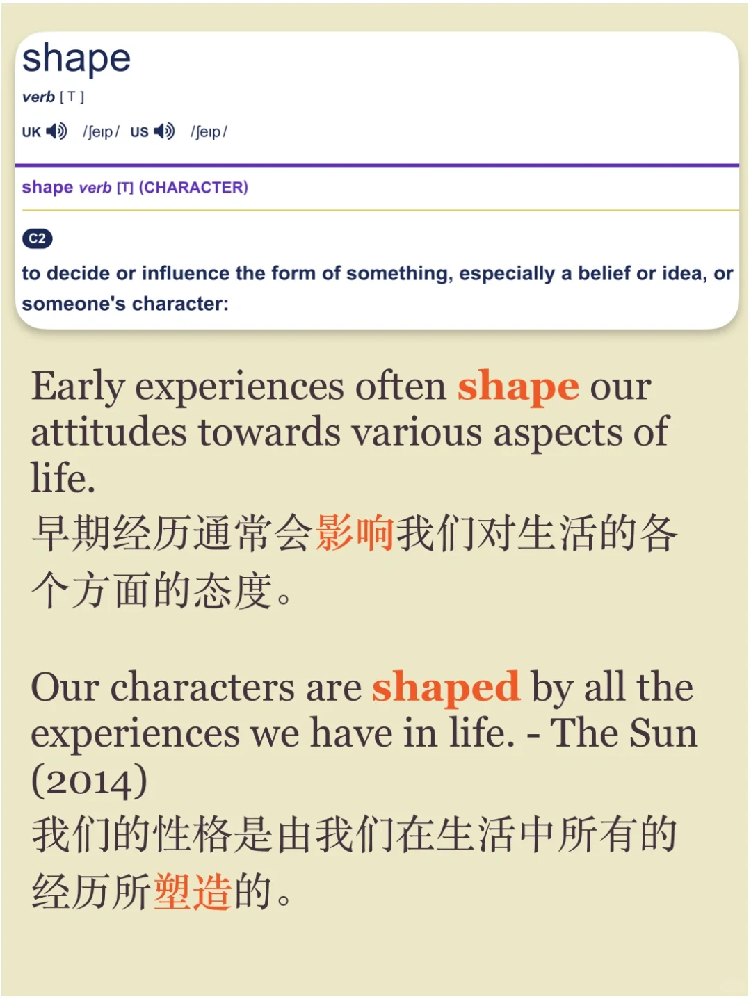
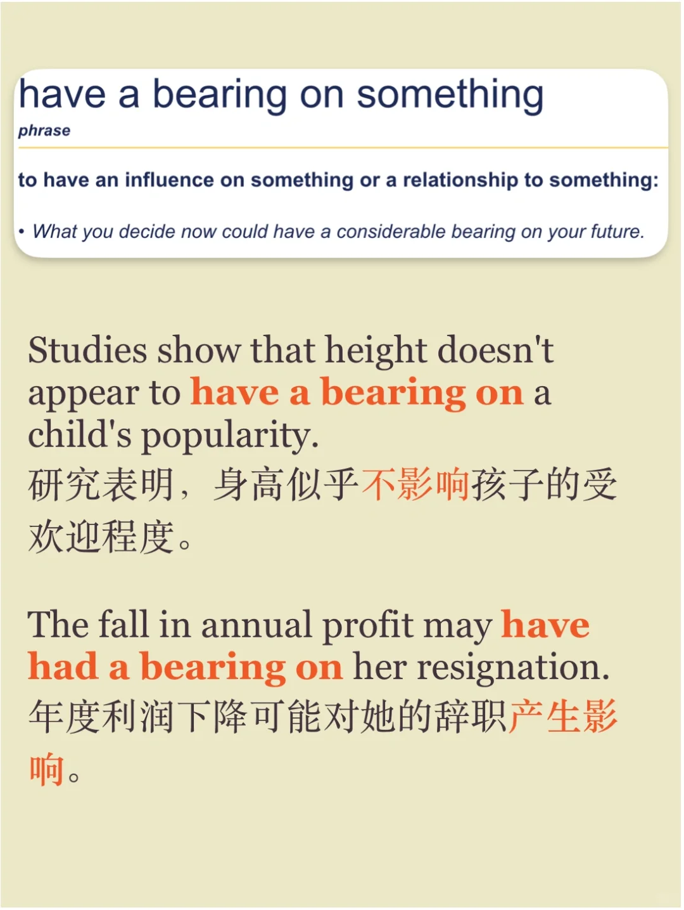
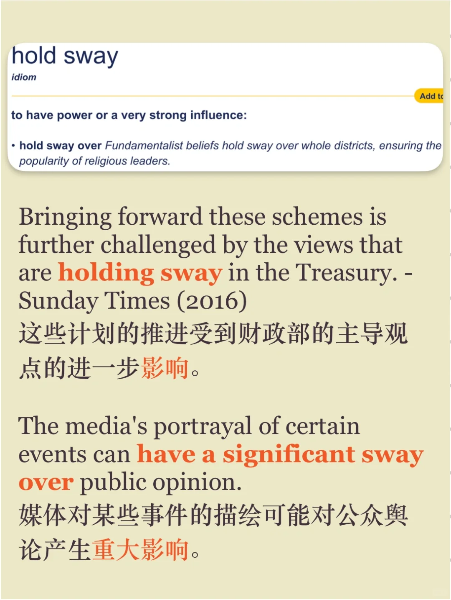
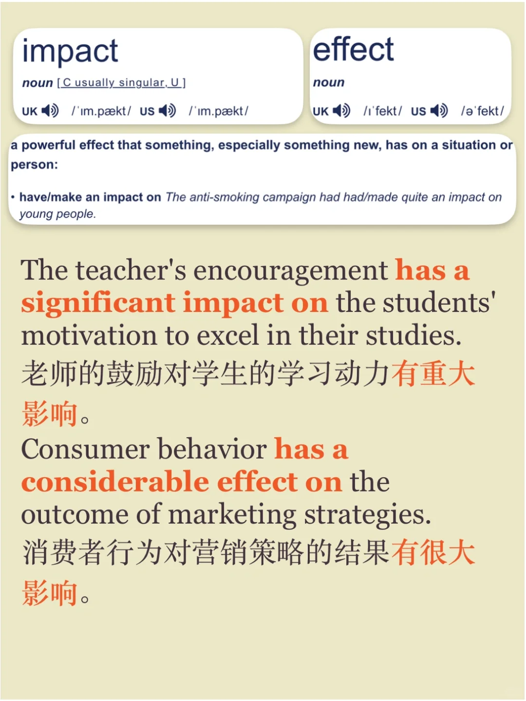

# 你知道哪些表达“影响”的词组？

平时运用比较多的，还是influence、affect、（have）impact、effect 等词，今天积累一些平时较少见到大家用的，让表达更地道，也在雅思等类似考试中可以让考官眼前一亮🌟
#雅思口语 #雅思攻略 #英语口语 #高级词替换 #英语同义词 #英语地道表达 #雅思 #雅思备考 #每日英语

## 图片
| 图1 | 图2 | 图3 | 图4 |
| --- | --- | --- | --- |
|  |  |  |  |
|  |  |   |   |

生成时间：2025-11-15 00:40:11