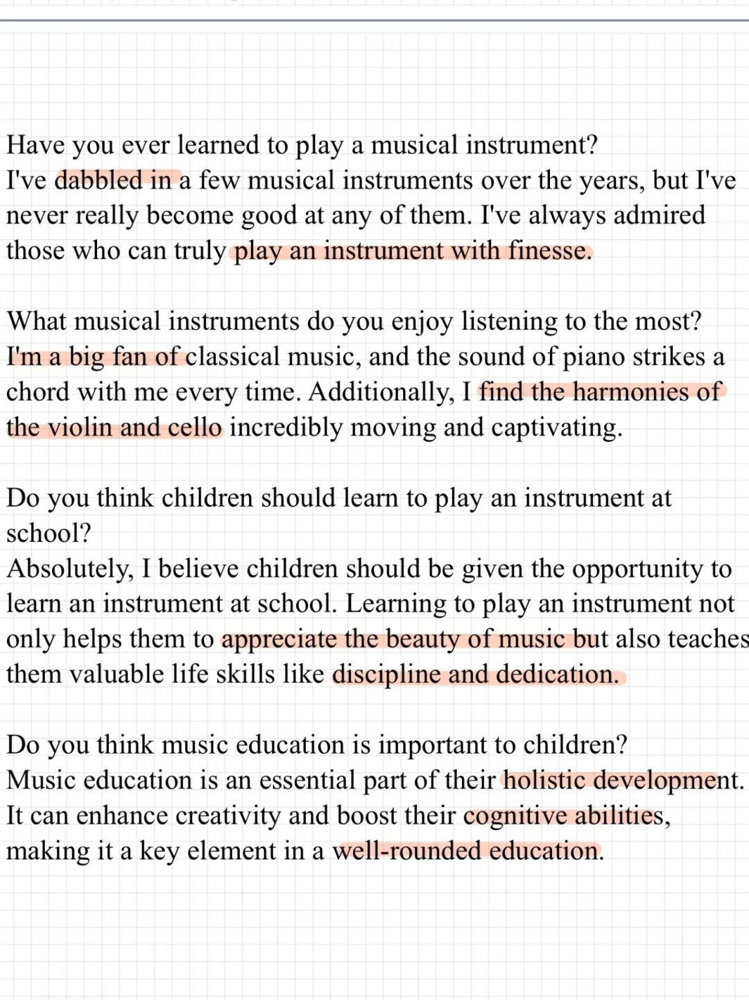
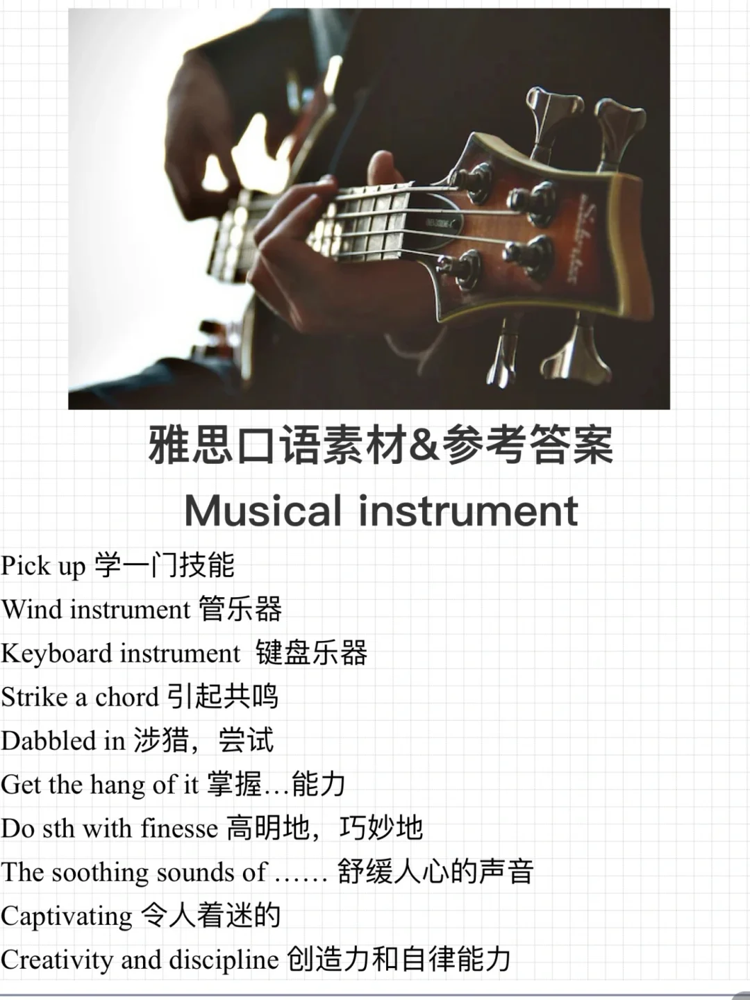

# 雅思口语参考素材｜PART1 乐器

🌟Musical instrument
Have you ever learned to play a musical instrument?
What musical instruments do you enjoy listening to the most?
Do you think children should learn to play an instrument at school?
Do you think music education is important to children?  乐器相关的话题相对有一些难度，大家可以尝试肯定的回答，并积累相关的乐器名称、特点、感受等词汇。考官也经常问孩子学习某项技能的好处，注意总结归纳
	
#雅思口语 #雅思攻略 #雅思备考 #英语口语 #雅思口语参考答案 #雅思口语Part1

## 图片
| 图1 | 图2 | 图3 | 图4 |
| --- | --- | --- | --- |
|  |  |  |   |

生成时间：2025-11-15 00:39:05