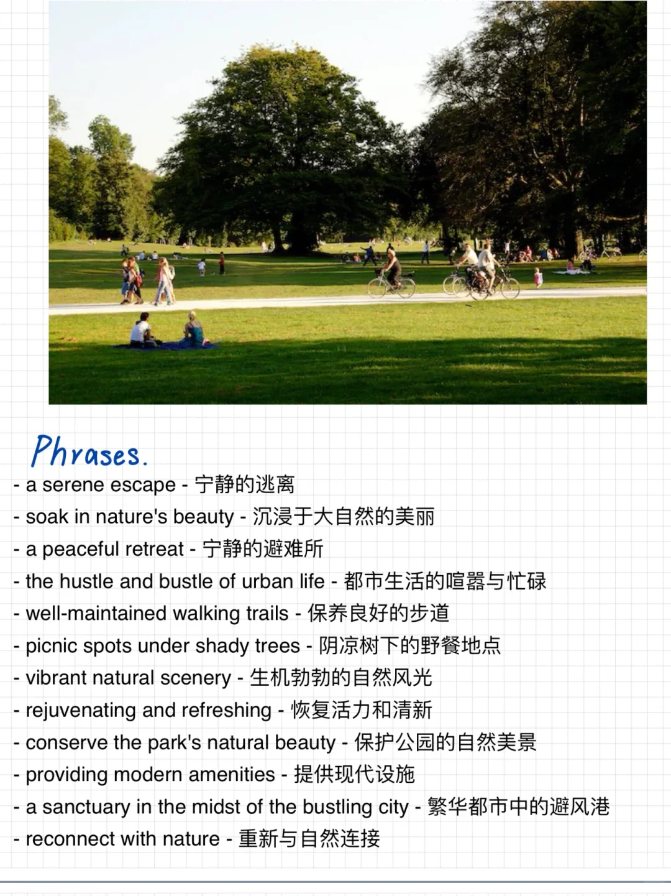
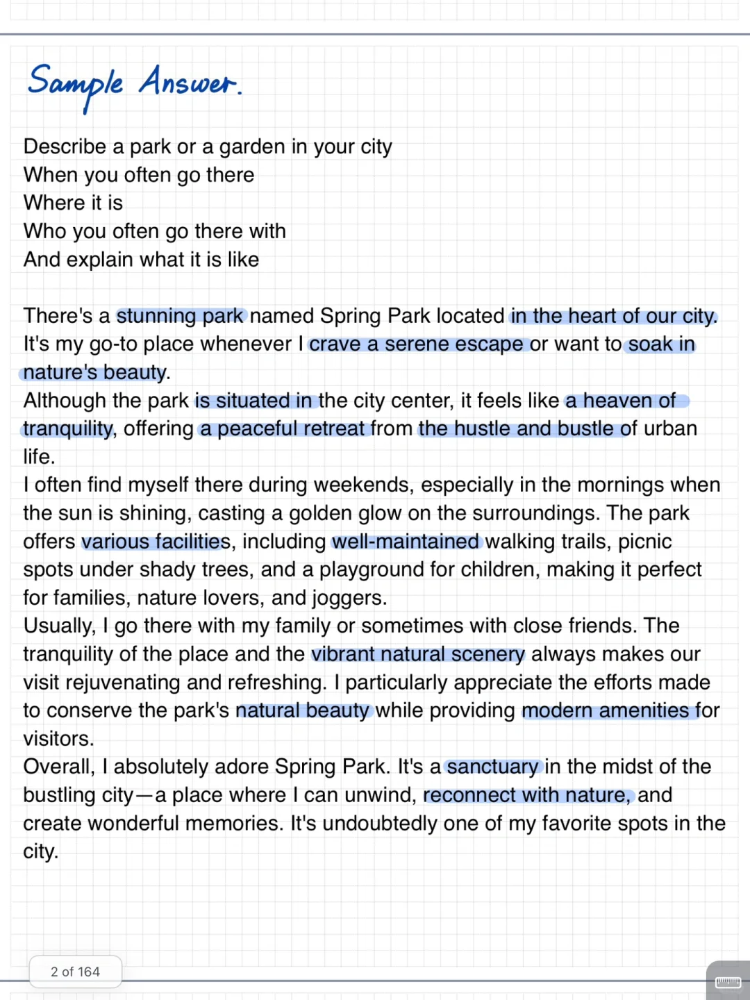

# 雅思口语PART2素材答案｜ 公园

你的城市有风景优美、安静、设施齐全的公园吗？
你会怎样描述它呢？
12月雅思口语训练营可以开始报名啦
跨换题季，30天练完保留题和新题💪
#雅思口语 #雅思攻略 #雅思备考 #雅思口语part2 #雅思口语答案

## 图片
| 图1 | 图2 | 图3 | 图4 |
| --- | --- | --- | --- |
|  |  |  |  |

生成时间：2025-11-15 00:38:00