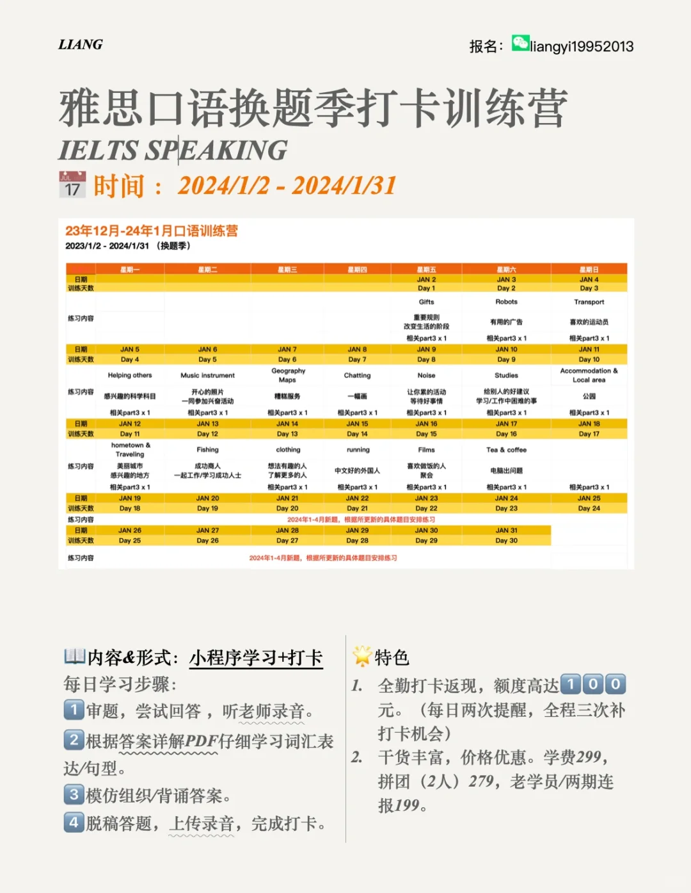
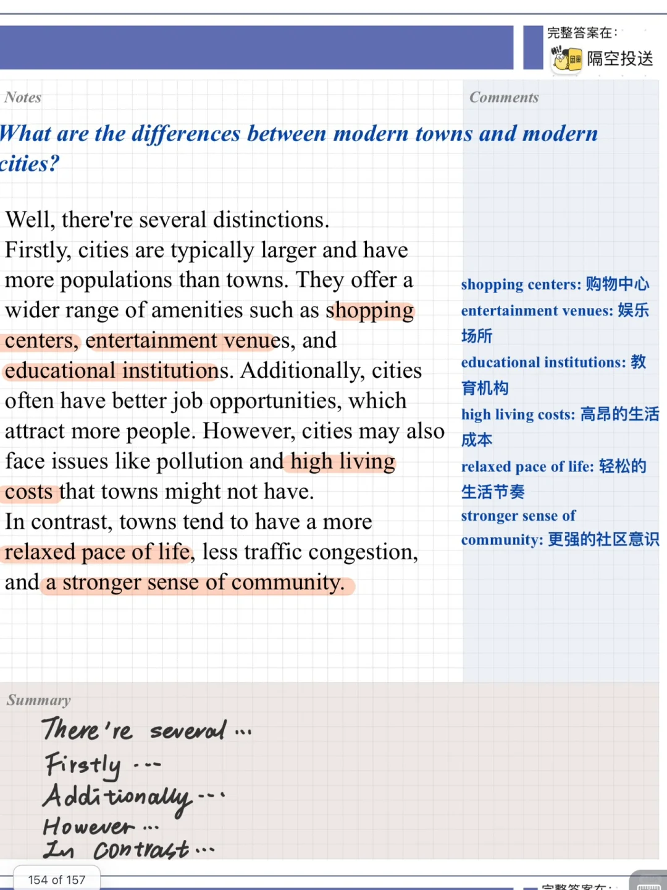
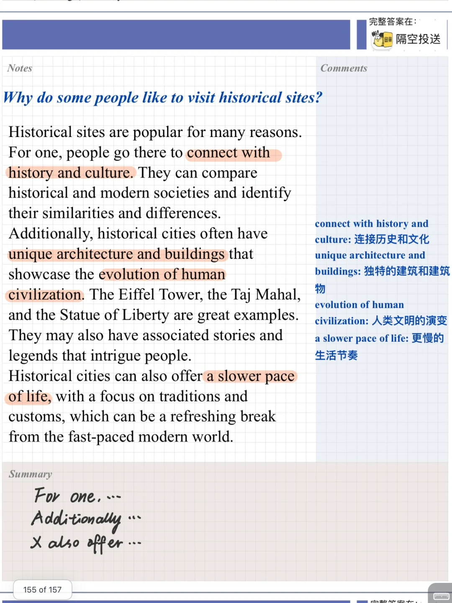
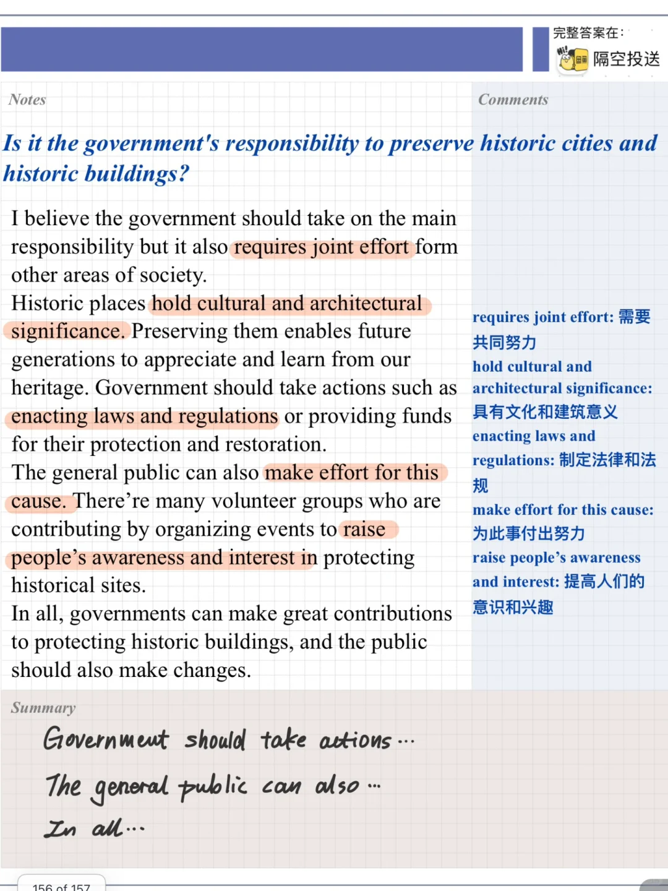
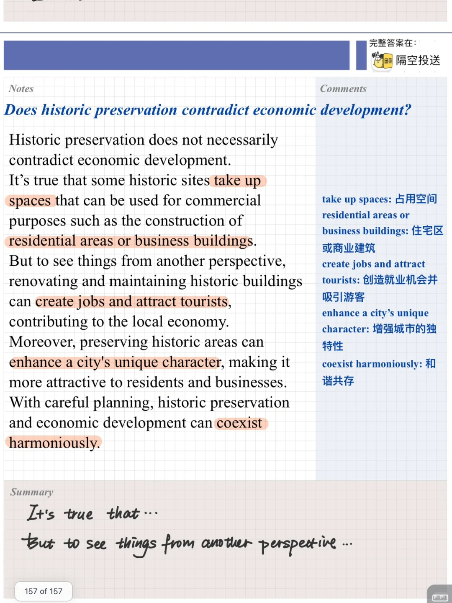

# 雅思口语PART3答案｜美丽的城市

关于城市的part3问题会问到建筑、大小规模城市的不同等细节问题，快积累起来吧
下一期雅思口语训练营 一月二号开始
先练保留题，再练新题，一个月搞定新题库
需要的同学快加入吧，报名在图6右上角～
#雅思口语 #雅思攻略 #雅思备考 #雅思 #雅思口语part3 #雅思口语训练营

## 图片
| 图1 | 图2 | 图3 | 图4 |
| --- | --- | --- | --- |
|  |  |  |  |
|  |  |   |   |

生成时间：2025-11-15 00:35:48